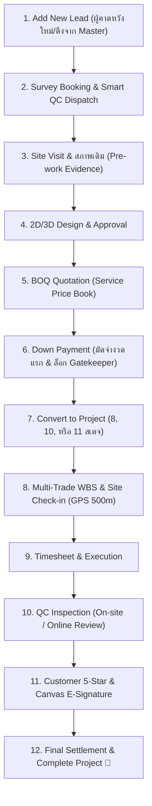

# 📘 คู่มือทดสอบระบบฉบับสมบูรณ์สำหรับ Tester (QA & UAT Test Manual)
## ระบบบริหารโครงการและติดตามงานติดตั้ง NexTime (vbooking)
### 🎯 เริ่มต้นตั้งแต่: บันทึกข้อมูลลูกค้าผู้คาดหวัง (Add New Lead) ➔ ปิดโครงการสมบูรณ์ (Project Closure)

---

## 📑 สารบัญ (Table of Contents)
1. [ข้อมูลทั่วไปและการเตรียมสภาพแวดล้อมทดสอบ (Test Setup & Personas)](#1-ข้อมูลทั่วไปและการเตรียมสภาพแวดล้อมทดสอบ)
2. [ภาพรวมวงจรการทำงาน (End-to-End Workflow Diagram)](#2-ภาพรวมวงจรการทำงาน)
3. [ขั้นตอนที่ 1: การบันทึกข้อมูลลูกค้าผู้คาดหวัง (Add Lead / Prospect Entry)](#3-ขั้นตอนที่-1-การบันทึกข้อมูลลูกค้าผู้คาดหวัง-add-lead--prospect-entry)
4. [ขั้นตอนที่ 2: การนัดหมายสำรวจหน้างาน & จัดคิวช่าง (Survey Booking & Smart QC Dispatch)](#4-ขั้นตอนที่-2-การนัดหมายสำรวจหน้างาน--จัดคิวช่าง)
5. [ขั้นตอนที่ 3: การอนุมัติออก Site & บันทึกผลการตรวจหน้างาน (Site Visit Approval & Inspection)](#5-ขั้นตอนที่-3-การอนุมัติออก-site--บันทึกผลการตรวจหน้างาน)
6. [ขั้นตอนที่ 4: การจัดทำแบบ 2D/3D และการอนุมัติแบบ (Design & Customer Approval)](#6-ขั้นตอนที่-4-การจัดทำแบบ-2d3d-และการอนุมัติแบบ)
7. [ขั้นตอนที่ 5: การออกใบเสนอราคา BOQ และราคากลาง (Quotation & Price Book)](#7-ขั้นตอนที่-5-การออกใบเสนอราคา-boq-และราคากลาง)
8. [ขั้นตอนที่ 6: การบันทึกรับเงินมัดจำ (Down Payment & Financial Gatekeeper)](#8-ขั้นตอนที่-6-การบันทึกรับเงินมัดจำ)
9. [ขั้นตอนที่ 7: การแปลงเป็นโครงการติดตั้งจริง (Convert to Active Project Engine)](#9-ขั้นตอนที่-7-การแปลงเป็นโครงการติดตั้งจริง)
10. [ขั้นตอนที่ 8: การจัดการแผนงานหลายหมวดช่าง (Multi-Trade WBS & Timesheet)](#10-ขั้นตอนที่-8-การจัดการแผนงานหลายหมวดช่าง)
11. [ขั้นตอนที่ 9: การเช็คอินหน้างานด้วย GPS ดาวเทียมและกล้องสด (Site Check-In Geofence)](#11-ขั้นตอนที่-9-การเช็คอินหน้างานด้วย-gps-ดาวเทียมและกล้องสด)
12. [ขั้นตอนที่ 10: การตรวจรับคุณภาพงาน (Quality Control: On-site QC & Online QC)](#12-ขั้นตอนที่-10-การตรวจรับคุณภาพงาน)
13. [ขั้นตอนที่ 11: การส่งมอบงาน, ลายเซ็น E-Signature & ปิดโครงการ (Digital Handover & Settlement)](#13-ขั้นตอนที่-11-การส่งมอบงาน-ลายเซ็น-e-signature--ปิดโครงการ)
14. [ตารางบันทึกผลการทดสอบ UAT Checklist (Test Matrix Sheet)](#14-ตารางบันทึกผลการทดสอบ-uat-checklist)

---

## 1. ข้อมูลทั่วไปและการเตรียมสภาพแวดล้อมทดสอบ

### 🌐 ที่อยู่ระบบสำหรับทดสอบ (Target URL)
* **Local Development:** `http://localhost:5173` (Frontend) / `http://localhost:5000` (Backend API)
* **Staging / Production:** `https://vibepmt.online`

### 👥 บัญชีผู้ใช้งานที่ใช้ในการทดสอบ (Test Roles & Personas)
| บทบาท (Role) | สิทธิ์ในระบบ | หน้าที่และความรับผิดชอบในการทดสอบ |
| :--- | :--- | :--- |
| **Sales / CRM** | `ROLE_SALES` / Admin | บันทึกผู้คาดหวัง (Lead), บันทึกการติดตาม (Follow-up), นัดหมายวันสำรวจ |
| **PM / Manager** | `ROLE_PM` / Admin | อนุมัตินัดหมายออก Site, จัดทำแบบแปลน, ออกใบเสนอราคา BOQ, จัดการ Multi-Trade WBS |
| **QC Inspector** | `ROLE_TECH` (QC) | ออกตรวจพื้นที่หน้างานเดิม (Pre-work), ตรวจประเมินผลงาน (On-site / Online QC) |
| **Technician (ช่าง)** | `ROLE_TECH` | เช็คอินพิกัด GPS หน้างาน, ถ่ายภาพสด, บันทึกชั่วโมงการทำงาน (Timesheet) แยกหมวดช่าง |
| **Finance / Admin** | `ROLE_ADMIN` | ตรวจสอบยอดเงินมัดจำ (Down Payment), อนุมัติการแปลงงาน, ปิดงวดเงินและตัดจ่าย (Settlement) |
| **Customer (ลูกค้า)** | - (End User) | ตรวจแบบ 3D, ตรวจรับมอบงาน, ให้คะแนนความพึงพอใจ 5 ดาว และเซ็นชื่อ E-Signature |

---

## 2. ภาพรวมวงจรการทำงาน



---

## 3. ขั้นตอนที่ 1: การบันทึกข้อมูลลูกค้าผู้คาดหวัง (Add Lead / Prospect Entry)

### 📌 วัตถุประสงค์
ทดสอบการป้อนข้อมูลลูกค้ารายใหม่เข้าสู่ระบบ ตรวจสอบความถูกต้องของการดึงข้อมูลจาก Master Directory, การคำนวณรหัส Lead อัตโนมัติ (`LD-YYYYMMDD-XXXXX`), การแปลงพิกัด GPS/GIS และการเลือกประเภทงาน

### 🧭 ขั้นตอนการดำเนินการ (Step-by-step Execution)
1. เข้าสู่ระบบด้วยสิทธิ์ **Sales**, **PM** หรือ **Admin**
2. ไปที่แถบเมนูด้านซ้าย เลือก **"ลูกค้ามุ่งหวัง (Leads)"** หรือเปิด URL `/leads`
3. คลิกปุ่มสีเขียว **"+ เพิ่มลูกค้าใหม่"** ที่มุมขวาบน
4. หน้าต่าง **"บันทึกข้อมูลลูกค้าใหม่ (Lead Entry)"** จะเปิดขึ้นมา

---

### 📝 รายละเอียดฟิลด์ข้อมูลและการทดสอบ (Field Validation Guide)

#### 3.1 วิธีเลือกข้อมูลลูกค้า (เลือกวิธีใดวิธีหนึ่ง):
* **วิธี ก: ดึงข้อมูลจากทำเนียบลูกค้าเดิม (Customer Master Auto-fill)**
  * ในช่อง *"ค้นหาลูกค้าเดิมจาก Master (Auto-fill)"* ให้พิมพ์ชื่อหรือเบอร์โทร เช่น `สมชาย` หรือ `081`
  * รายการค้นหาจะแสดง Dropdown ขึ้นมา ให้คลิกเลือกลูกค้า
  * **ผลลัพธ์:** ชื่อ, นามสกุล, เบอร์โทร และที่อยู่จะถูกเติมให้อัตโนมัติ พร้อมแสดงป้าย `✓ เชื่อมต่อ Customer Master แล้ว`
  * หากลูกค้ามีหลายไซต์งาน จะมีเมนู Dropdown `🏢 เลือกสถานที่ติดตั้ง / ไซต์งานของลูกค้ารายนี้` ให้เลือกไซต์ที่ต้องการ
* **วิธี ข: ป้อนข้อมูลลูกค้าใหม่ทั้งหมด (Manual Entry)**
  * **ชื่อ (First Name) *:** ระบุชื่อ เช่น `คุณสมชาย` *(ห้ามเว้นว่าง)*
  * **นามสกุล (Last Name):** ระบุ เช่น `ใจดี`
  * **เบอร์โทรติดต่อ (Phone) *:** ระบุหมายเลข 10 หลัก เช่น `0812345678` *(ระบบจะล็อกรับเฉพาะตัวเลข 10 หลักเท่านั้น)*
  * **สถานะ Lead:** ค่าเริ่มต้นคือ `New (ใหม่)`
  * **โซนพื้นที่ & สาขา (Zone & Branch):** เช่น `[BKK] กรุงเทพฯ & ปริมณฑล` ➔ `สาขาบางนา`
  * **พนักงานขาย (Deal Owner):** เลือกผู้ดูแล เช่น `แอดมิน` หรือ `Sales Person`

---

#### 3.2 การระบุพิกัดสถานที่ติดตั้ง & ระบบแผนที่อัจฉริยะ (GPS & Smart GIS Engine)
ให้ทดสอบฟังก์ชันระบุพิกัดอย่างน้อย 1 วิธีจากตัวเลือกต่อไปนี้:
* **วิธีที่ 1 (Smart Auto-Fill - แนะนำ):** ก๊อปปี้พิกัดจาก Google Maps มาวางในช่อง *"วางพิกัด หรือ ลิงก์จาก Google Maps อัจฉริยะ"*
  * รองรับทั้งพิกัดทศนิยม: `13.851979, 100.643406`
  * รองรับพิกัด DMS: `13°51'07.1"N 100°38'36.3"E`
  * รองรับลิงก์ URL: `https://maps.app.goo.gl/...`
  * คลิกปุ่ม **"✨ ถอดค่าพิกัด"** ➔ ระบบจะแยกค่าลงในช่องละติจูดและลองจิจูดให้อัตโนมัติ
* **วิธีที่ 2 (GPS ปัจจุบัน):** คลิกปุ่ม **"🎯 ดึงพิกัดปัจจุบัน (GPS)"** เพื่อใช้พิกัดจากเครื่องอุปกรณ์
* **วิธีที่ 3 (Interactive GIS Picker):** คลิกปุ่ม **"📍 ปักหมุดเลือกพิกัดบนแผนที่ (ฟรี GIS)"** เพื่อเปิดแผนที่ GIS แล้วเลื่อนหมุดไปยังตำแหน่งที่ต้องการ จากนั้นกดบันทึก
* **วิธีที่ 4 (Geocoding):** กรอกที่อยู่ข้อความ เช่น `206 ซอย รามอินทรา 57 แขวงท่าแร้ง เขตบางเขน กรุงเทพฯ` แล้วคลิก **"🔍 ค้นหาพิกัดจากข้อความที่อยู่"**
* **การตรวจสอบ Preview:** ตรวจดูว่ากรอบแผนที่ Google Maps ด้านล่างแสดงหมุดตรงกับพิกัดที่ระบุหรือไม่

---

#### 3.3 ข้อมูลความต้องการของลูกค้า (Customer Requirements - ฝั่งขวา)
* **ประเภทงาน (Job Type) *:** ให้เลือกทดสอบตาม Scenario:
  * `Quick service (งานซ่อมด่วน)` ➔ สำหรับงานแก้ปัญหาด่วน (8 ขั้นตอน)
  * `Renovate Service (งานรีโนเวท)` ➔ สำหรับงานปรับปรุงพื้นที่เต็มรูปแบบ (11 ขั้นตอน)
  * `MA Service (งานซ่อมบำรุง)` ➔ สำหรับงานสัญญาตรวจเช็ครายงวด (10 ขั้นตอน)
* **ประเภทสิ่งก่อสร้าง (Building Type) *:** เลือก `บ้านเดี่ยว`, `คอนโด`, `อาคารพาณิชย์` หรือ `อื่นๆ`
* **ขนาดพื้นที่ (ตร.ม.):** ระบุ เช่น `65`
* **งบประมาณเบื้องต้น (บาท):** ระบุ เช่น `150,000`
* **วิธีการชำระเงิน:** เลือก `โอนเข้าบัญชีธนาคาร`
* **พื้นที่งาน (Work Areas):** ติ๊กเลือก เช่น `[✓] ห้องรับแขก`, `[✓] ห้องนอน`
* **ประเภทงานที่ต้องการ (Required Work Types):** ติ๊กเลือก เช่น `[✓] งานไฟฟ้า`, `[✓] งานออกแบบ`, `[✓] งานติดตั้ง`
* **หมายเหตุ / บันทึกเพิ่มเติม:** ระบุรายละเอียดเพิ่มเติมจากเซลล์

5. คลิกปุ่ม **"💾 บันทึกข้อมูลลูกค้า (Save Lead)"**

---

### ✅ ผลลัพธ์ที่คาดหวัง (Expected Result)
1. หน้าต่าง Modal ปิดลงอย่างสมบูรณ์
2. รายการ Lead ใหม่แสดงในตารางรายการแรกสุด พร้อมแสดงป้ายกระพริบสีแดง `⚡ NEW`
3. รหัสอ้างอิงสร้างขึ้นถูกต้องตามรูปแบบ `🏷️ LD-YYYYMMDD-XXXXX`
4. ข้อมูลชื่อลูกค้า, เบอร์โทร, พิกัด GPS, ประเภทงาน และสาขา แสดงผลถูกต้องครบถ้วน
5. ตัวเลขสรุปใน Dashboard Bar ด้านบน (Total Leads และ New Leads) เพิ่มขึ้น +1 ทันที

---

## 4. ขั้นตอนที่ 2: การนัดหมายสำรวจหน้างาน & จัดคิวช่าง (Survey Booking & Smart QC Dispatch)

### 📌 วัตถุประสงค์
ทดสอบการลงตารางนัดหมายลงพื้นที่สำรวจ, ตรวจสอบการชนกันของคิวงานช่าง (Conflict Detection +-3 ชั่วโมง) และการบันทึกข้อมูลผู้ประสานงานหน้างาน

### 🧭 ขั้นตอนการดำเนินการ
1. ในตาราง Leads ค้นหารายการที่เพิ่งสร้าง
2. คลิกปุ่ม **"📅 นัดหมายช่างประเมิน"** หรือคลิกเมนูดำเนินการ `[ ︙ ]` ➔ เลือก **"📅 1. นัดหมายช่างประเมิน"**
3. หน้าต่างติดตามและการนัดหมายจะเปิดขึ้น:
   * **ประเภทกิจกรรม:** เลือก `1.2.2 นัดลงพื้นที่ site งาน`
   * **ข้อมูลผู้ประสานงานหน้างาน:**
     * ชื่อผู้ประสานงาน: `คุณสมชาย`
     * เบอร์โทรศัพท์: `0812345678`
     * LINE ID: `somchai_line`
   * **กำหนดวันและเวลานัดหมาย:** เลือกวันพรุ่งนี้ เวลา `10:00`
   * **เลือกช่างประเมิน (Smart QC Dispatch):**
     * ระบบจะคำนวณและแสดงเฉพาะช่างที่มีสถานะว่าง ไม่มีคิวงานซ้อนทับในช่วง +-3 ชั่วโมง
     * เลือกช่าง QC ที่ต้องการ เช่น `สมศักดิ์ ช่างประเมิน`
   * **ตรวจสอบแผนที่เส้นทาง:** คลิกปุ่ม `🌐 เปิด Google Maps เพื่อนำทาง` เพื่อทดสอบลิงก์พิกัด
   * **บันทึกโน้ตการนัดหมาย:** เช่น `ลูกค้านัดเข้าดูสภาพฝ้าเพดานและจุดติดตั้งแอร์`
4. คลิกปุ่ม **"💾 บันทึกการนัดหมาย"**

### ✅ ผลลัพธ์ที่คาดหวัง
* สถานะการนัดหมายในตารางอัปเดตเป็นวัน-เวลาที่กำหนด
* สถานะการอนุมัติแสดงเป็น `⏳ รออนุมัตินัดหมาย (Pending Approval)` หรือ `Approved`

---

## 5. ขั้นตอนที่ 3: การอนุมัติออก Site & บันทึกผลการตรวจหน้างาน (Site Visit Approval & Inspection)

### 5.1 การอนุมัตินัดหมายออก Site (โดย Manager / PM)
1. คลิกปุ่ม **"🛡️ อนุมัตินัดหมายออก Site"** ที่ด้านบนของหน้ารายการ Leads
2. ในหน้าต่าง `Site Visit Approval Manager`:
   * ตรวจสอบรายการนัดหมายของช่างและข้อมูลลูกค้า
   * คลิกปุ่ม **"✅ อนุมัติ (Approve)"**
   * ระบบจะส่งสัญญาณยืนยันให้ช่างเตรียมออกพื้นที่ได้ทันที

### 5.2 การบันทึกผลการตรวจหน้างานจริง (Site Visit Result)
1. เมื่อช่างเดินทางไปตรวจสภาพพื้นที่จริงเสร็จสิ้น ให้คลิกปุ่ม **"📋 บันทึกผล Visit"** ที่แถวรายการ Lead
2. ในหน้าต่าง `Site Visit Result Modal`:
   * **ผลการลงพื้นที่:** เลือก `เข้า Visit สำเร็จ`
   * **สภาพหน้างานเดิม (Pre-work Evidence):** กรอก เช่น `โครงสร้างฝ้าเดิมมีความชื้น ต้องเปลี่ยนแผ่นยิปซัมและเดินสายไฟใหม่`
   * **แนบรูปภาพสภาพเดิม:** อัปโหลดรูปภาพถ่ายสภาพหน้างานจริง
   * **ขั้นตอนถัดไป:** เลือก `ส่งใบเสนอราคา (Pending Quote)` หรือ `จัดทำแบบแปลน (Pending Design)`
3. คลิกปุ่ม **"💾 บันทึกผลการสำรวจ"**

### ✅ ผลลัพธ์ที่คาดหวัง
* สถานะของ Lead ปรับเปลี่ยนเป็น `Pending Quote` หรือ `Pending Design` อัตโนมัติ
* ประวัติการลงพื้นที่ถูกบันทึกใน Timeline สามารถคลิกดูได้ที่ปุ่ม `📜 ประวัติ / ไทม์ไลน์`

---

## 6. ขั้นตอนที่ 4: การจัดทำแบบ 2D/3D และการอนุมัติแบบ (Design & Customer Approval)

### 📌 วัตถุประสงค์
ทดสอบการควบคุมเวอร์ชันแบบแปลน (Revision Control) และการบันทึกประวัติการอนุมัติของลูกค้า

### 🧭 ขั้นตอนการดำเนินการ
1. ในแถวรายการ Lead คลิกปุ่ม **"🎨 แบบ 2D/3D"** หรือเลือกเมนูลัด `🎨 2. แบบ 2D/3D & อนุมัติ`
2. หน้าต่าง `Design Approval Modal` จะปรากฏขึ้น:
   * **ประเภทแบบ:** เลือก `3D Perspective` หรือ `2D Layout / Floor Plan`
   * **เวอร์ชัน (Revision):** เลือก `Rev A`
   * **อัปโหลดไฟล์/รูปภาพแบบ:** อัปโหลดรูปภาพ 3D Perspective ที่ออกแบบไว้
   * **บันทึกข้อมูลแบบ:** กดบันทึกรายการแบบ
3. **การทดสอบการอนุมัติของลูกค้า (Design Approval):**
   * คลิกปุ่ม **"✅ ลูกค้าอนุมัติแบบแปลนนี้ (Design Approved)"**
   * ระบุข้อคิดเห็นของลูกค้า: `ลูกค้าพึงพอใจโทนสีและตำแหน่งเฟอร์นิเจอร์ สรุปตามแบบ Rev A`
   * คลิกยืนยันการอนุมัติ

### ✅ ผลลัพธ์ที่คาดหวัง
* สถานะของ Lead ปรับเป็น `Design Approved` แสดง Badge สีเขียวชัดเจน
* แบบที่อนุมัติถูกล็อกเป็น Final Approved Design

---

## 7. ขั้นตอนที่ 5: การออกใบเสนอราคา BOQ และราคากลาง (Quotation & Price Book)

### 📌 วัตถุประสงค์
ทดสอบการคำนวณราคาจาก Service Price Book, การตรวจสอบ Margin % และการออกเลขใบเสนอราคา

### 🧭 ขั้นตอนการดำเนินการ
1. ไปที่เมนู **"ใบเสนอราคา (Quotations)"** หรือคลิกที่ลิงก์ใบเสนอราคาในหน้า Lead
2. คลิก **"+ สร้างใบเสนอราคาใหม่"** และเลือกลูกค้า `คุณสมชาย ใจดี`
3. เพิ่มรายการงานจาก **Service Price Book**:
   * รายการ 1: `งานรื้อถอนและทำฝ้าเพดานฉาบเรียบ` (ระบุพื้นที่ 65 ตร.ม.)
   * รายการ 2: `งานเดินระบบไฟฟ้าและโคมไฟ LED` (ระบุ 1 ชุด)
   * รายการ 3: `งานปูพื้นกระเบื้องยาง SPC ลายไม้` (ระบุ 65 ตร.ม.)
4. ตรวจสอบการคำนวณ:
   * ต้นทุนรวม (Material + Labor Cost)
   * Gross Margin % (ระบบแสดงป้ายสีเขียวเมื่อ Margin ≥ 30%)
   * ยอดรวมสุทธิ: เช่น `120,000 บาท`
5. เปลี่ยนสถานะใบเสนอราคาเป็น **"Approved"**

### ✅ ผลลัพธ์ที่คาดหวัง
* ระบบสร้างเลขที่ใบเสนอราคาทางการ เช่น `QT-2026-0015` ยอดรวม 120,000 บาท พร้อมบันทึกประวัติ

---

## 8. ขั้นตอนที่ 6: การบันทึกรับเงินมัดจำ (Down Payment & Financial Gatekeeper)

### 📌 วัตถุประสงค์
ทดสอบระบบควบคุมความปลอดภัยทางการเงิน (Financial Gatekeeper) ซึ่งจะ **ไม่อนุญาต** ให้เริ่มงานหรือแปลงเป็นโครงการจนกว่าจะมีการยืนยันชำระเงินมัดจำ

### 🧭 ขั้นตอนการดำเนินการ
1. กลับมาที่หน้า **Leads** (`/leads`)
2. *[ทดสอบเงื่อนไขข้อผิดพลาด / Negative Test]:* พยายามคลิกปุ่มแปลงโครงการ ➔ **ระบบต้องไม่อนุญาตหรือปุ่มถูกล็อก**
3. คลิกปุ่ม **"💰 รับมัดจำ & แปลงงาน"** หรือเลือกเมนูลัด `💰 4. รับชำระเงินมัดจำ`
4. ในหน้าต่าง `Payment Modal`:
   * ยอดเงินใบเสนอราคา: `120,000` บาท
   * ยอดมัดจำงวดที่ 1 (แนะนำ 50%): `60,000` บาท
   * วิธีการชำระเงิน: `โอนเข้าบัญชีธนาคาร`
   * วันที่ชำระเงิน: วันที่ปัจจุบัน
   * แนบไฟล์/สลิปโอนเงินธนาคาร
5. คลิกปุ่ม **"💾 บันทึกการรับชำระเงินมัดจำ"**

### ✅ ผลลัพธ์ที่คาดหวัง
* ระบบบันทึกรายการเงินมัดจำ 60,000 บาท สถานะ `Paid`
* ปลดล็อกปุ่ม **"🚀 แปลงเป็นโครงการติดตั้ง (Convert to Project)"** ทันที

---

## 9. ขั้นตอนที่ 7: การแปลงเป็นโครงการติดตั้งจริง (Convert to Active Project Engine)

### 📌 วัตถุประสงค์
ทดสอบการเปลี่ยนผ่านจาก Sales Pipeline เข้าสู่ Execution Engine, การออก Smart Project ID และการจัดสรร Stage ตามประเภทงาน

### 🧭 ขั้นตอนการดำเนินการ
1. ที่หน้า Leads คลิกปุ่มสีส้ม **"🚀 แปลงเป็นโครงการติดตั้ง"** หรือคลิกเมนู `[ ︙ ]` ➔ **"🚀 5. แปลงเป็นโครงการ"**
2. หน้าต่างยืนยันจะแสดงสรุปข้อมูล:
   * รหัส Lead: `LD-20260824-xxxxx`
   * ชื่อลูกค้า: `คุณสมชาย ใจดี`
   * ประเภทงาน: `Renovate Service`
   * พิกัด GPS Geofencing: `13.851979, 100.643406` (รัศมี 500 เมตร)
3. คลิกปุ่ม **"ยืนยันการแปลงเป็นโครงการ"**

### ✅ ผลลัพธ์ที่คาดหวัง
* สถานะของ Lead เปลี่ยนเป็น `Converted (แปลงเป็นโปรเจกต์แล้ว)` สีเขียว
* ระบบสร้างโครงการใหม่ในหน้า Projects พร้อม **Smart Project ID** (เช่น `PRBNA-2026-00042`)
* จัดสรรกระดาน Kanban ตามประเภทงานอัตโนมัติ:
  * `Renovate Service` ➔ **11 ขั้นตอน** (รวม Survey, Design, Check-in, Execution, QC, Handover)
  * `Quick service` ➔ **8 ขั้นตอน**
  * `MA Service` ➔ **10 ขั้นตอน**
* พิกัด GPS และข้อมูลลูกค้าถูกถ่ายทอด (Inherit) เข้าสู่โครงการโดยตรง

---

## 10. ขั้นตอนที่ 8: การจัดการแผนงานหลายหมวดช่าง (Multi-Trade WBS & Timesheet)

### 📌 วัตถุประสงค์
ทดสอบการรวมชุดงานจากหลายหมวดช่าง (Multi-Trade) เข้าในโครงการเดียว และการลงเวลาแยกหมวดงาน

### 🧭 ขั้นตอนการดำเนินการ
1. เปิดเข้าไปในโครงการที่สร้างขึ้น ➔ ไปที่แท็บ **"Project Plan"** หรือ **"Tasks"**
2. คลิกปุ่ม **"+ นำเข้าแม่แบบชุดงานหลายหมวดช่าง"**
3. ระบุพื้นที่งาน: `ห้องรับแขก`
4. ติ๊กเลือกหมวดงานที่ต้องการ:
   * `[✓] งานไฟฟ้า`
   * `[✓] งานแอร์`
   * `[✓] งานฝ้าเพดาน`
   * `[✓] งานปูพื้นกระเบื้องยาง`
5. คลิก **"ยืนยันการนำเข้า Tasks"**
6. ไปที่แท็บ **Kanban Board** ➔ ทดสอบฟิลเตอร์กรองงาน:
   * เลือกตัวกรอง `#ไฟฟ้า` ➔ แสดงเฉพาะการ์ดงานช่างไฟ
   * เลือกตัวกรอง `#แอร์` ➔ แสดงเฉพาะการ์ดงานช่างแอร์

### ✅ ผลลัพธ์ที่คาดหวัง
* Tasks ย่อยทั้ง 4 หมวดถูกสร้างขึ้นพร้อมติดแท็ก เช่น `[ห้องรับแขก - ไฟฟ้า] เดินสายไฟเมน`
* ช่างแต่ละทีมสามารถกรองดูเฉพาะงานของตนเอง และบันทึกเวลาทำงานลง Timesheet ได้อย่างถูกต้อง

---

## 11. ขั้นตอนที่ 9: การเช็คอินหน้างานด้วย GPS ดาวเทียมและกล้องสด (Site Check-In Geofence)

### 📌 วัตถุประสงค์
ทดสอบระบบ Geofencing รัศมี 500 เมตร และการบังคับถ่ายภาพผ่านกล้องสด (Proof of Presence)

### 🧭 ขั้นตอนการดำเนินการ
1. เข้าสู่ระบบด้วยบทบาท **Technician (ช่าง)**
2. ไปที่เมนู **"Site Check-In/Out"** (`/site-checkin`)
3. เลือกโครงการ `คุณสมชาย ใจดี`
4. **ทดสอบระบบ Geofencing:**
   * กดปุ่ม **"📍 ตรวจสอบพิกัด GPS"**
   * *กรณีอยู่ในรัศมี (≤ 500 ม.):* ระบบขึ้นสถานะ `✓ อยู่ในพื้นที่โครงการ (ระยะห่าง XX เมตร)`
   * *กรณีอยู่นอกรัศมี (> 500 ม.):* ระบบแสดงข้อความเตือนระยะห่างเกินเกณฑ์
5. **ทดสอบการถ่ายภาพสด:**
   * คลิกปุ่ม **"📸 เปิดกล้องถ่ายภาพหน้างาน"**
   * ถ่ายภาพบรรยากาศหน้างานสด
6. คลิกปุ่ม **"✅ ยืนยันการ Check-In"**

### ✅ ผลลัพธ์ที่คาดหวัง
* บันทึกเวลาเริ่มต้นทำงาน, พิกัด GPS และรูปถ่ายหน้างาน เข้าสู่ระบบ Timesheet และ Project Activity Log ทันที

---

## 12. ขั้นตอนที่ 10: การตรวจรับคุณภาพงาน (Quality Control: On-site QC & Online QC)

### 📌 วัตถุประสงค์
ทดสอบการตรวจประเมินคุณภาพงานทั้ง 2 รูปแบบ และการทำงานของ Rework Loop เมื่อพบข้อบกพร่อง

---

### 12.1 โหมดที่ 1: งาน Renovate ➔ ตรวจ On-site QC Inspection (ภาคสนาม)
1. ในหน้า Project Detail คลิกปุ่ม **"🏅 QC & ส่งมอบงาน (Phase 04)"**
2. เลือกระบบตรวจ: **"📍 On-site QC Inspection"**
3. ตรวจสอบ Digital Checklist 5 ด้านหลัก:
   * 1. ความเรียบร้อยของพื้นผิวและรอยต่อ (Surface & Joint Finish)
   * 2. ระบบความปลอดภัยทางไฟฟ้าและแสงสว่าง (Electrical & Lighting Safety)
   * 3. ความสะอาดและการเก็บเศษวัสดุ (Site Cleanliness & Waste Removal)
   * 4. ความถูกต้องตรงตามแบบแปลน 3D (Design & Dimension Accuracy)
   * 5. การทดสอบการใช้งานจริง (Functional & Load Test)

#### 🧪 การทดสอบกรณีงานมีข้อบกพร่อง (Defect & Rework Test):
* ติ๊กข้อ 1 เป็น `❌ ไม่ผ่าน (Defect)`
* ระบุข้อบกพร่อง: `แนวฝ้าเพดานบริเวณมุมห้องมีรอยต่อไม่เรียบ ช่างต้องเก็บสีใหม่`
* เลือกผลการประเมิน: `🛠️ สั่งช่างแก้งาน (Rework Required)` แล้วกดบันทึก
* **ผลลัพธ์:** โครงการปรับสถานะเป็น `Reworking` การ์ดงานถูกส่งกลับไปให้ช่างแก้ไข และล็อกไม่ให้ข้ามไปขั้นตอนส่งมอบ

#### 🧪 การทดสอบกรณีงานผ่านสมบูรณ์ (QC Passed Test):
* หลังช่างแก้ไขเสร็จ ให้เปิด QC Modal อีกครั้ง
* ติ๊กเลือก `✅ ผ่าน (Pass)` ครบทั้ง 5 ข้อ
* อัปโหลดภาพถ่ายผลงานที่เสร็จสมบูรณ์
* เลือกผลการประเมิน: `🏆 ผ่านเกณฑ์ QC (Passed On-site)` แล้วกดบันทึก
* **ผลลัพธ์:** ระบบปลดล็อกและสลับไปยัง **Tab 2: ส่งมอบงาน & E-Sign** อัตโนมัติ

---

### 12.2 โหมดที่ 2: งานบริการด่วน ➔ ตรวจ Online QC Review (ผ่านรูปถ่าย)
1. สำหรับโครงการประเภท `Quick service` ระบบจะ Auto-select โหมด **"📱 Online QC Review"**
2. ผู้ตรวจตรวจสอบรูปถ่ายผลงานที่ช่าง Check-out ส่งเข้ามา
3. ตรวจสอบเกณฑ์ 4 ข้อ:
   * 1. รูปถ่ายชัดเจนครบทุกมุมมอง
   * 2. ติดตั้งอุปกรณ์ถูกต้องตามมาตรฐาน
   * 3. ทำความสะอาดพื้นที่เรียบร้อย
   * 4. ทดสอบระบบใช้งานได้ปกติ
4. ติ๊ก `✅ ผ่าน (Pass)` ทั้ง 4 ข้อ ➔ คลิก **"บันทึกผล Online QC"** ➔ ผ่านได้ทันทีโดยไม่ต้องลงพื้นที่

---

## 13. ขั้นตอนที่ 11: การส่งมอบงาน, ลายเซ็น E-Signature & ปิดโครงการ (Digital Handover & Settlement)

### 📌 วัตถุประสงค์
ทดสอบการให้คะแนนความพึงพอใจ, การลงลายมือชื่อสดบนหน้าจอ (HTML5 Canvas), การกำหนดระยะเวลารับประกัน และการตัดจ่ายงวดสุดท้าย

### 🧭 ขั้นตอนการดำเนินการ

#### 13.1 แท็บที่ 2: การส่งมอบงาน & ลายเซ็นลูกค้า (Handover & E-Signature)
1. ในหน้าต่าง Phase 04 ให้ไปที่ **"Tab 2: ส่งมอบงาน & E-Sign"**
2. ให้ลูกค้ากดประเมินความพึงพอใจ: ติ๊กเลือก **5 ดาว ⭐⭐⭐⭐⭐**
3. กำหนดเงื่อนไขการรับประกันผลงาน: เลือก `12 เดือน (1 ปี)`
4. **ทดสอบกระดานเซ็นชื่อดิจิทัล (Canvas):**
   * ใช้เมาส์หรือนิ้วมือวาดลายเซ็นสดลงในกรอบลายเซ็น
   * *[ทดสอบปุ่มล้างลายเซ็น]:* คลิกปุ่ม `🗑️ ล้างลายเซ็น` ➔ กระดานต้องกลับมาว่างเปล่า
   * เซ็นลายชื่อลูกค้า `สมชาย ใจดี` ลงบนกระดาน
5. คลิกปุ่ม **"ต่อไป: ตัดจ่าย & ปิด Job ➔"**

---

#### 13.2 แท็บที่ 3: การตัดจ่าย & ปิดโครงการสมบูรณ์ (BMT Settlement & Completion)
1. ใน **"Tab 3: ตัดจ่าย & ปิดโครงการ (Settlement)"**:
   * ตรวจสอบสรุปข้อมูลโครงการและทีมช่างปฏิบัติการ
   * ยอดเงินโครงการทั้งหมด: `120,000` บาท
   * ยอดมัดจำงวดที่ 1 (จ่ายแล้ว): `60,000` บาท
   * ยอดชำระงวดสุดท้ายคงเหลือ: `60,000` บาท
2. ติ๊กสถานะการรับเงินงวดสุดท้าย: `✅ ชำระครบถ้วนแล้ว (Paid)`
3. คลิกปุ่มสีเขียว **"🏁 ยืนยันปิดโครงการสมบูรณ์ (Complete Project)"**

---

### ✅ ผลลัพธ์ที่คาดหวัง
1. สถานะโครงการเปลี่ยนเป็น **"Completed"** สมบูรณ์
2. ระบบสร้างเอกสารบันทึกการส่งมอบงาน (Digital Handover Certificate) พร้อมแนบลายเซ็นลูกค้า, พิกัด GPS, คะแนน 5 ดาว และเงื่อนไขการรับประกัน 12 เดือน
3. รายการบนกระดาน Kanban ถูกย้ายเข้าสู่คอลัมน์ `Close / Completed`
4. รายงาน Executive Dashboard อัปเดตรายได้, กำไรสุทธิ (P&L) และสถิติความสำเร็จของโครงการทันที

---

## 14. ตารางบันทึกผลการทดสอบ UAT Checklist (Test Matrix Sheet)

| ลำดับ | รหัสขั้นตอน | รายการทดสอบ | ข้อมูลที่ใช้ทดสอบ | ผลลัพธ์ที่คาดหวัง | ผลทดสอบ |
| :---: | :--- | :--- | :--- | :--- | :---: |
| **1** | **TC-LEAD-01** | เพิ่ม Lead ใหม่พร้อมกรอกพิกัด GPS อัจฉริยะ | ชื่อ: คุณสมชาย, เบอร์: 0812345678, งาน: Renovate, พิกัด: `13.851979, 100.643406` | บันทึกสำเร็จ ได้รหัส `LD-...` สถานะ New Lead หมุดแผนที่แสดงตรงตำแหน่ง | `[ ] Pass`<br/>`[ ] Fail` |
| **2** | **TC-LEAD-02** | ดึงข้อมูลลูกค้าเดิมจาก Master Directory | พิมพ์ค้นหาชื่อลูกค้าใน Master | ข้อมูลชื่อ เบอร์โทร และไซต์งานถูก Auto-fill ครบถ้วน | `[ ] Pass`<br/>`[ ] Fail` |
| **3** | **TC-SURV-01** | นัดหมายช่างสำรวจ (Smart QC Dispatch) | นัดหมายวันพรุ่งนี้ 10:00 น. | ระบบคัดกรองเฉพาะช่างที่ว่าง บันทึกนัดหมายสำเร็จ | `[ ] Pass`<br/>`[ ] Fail` |
| **4** | **TC-SURV-02** | อนุมัตินัดหมายออก Site & บันทึกผล Visit | สภาพบ้านเดิม: ฝ้าเพดานชื้น, ไปต่อ: ส่งใบเสนอราคา | สถานะ Lead ปรับเป็น `Pending Quote` อัตโนมัติ | `[ ] Pass`<br/>`[ ] Fail` |
| **5** | **TC-DSGN-01** | อัปโหลดแบบ 3D และลูกค้าอนุมัติแบบ | แบบ 3D Rev A, ลูกค้าอนุมัติ | สถานะ Lead เป็น `Design Approved` สีเขียว | `[ ] Pass`<br/>`[ ] Fail` |
| **6** | **TC-QUOT-01** | ออกใบเสนอราคา BOQ ดึงจาก Price Book | งานฝ้า + ไฟ + พื้น รวม 120,000 บาท | ออกใบเสนอราคา `QT-xxx` มี Margin ≥ 30% | `[ ] Pass`<br/>`[ ] Fail` |
| **7** | **TC-GATE-01** | ทดสอบ Gatekeeper ล็อกการแปลงงานถ้ายังไม่จ่ายมัดจำ | พยายามกดแปลงโครงการโดยไม่จ่ายมัดจำ | ระบบล็อก ไม่อนุญาตให้เปิดโครงการ | `[ ] Pass`<br/>`[ ] Fail` |
| **8** | **TC-PAYM-01** | รับชำระเงินมัดจำงวดแรก (Down Payment) | ยอดมัดจำ 60,000 บาท พร้อมแนบสลิป | บันทึกเงินสำเร็จ ➔ ปลดล็อกปุ่ม Convert to Project | `[ ] Pass`<br/>`[ ] Fail` |
| **9** | **TC-CONV-01** | แปลง Lead เป็นโครงการติดตั้งจริง (11 Stages) | ยืนยันการแปลงงาน | สร้าง Smart Project ID, สืบทอด GPS 500m, เปิด 11 สเตจ | `[ ] Pass`<br/>`[ ] Fail` |
| **10** | **TC-EXEC-01** | นำเข้าแม่แบบ Multi-Trade WBS | ห้องรับแขก: ไฟฟ้า + แอร์ + ฝ้า + พื้น | สร้าง Tasks ย่อย 4 หมวดพร้อมแท็ก กรองแยกหมวดได้ | `[ ] Pass`<br/>`[ ] Fail` |
| **11** | **TC-CHCK-01** | ช่างเช็คอินพิกัดดาวเทียม & กล้องสด | GPS อยู่ในรัศมี 500m, ถ่ายภาพสด | Check-In สำเร็จ บันทึกเวลาและรูปเข้า Timesheet | `[ ] Pass`<br/>`[ ] Fail` |
| **12** | **TC-QC-01** | ทดสอบ Defect & Rework Loop | ติ๊กข้อบกพร่อง ➔ สั่งช่างแก้งาน | สถานะเป็น Reworking ล็อกขั้นตอนส่งมอบ | `[ ] Pass`<br/>`[ ] Fail` |
| **13** | **TC-QC-02** | ตรวจผ่าน On-site QC หลังช่างแก้ไข | ผ่านครบ 5 ข้อ ➔ บันทึกผล | ปลดล็อกเข้าสู่แท็บส่งมอบงาน & E-Sign ทันที | `[ ] Pass`<br/>`[ ] Fail` |
| **14** | **TC-SIGN-01** | ลูกค้าประเมิน 5 ดาว & เซ็นชื่อสด E-Sign | 5 ดาว ⭐, เซ็นชื่อบน Canvas, รับประกัน 1 ปี | ลายเซ็นและคะแนนดาวแสดงผลชัดเจน | `[ ] Pass`<br/>`[ ] Fail` |
| **15** | **TC-SETT-01** | บันทึกเงินงวดสุดท้าย & ปิดโครงการสมบูรณ์ | บันทึกชำระ 60,000 บาท ➔ ปิดโครงการ | สถานะเป็น `Completed` สรุป P&L ใน Executive Dashboard | `[ ] Pass`<br/>`[ ] Fail` |

---

### ✍️ แบบฟอร์มลงนามตรวจรับรองผลการทดสอบ (UAT Sign-Off)
```
ผลสรุปการทดสอบระบบ:
[  ] ผ่านการตรวจรับทั้งหมด (Accepted - Ready for Production)
[  ] ผ่านโดยมีเงื่อนไขปรับปรุงย่อย (Conditionally Accepted)
[  ] ไม่ผ่าน ต้องแก้ไขข้อบกพร่อง (Rejected)

ผู้รับผิดชอบการทดสอบ (QA / Tester Lead): _____________________________  วันที่: _____/_____/________
ผู้จัดการโครงการ (Project Manager Lead): _____________________________  วันที่: _____/_____/________
```
