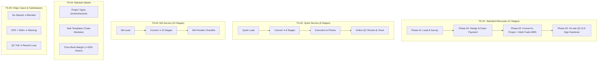

# 🧪 คู่มือและชุดทดสอบระบบฉบับสมบูรณ์ (End-to-End Test Scenarios & QA Test Plan)
**Project:** NexTime (vbooking / BuildFlow)  
**Author:** PM & QA Lead Engineer  
**Coverage:** Phase 01 to Phase 04 + Convert to Project Engine + Multi-Trade WBS + Maintain Master Configuration  
**Target URL:** `https://vibepmt.online` (Production) / `http://localhost:5173` (Local Dev)  
**File for Google Sheets Import:** `TEST_SCENARIOS_GOOGLE_SHEET.csv`

---

## 📑 สารบัญชุดการทดสอบ (Test Scenarios Index)

1. [ภาพรวมและบทบาทผู้ใช้งานในการทดสอบ (Test Personas & Test Data)](#1-ภาพรวมและบทบาทผู้ใช้งานในการทดสอบ)
2. [ตารางสรุปชุดการทดสอบ (Test Scenario Matrix)](#2-ตารางสรุปชุดการทดสอบ)
3. [TS-01: โครงการรีโนเวทเต็มรูปแบบ (Full Standard Renovate 11 Stages + Multi-Trade WBS + On-site QC)](#3-ts-01-โครงการรีโนเวทเต็มรูปแบบ-full-standard-renovate)
4. [TS-02: โครงการบริการด่วน (Quick Service 8 Stages + Online QC Review)](#4-ts-02-โครงการบริการด่วน-quick-service-8-stages)
5. [TS-03: โครงการงานซ่อมบำรุง (Maintenance / MA Service 10 Stages)](#5-ts-03-โครงการงานซ่อมบำรุง-maintenance--ma-service-10-stages)
6. [TS-04: การตั้งค่าระบบหลัก (Maintain Master & Dynamic Configuration)](#6-ts-04-การตั้งค่าระบบหลัก-maintain-master--configuration)
7. [TS-05: การทดสอบเงื่อนไขข้อผิดพลาดและส่งแก้งาน (Exception, Gatekeepers & Rework Loop)](#7-ts-05-การทดสอบเงื่อนไขข้อผิดพลาดและส่งแก้งาน)
8. [แบบฟอร์มบันทึกผลการตรวจรับระบบ (UAT Sign-Off Sheet)](#8-แบบฟอร์มบันทึกผลการตรวจรับระบบ)

---

## 1. ภาพรวมและบทบาทผู้ใช้งานในการทดสอบ (Test Personas & Test Data)

### 👥 บัญชีผู้ใช้งานที่ใช้ในการทดสอบ (Test Personas):
| บทบาท (Role) | บัญชี / ตัวแทน | หน้าที่ในกระบวนการทดสอบ |
| :--- | :--- | :--- |
| **Sales / CRM** | `sales@vibepmt.online` หรือ Demo Admin | บันทึก Lead, นัดหมายสำรวจ, บันทึกผลการ Visit หน้างาน |
| **QC Inspector** | ทีมช่าง QC (เช่น ช่างประเมินหน้างาน) | ออกตรวจพื้นที่ (Phase 01) และตรวจรับงาน On-site / Online QC (Phase 04) |
| **Designer / PM** | `pm@vibepmt.online` หรือ Demo PM | อัปโหลดแบบ 2D/3D, อนุมัติแบบ, ออกใบเสนอราคา BOQ, จัดการ Multi-Trade WBS |
| **Finance / Admin** | `admin@vibepmt.online` หรือ Demo Admin | บันทึกเงินมัดจำ (Down Payment), ตรวจสอบสลิป, แปลงเป็น Project, ตั้งค่า Master |
| **Technician (ช่าง)** | ทีมช่าง INT (ช่างไฟ, ช่างแอร์, ช่างฝ้า, ช่างกระเบื้อง) | เช็คอินพิกัด GPS, ถ่ายรูปสดหน้างาน, กรองงานตามแท็ก, บันทึกเวลา Timesheet, เช็คเอาท์ |
| **Customer (ลูกค้า)** | คุณสมชาย ใจดี (ลูกค้าทดสอบ) | ตรวจรับแบบ 3D, ตรวจรับมอบงาน, ให้คะแนน 5 ดาว และเซ็นชื่อ E-Signature |

---

## 2. ตารางสรุปชุดการทดสอบ (Test Scenario Matrix)



---

## 3. TS-01: โครงการรีโนเวทเต็มรูปแบบ (Full Standard Renovate)

> **วัตถุประสงค์:** ทดสอบกระบวนการทำงานครบทั้ง 4 เฟส ตั้งแต่ลูกค้ารายใหม่ สำรวจหน้างาน ออกแบบ เสนอราคา จ่ายมัดจำ แปลงโครงการ 11 สเตจ จัดการหลายหมวดช่าง (Multi-Trade WBS) ตรวจ On-site QC และปิดโครงการ

| Step ID | ขั้นตอนการทดสอบ (Action) | ข้อมูลที่ใช้ทดสอบ (Test Data) | ผลลัพธ์ที่คาดหวัง (Expected Result) | สถานะ (Pass/Fail) |
| :--- | :--- | :--- | :--- | :--- |
| **1.1** | ไปที่เมนู **Leads** (`/leads`) ➔ คลิก **"+ เพิ่มลูกค้าใหม่"** | • ชื่อ: คุณสมชาย ใจดี<br/>• เบอร์: `081-234-5678`<br/>• ประเภทงาน: `Renovate Service`<br/>• งบประมาณ: `150,000` บาท | รายการ Lead ใหม่ปรากฏในตาราง พร้อมสถานะ **"New Lead"** | [ ] Pass<br/>[ ] Fail |
| **1.2** | คลิกปุ่ม **"📅 นัดหมายช่างประเมิน"** ในแถวรายการ Lead | • วัน-เวลา: พรุ่งนี้ 10:00 น.<br/>• เลือกช่าง QC: ช่างที่มีคิวว่าง<br/>• พิกัด: `13.8519, 100.6434` | ระบบตรวจสอบคิวว่างไม่ซ้อนทับ แสดง Preview Google Maps และบันทึกนัดหมายสำเร็จ | [ ] Pass<br/>[ ] Fail |
| **1.3** | เมื่อกลับจากพื้นที่ คลิกปุ่ม **"📋 บันทึกผล Visit"** | • ผล: `เข้า Visit สำเร็จ`<br/>• สภาพหน้างาน: บ้านเดี่ยว 2 ชั้น ปรับปรุงห้องรับแขก<br/>• ดำเนินการต่อ: `ส่งใบเสนอราคา` | บันทึกสำเร็จ ➔ สถานะ Lead ปรับเป็น **"Pending Quote"** อัตโนมัติ และแสดงประวัติในแท็บ History | [ ] Pass<br/>[ ] Fail |
| **1.4** | ที่หน้ารายชื่อ Leads คลิกปุ่ม **"🎨 แบบ 2D/3D"** | • ประเภทแบบ: `3D Perspective`<br/>• Revision: `Rev A`<br/>• แนบไฟล์: อัปโหลดรูปภาพ 3D หรือใส่ URL | รูปภาพ Thumbnail แสดงผลชัดเจน พร้อมรายการเวอร์ชันแบบในประวัติ | [ ] Pass<br/>[ ] Fail |
| **1.5** | ทดสอบการอนุมัติแบบ: คลิกปุ่ม **"✅ ลูกค้าอนุมัติแบบ (Design Approved)"** | • ระบุความคิดเห็น: "ลูกค้าชอบโทนสีและแปลนห้อง สรุปตามแบบ Rev A" | สถานะ Lead ปรับเป็น **"Design Approved"** แสดง Badge สีเขียว | [ ] Pass<br/>[ ] Fail |
| **1.6** | ไปที่เมนู **Quotations** หรือแท็บใบเสนอราคา ➔ ออกใบเสนอราคา BOQ | • ดึงรายการจาก Service Price Book: งานฝ้า + ไฟ + ปูพื้น<br/>• ยอดรวมสุทธิ: `120,000` บาท | ออกใบเสนอราคาเลขที่ `QT-xxx` สถานะ Approved ยอดเงิน 120,000 บาท | [ ] Pass<br/>[ ] Fail |
| **1.7** | ที่หน้า Leads คลิกปุ่ม **"💰 รับมัดจำ & แปลงงาน"** | • ระบบคำนวณมัดจำ 50%: `60,000` บาท<br/>• แนบลิงก์สลิปโอนเงินธนาคาร | บันทึกการรับเงินมัดจำสำเร็จ ➔ ปลดล็อกปุ่ม **"🚀 แปลงเป็นโครงการติดตั้ง (Convert to Project)"** | [ ] Pass<br/>[ ] Fail |
| **1.8** | คลิกปุ่ม **"🚀 แปลงเป็นโครงการติดตั้ง"** หรือเลือกเมนูจุด 3 จุด **"🚀 5. แปลงเป็นโครงการ"** | ยืนยันการแปลงงาน | ระบบสร้าง Smart Project ID (`PRBNA...`), สืบทอดพิกัด GPS Geofencing 500m, เปิด Kanban 11 ขั้นตอนสมบูรณ์ | [ ] Pass<br/>[ ] Fail |
| **1.9** | ในหน้า **Project Plan** ➔ นำเข้าแม่แบบชุดงานหลายหมวดช่าง | • ระบุพื้นที่: `ห้องรับแขก`<br/>• ติ๊กเลือก: `[✓] ไฟฟ้า [✓] แอร์ [✓] ฝ้า [✓] พื้น` | รวม Tasks ย่อยทั้ง 4 หมวดเข้าสู่โครงการเดียว พร้อมติดแท็ก เช่น `[ห้องรับแขก - แอร์] เดินท่อน้ำยา` | [ ] Pass<br/>[ ] Fail |
| **1.10** | ช่างเปิดเมนู **Site Check-In/Out** (`/site-checkin`) | • ช่างเปิด GPS เบราว์เซอร์<br/>• เปิดกล้องสดถ่ายภาพหน้างาน | ระบบยืนยันพิกัด Geofence 500m ผ่าน บันทึกเวลาเริ่มงานและรูปถ่ายเข้าสู่ Timesheet | [ ] Pass<br/>[ ] Fail |
| **1.11** | ช่างเฉพาะทางกรองการ์ดงานและลงเวลา Timesheet | • ช่างไฟกรอง `#ไฟฟ้า`<br/>• ช่างแอร์กรอง `#แอร์` | บอร์ดแสดงเฉพาะการ์ดงานของหมวดช่างที่เลือก และบันทึกต้นทุนค่าแรงสะสมแยกตามหมวด | [ ] Pass<br/>[ ] Fail |
| **1.12** | ที่หน้า Project Detail คลิกปุ่ม **"🏅 QC & ส่งมอบงาน (Phase 04)"** | • เลือกโหมด: **"📍 On-site QC Inspection"** | แสดง Digital QC Checklist 5 ด้านหลักสำหรับงานภาคสนาม | [ ] Pass<br/>[ ] Fail |
| **1.13** | ตรวจ Checklist ทั้ง 5 ข้อ ➔ ติ๊กเลือก **"✅ ผ่าน (Pass)"** ครบทุกข้อ ➔ แนบรูปภาพผลงาน ➔ บันทึก | • ผล: `🏆 ผ่านเกณฑ์ QC (Passed On-site)`<br/>• แนบภาพถ่ายห้องรับแขกที่เสร็จสมบูรณ์ | บันทึกผล QC สำเร็จ ➔ ระบบสลับไปยัง **Tab 2: ส่งมอบงาน & E-Sign** อัตโนมัติ | [ ] Pass<br/>[ ] Fail |
| **1.14** | **Tab 2 (Handover & E-Sign):** ให้ลูกค้าประเมินความพึงพอใจและลงลายมือชื่อ | • คะแนน: 5 ดาว ⭐⭐⭐⭐⭐<br/>• เซ็นชื่อสดบนจอ (HTML5 Canvas)<br/>• รับประกัน: `12 เดือน` (1 ปี) | ลายเซ็นและคะแนนดาวแสดงผลชัดเจน ➔ คลิก **"ต่อไป: ตัดจ่าย & ปิด Job ➔"** | [ ] Pass<br/>[ ] Fail |
| **1.15** | **Tab 3 (BMT Settlement):** บันทึกการรับชำระเงินงวดสุดท้ายและปิดโครงการ | • ยอดเงินงวดสุดท้าย: `60,000` บาท (Paid)<br/>• คลิกปุ่ม **"🏁 ยืนยันปิดโครงการสมบูรณ์"** | สถานะโครงการเปลี่ยนเป็น **"Completed"** สมบูรณ์ ปิดโครงการใน BMT เรียบร้อย | [ ] Pass<br/>[ ] Fail |

---

## 4. TS-02: โครงการบริการด่วน (Quick Service 8 Stages)

> **วัตถุประสงค์:** ทดสอบโครงการประเภทด่วน ที่จัดสรร 8 ขั้นตอน Kanban และใช้การตรวจแบบ **Online QC Review ผ่านรูปถ่าย**

| Step ID | ขั้นตอนการทดสอบ (Action) | ข้อมูลที่ใช้ทดสอบ (Test Data) | ผลลัพธ์ที่คาดหวัง (Expected Result) | สถานะ (Pass/Fail) |
| :--- | :--- | :--- | :--- | :--- |
| **2.1** | สร้าง Lead ประเภท `Quick service` ➔ กด Convert to Project | • ชื่องาน: ซ่อมกระเบื้องร่อนด่วน<br/>• ประเภท: `Quick service` | ระบบสร้างโครงการพร้อมจัดสรร **8 ขั้นตอน Kanban** (`To Do` ➔ `ชำระเงิน` ➔ `Assign` ➔ `Check-in` ➔ `Check-out` ➔ `QC` ➔ `Aftersale` ➔ `Close`) | [ ] Pass<br/>[ ] Fail |
| **2.2** | ช่างเข้าปฏิบัติงาน ➔ ถ่ายรูปงานติดตั้งและ Check-out รายงานผล | • ช่างแนบรูปถ่ายงานซ่อมกระเบื้องที่ปูใหม่และยาแนวเรียบร้อย | ภาพถ่ายถูกบันทึกเข้าระบบพร้อมสำหรับการตรวจ Online | [ ] Pass<br/>[ ] Fail |
| **2.3** | เจ้าหน้าที่ QC / PM เปิดหน้าต่าง **"🏅 QC & ส่งมอบงาน"** | • ระบบ Auto-select โหมด: **"📱 Online QC Review"** | แสดงเกณฑ์ตรวจประเมิน 4 ข้อสำหรับ Quick Job โดยไม่ต้องลงพื้นที่ | [ ] Pass<br/>[ ] Fail |
| **2.4** | ตรวจสอบรูปถ่าย ➔ กด **"✅ ผ่าน (Pass)"** ทั้ง 4 ข้อ ➔ คลิก **"บันทึกผล Online QC Review"** | • ผล: `🏆 ผ่านเกณฑ์ QC (Approved Online)` | ผ่าน QC ทางออนไลน์ได้ทันทีโดยไม่ต้องออกพื้นที่จริง | [ ] Pass<br/>[ ] Fail |
| **2.5** | ลูกค้าลงนาม E-Signature ➔ ยืนยันปิด Job ในแท็บ Settlement | • เซ็นรับมอบงาน ➔ ปิดโครงการ | ปิด Job เสร็จสิ้น รวดเร็ว สมบูรณ์ | [ ] Pass<br/>[ ] Fail |

---

## 5. TS-03: โครงการงานซ่อมบำรุง (Maintenance / MA Service 10 Stages)

> **วัตถุประสงค์:** ทดสอบโครงการประเภท MA ที่จัดสรร 10 ขั้นตอน Kanban และการดึงชุดงาน Preventive Maintenance

| Step ID | ขั้นตอนการทดสอบ (Action) | ข้อมูลที่ใช้ทดสอบ (Test Data) | ผลลัพธ์ที่คาดหวัง (Expected Result) | สถานะ (Pass/Fail) |
| :--- | :--- | :--- | :--- | :--- |
| **3.1** | สร้าง Lead ประเภท `Maintenance (งานซ่อมบำรุง MA)` ➔ Convert เป็นโครงการ | • ชื่องาน: ตรวจเช็คระบบแอร์และฝ้ารายปี<br/>• ประเภท: `Maintenance` | ระบบสร้างโครงการพร้อมจัดสรร **10 ขั้นตอน Kanban** (เพิ่มขั้นตอน `Buy-Survey` ➔ `Survey`) | [ ] Pass<br/>[ ] Fail |
| **3.2** | เปิดหน้า Tasks ➔ ดึงแม่แบบ MA Checklist ➔ ช่างบันทึกผลตรวจและรูปถ่าย | • ตรวจสอบ 10 รายการตามงวดสัญญา MA | บันทึกผลการบำรุงรักษาและเก็บหลักฐานพร้อมส่งมอบตามงวด | [ ] Pass<br/>[ ] Fail |

---

## 6. TS-04: การตั้งค่าระบบหลัก (Maintain Master & Configuration)

> **วัตถุประสงค์:** ทดสอบความยืดหยุ่นในการเปิด-ปิดประเภทโครงการ, แม่แบบชุดงานช่าง และ Price Book Margin

| Step ID | ขั้นตอนการทดสอบ (Action) | ข้อมูลที่ใช้ทดสอบ (Test Data) | ผลลัพธ์ที่คาดหวัง (Expected Result) | สถานะ (Pass/Fail) |
| :--- | :--- | :--- | :--- | :--- |
| **4.1** | ไปที่ **Maintain Master** ➔ แท็บ `1. Project Types` ➔ ทดลองสลับสถานะ Active / Inactive | • ปิด/เปิดประเภทโครงการ เช่น Installer | ระบบบันทึกสถานะทันที และแสดงเฉพาะประเภทที่ Active ในหน้าสร้าง Lead/Project | [ ] Pass<br/>[ ] Fail |
| **4.2** | แท็บ `2. Task Templates` ➔ เพิ่มชุดแม่แบบงานช่างใหม่ | • เพิ่มชุดงาน: `[Template] งานสุขาภิบาลและประปา` พร้อม 4 Tasks | ชุดแม่แบบใหม่ปรากฏในรายการ และพร้อมให้ดึงไปใช้งานใน Project Plan | [ ] Pass<br/>[ ] Fail |
| **4.3** | แท็บ `Price Book` ➔ ตรวจสอบการคำนวณ Margin % | • ราคาขาย 1,000 บาท ต้นทุน 600 บาท (Margin 40%) | แสดงป้ายกำไรสีเขียวสำหรับ Margin >= 30% และป้ายสีส้มสำหรับ < 30% | [ ] Pass<br/>[ ] Fail |

---

## 7. TS-05: การทดสอบเงื่อนไขข้อผิดพลาดและส่งแก้งาน (Exception & Gatekeepers)

> **วัตถุประสงค์:** ตรวจสอบความถูกต้องของ Business Rules, Gatekeeper ป้องกันข้อผิดพลาด และวงรอบการส่งแก้งาน (Rework)

| Step ID | กรณีทดสอบ (Test Case) | วิธีการทดสอบ (Test Steps) | ผลลัพธ์ที่ต้องเกิดขึ้น (Expected Behavior) | สถานะ (Pass/Fail) |
| :--- | :--- | :--- | :--- | :--- |
| **5.1** | **Down Payment Gatekeeper Enforcement** | พยายามกดแปลง Lead เป็นโครงการโดยที่ยังไม่ได้บันทึกรับเงินมัดจำ | ปุ่ม "แปลงเป็นโครงการ" จะถูกล็อก ไม่สามารถกดได้จนกว่าจะกรอกและบันทึกเงินมัดจำ | [ ] Pass<br/>[ ] Fail |
| **5.2** | **GPS Geofencing Warning** | ช่างกด Check-in ณ ตำแหน่งที่อยู่นอกรัศมี 500 เมตรจากพิกัดไซต์งาน | ระบบแจ้งเตือนระยะห่างเกินเกณฑ์พิกัดจริง และบันทึกพิกัดจริงลง Log เพื่อตรวจสอบ | [ ] Pass<br/>[ ] Fail |
| **5.3** | **QC Failed ➔ Trigger Rework Loop** | ในหน้าจอ QC Inspection ให้ติ๊กข้อใดข้อหนึ่งเป็น **"❌ ไม่ผ่าน (Defect)"** และเลือกผล **"⚠️ ไม่ผ่าน — สั่งช่างแก้งาน (Rework)"** | 1. ระบบบันทึกสถานะโครงการเป็น **"In Progress / Reworking"**<br/>2. ไม่อนุญาตให้ผ่านไปขั้นตอน E-Signature ส่งมอบงาน<br/>3. ส่งงานกลับไปให้ทีมช่างใน Phase 03 ทำการแก้ไข | [ ] Pass<br/>[ ] Fail |
| **5.4** | **Re-inspection after Rework** | หลังช่างแก้ไขงานเสร็จ เปิด QC Modal ตรวจสอบซ้ำและเลือก **"Passed"** | ปลดล็อกเข้าสู่ขั้นตอน Handover & E-Signature ส่งมอบงานได้ตามปกติ | [ ] Pass<br/>[ ] Fail |
| **5.5** | **Canvas E-Signature Clear & Redraw** | ทดลองเซ็นชื่อผิด แล้วกดปุ่ม **"ล้างลายเซ็น"** | กระดาน Canvas ถูกล้างว่างเปล่า พร้อมให้เซ็นใหม่ได้อย่างลื่นไหล | [ ] Pass<br/>[ ] Fail |

---

## 8. แบบฟอร์มบันทึกผลการตรวจรับระบบ (UAT Sign-Off Sheet)

| หมวดหมู่การทดสอบ | จำนวน Test Cases | ผ่าน (Passed) | ไม่ผ่าน (Failed) | ผู้ทดสอบ (Tester) | วันที่ทดสอบ |
| :--- | :---: | :---: | :---: | :---: | :---: |
| **TS-01: Full Standard Renovate (11 Stages + Multi-Trade)** | 15 ข้อ | _______ | _______ | __________________ | ____/____/____ |
| **TS-02: Quick Service Fast-Track (8 Stages)** | 5 ข้อ | _______ | _______ | __________________ | ____/____/____ |
| **TS-03: Maintenance / MA Service (10 Stages)** | 2 ข้อ | _______ | _______ | __________________ | ____/____/____ |
| **TS-04: Maintain Master & Configuration** | 3 ข้อ | _______ | _______ | __________________ | ____/____/____ |
| **TS-05: Exception & Gatekeepers** | 5 ข้อ | _______ | _______ | __________________ | ____/____/____ |
| **รวมทั้งสิ้น (Total)** | **30 ข้อ** | _______ | _______ | **ความพร้อมขึ้นใช้งาน:** | [ ] GO [ ] NO-GO |

### ✍️ การลงนามรับรองผลการทดสอบ (Signatures):

```
ผู้จัดการโครงการ (PM Lead): _________________________ วันที่: _____/_____/_________
หัวหน้าทีมทดสอบ (QA Lead):  _________________________ วันที่: _____/_____/_________
ตัวแทนผู้ใช้งาน (Business User): _______________________ วันที่: _____/_____/_________
```
