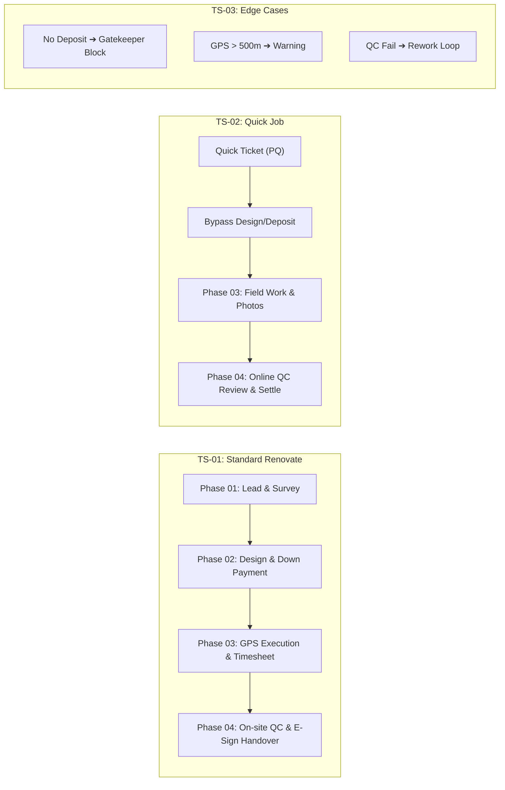

# 🧪 คู่มือและชุดทดสอบระบบฉบับสมบูรณ์ (End-to-End Test Scenarios & QA Test Plan)
**Project:** NexTime (vbooking / BuildFlow)  
**Author:** PM & QA Lead Engineer  
**Coverage:** Phase 01 to Phase 04 (Lead, Survey, Design, Payment, Execution, Online/On-site QC, E-Signature, Settlement)  
**Target URL:** `https://vibepmt.online` (Production) / `http://localhost:5173` (Local Dev)

---

## 📑 สารบัญชุดการทดสอบ (Test Scenarios Index)

1. [ภาพรวมและบทบาทผู้ใช้งานในการทดสอบ (Test Personas & Test Data)](#1-ภาพรวมและบทบาทผู้ใช้งานในการทดสอบ)
2. [ตารางสรุปชุดการทดสอบ (Test Scenario Matrix)](#2-ตารางสรุปชุดการทดสอบ)
3. [TS-01: โครงการรีโนเวท/Built-in เต็มรูปแบบ (Full Standard Workflow + On-site QC)](#3-ts-01-โครงการรีโนเวทbuilt-in-เต็มรูปแบบ-full-standard-workflow)
4. [TS-02: โครงการบริการด่วน/ติดตั้งย่อย (Quick Service Fast-Track + Online QC)](#4-ts-02-โครงการบริการด่วนติดตั้งย่อย-quick-service-fast-track)
5. [TS-03: การทดสอบเงื่อนไขข้อผิดพลาดและส่งแก้งาน (Exception, Geofence & Rework Loop)](#5-ts-03-การทดสอบเงื่อนไขข้อผิดพลาดและส่งแก้งาน)
6. [แบบฟอร์มบันทึกผลการตรวจรับระบบ (UAT Sign-Off Sheet)](#6-แบบฟอร์มบันทึกผลการตรวจรับระบบ)

---

## 1. ภาพรวมและบทบาทผู้ใช้งานในการทดสอบ (Test Personas & Test Data)

### 👥 บัญชีผู้ใช้งานที่ใช้ในการทดสอบ (Test Personas):
| บทบาท (Role) | บัญชี / ตัวแทน | หน้าที่ในกระบวนการทดสอบ |
| :--- | :--- | :--- |
| **Sales / CRM** | `sales@vibepmt.online` หรือ Demo Admin | บันทึก Lead, นัดหมายสำรวจ, บันทึกผลการ Visit หน้างาน |
| **QC Inspector** | ทีมช่าง QC (เช่น ช่างประเมินหน้างาน) | ออกตรวจพื้นที่ (Phase 01) และตรวจรับงาน On-site / Online QC (Phase 04) |
| **Designer / PM** | `pm@vibepmt.online` หรือ Demo PM | อัปโหลดแบบ 2D/3D, บันทึกผลลูกค้าอนุมัติแบบ, ออกใบเสนอราคา BOQ |
| **Finance / Admin** | `admin@vibepmt.online` หรือ Demo Admin | บันทึกเงินมัดจำ (Down Payment), ตรวจสอบสลิป, แปลงเป็น Project |
| **Technician (ช่าง)** | ทีมช่าง JMT (เช่น ช่างติดตั้ง) | เช็คอินพิกัด GPS, ถ่ายรูปสดหน้างาน, บันทึกเวลา Timesheet, เช็คเอาท์ |
| **Customer (ลูกค้า)** | คุณสมชาย ใจดี (ลูกค้าทดสอบ) | ตรวจรับแบบ 3D, ตรวจรับมอบงาน, ให้คะแนน 5 ดาว และเซ็นชื่อ E-Signature |

---

## 2. ตารางสรุปชุดการทดสอบ (Test Scenario Matrix)



---

## 3. TS-01: โครงการรีโนเวท/Built-in เต็มรูปแบบ (Full Standard Workflow)

> **วัตถุประสงค์:** ทดสอบกระบวนการทำงานครบทั้ง 4 เฟส ตั้งแต่ลูกค้ารายใหม่ สำรวจหน้างาน ออกแบบ เสนอราคา จ่ายมัดจำ ดำเนินการติดตั้ง ตรวจ On-site QC และปิดโครงการ

### 🔹 Phase 01: Lead & Survey (รับข้อมูล & สำรวจหน้างาน)
| Step ID | ขั้นตอนการทดสอบ (Action) | ข้อมูลที่ใช้ทดสอบ (Test Data) | ผลลัพธ์ที่คาดหวัง (Expected Result) | สถานะ (Pass/Fail) |
| :--- | :--- | :--- | :--- | :--- |
| **1.1** | ไปที่เมนู **Leads** (`/leads`) ➔ คลิก **"+ เพิ่มลูกค้าใหม่"** | • ชื่อ: คุณสมชาย ใจดี<br/>• เบอร์: `081-234-5678`<br/>• ประเภทงาน: `Renovate`<br/>• งบประมาณ: `150,000` บาท | รายการ Lead ใหม่ปรากฏในตาราง พร้อมสถานะ **"New Lead"** | [ ] Pass<br/>[ ] Fail |
| **1.2** | คลิกปุ่ม **"📅 นัดหมายช่างประเมิน"** ในแถวรายการ Lead | • วัน-เวลา: พรุ่งนี้ 10:00 น.<br/>• เลือกช่าง QC: ช่างที่มีคิวว่าง<br/>• พิกัด: `13.8519, 100.6434` | ระบบตรวจสอบคิวว่างไม่ซ้อนทับ แสดง Preview Google Maps และบันทึกนัดหมายสำเร็จ | [ ] Pass<br/>[ ] Fail |
| **1.3** | เมื่อกลับจากพื้นที่ คลิกปุ่ม **"📋 บันทึกผล Visit"** | • ผล: `เข้า Visit สำเร็จ`<br/>• สภาพหน้างาน: บ้านเดี่ยว 2 ชั้น ปูพื้นลามิเนตเดิมเสียหาย<br/>• ความต้องการ: เปลี่ยนพื้นกระเบื้องยาง SPC<br/>• ดำเนินการต่อ: `ส่งใบเสนอราคา` | บันทึกสำเร็จ ➔ สถานะ Lead ปรับเป็น **"Pending Quote"** อัตโนมัติ และแสดงประวัติในแท็บ History | [ ] Pass<br/>[ ] Fail |

---

### 🔹 Phase 02: Design, Quote & Payment (จัดการแบบ, ใบเสนอราคา & มัดจำ)
| Step ID | ขั้นตอนการทดสอบ (Action) | ข้อมูลที่ใช้ทดสอบ (Test Data) | ผลลัพธ์ที่คาดหวัง (Expected Result) | สถานะ (Pass/Fail) |
| :--- | :--- | :--- | :--- | :--- |
| **1.4** | ที่หน้ารายชื่อ Leads คลิกปุ่ม **"🎨 แบบ 2D/3D"** | • ประเภทแบบ: `3D Perspective`<br/>• Revision: `Rev A`<br/>• แนบไฟล์: อัปโหลดรูปภาพ 3D หรือใส่ URL | รูปภาพ Thumbnail แสดงผลชัดเจน พร้อมรายการเวอร์ชันแบบในประวัติ | [ ] Pass<br/>[ ] Fail |
| **1.5** | ทดสอบการอนุมัติแบบ: คลิกปุ่ม **"✅ ลูกค้าอนุมัติแบบ (Design Approved)"** | • ระบุความคิดเห็น: "ลูกค้าชอบโทนสีลายไม้ สรุปตามแบบ Rev A" | สถานะ Lead ปรับเป็น **"Design Approved"** แสดง Badge สีเขียว | [ ] Pass<br/>[ ] Fail |
| **1.6** | ไปที่เมนู **Quotations** หรือแท็บใบเสนอราคา ➔ ออกใบเสนอราคา BOQ | • ดึงรายการจาก Service Price Book: ปูกระเบื้อง SPC 80 ตร.ม.<br/>• ยอดรวมสุทธิ: `85,000` บาท | ออกใบเสนอราคาเลขที่ `QT-xxx` สถานะ Approved ยอดเงิน 85,000 บาท | [ ] Pass<br/>[ ] Fail |
| **1.7** | ที่หน้า Leads คลิกปุ่ม **"💰 รับมัดจำ & แปลงงาน"** | • ระบบคำนวณมัดจำ 50%: `42,500` บาท<br/>• แนบลิงก์สลิปโอนเงินธนาคาร<br/>• วันที่รับเงิน: วันนี้ | บันทึกการรับเงินมัดจำสำเร็จ ➔ ปลดล็อกปุ่ม **"🚀 แปลงเป็นโครงการติดตั้ง (Convert to Project)"** | [ ] Pass<br/>[ ] Fail |

---

### 🔹 Phase 03: Project Execution (แปลงเป็นโครงการ & ช่างลงพื้นที่)
| Step ID | ขั้นตอนการทดสอบ (Action) | ข้อมูลที่ใช้ทดสอบ (Test Data) | ผลลัพธ์ที่คาดหวัง (Expected Result) | สถานะ (Pass/Fail) |
| :--- | :--- | :--- | :--- | :--- |
| **1.8** | คลิกปุ่ม **"🚀 แปลงเป็นโครงการติดตั้ง"** | ยืนยันการแปลงงาน | ระบบสร้างโครงการใหม่พร้อม **Smart Project ID** (เช่น `PRBNA...`) สืบทอดพิกัด GPS และ Tasks แม่แบบอัตโนมัติ | [ ] Pass<br/>[ ] Fail |
| **1.9** | เข้าไปที่โครงการใหม่ ➔ เมนู **Site Check-In/Out** (`/site-checkin`) | • ช่างเปิดใช้งาน GPS เบราว์เซอร์<br/>• เปิดกล้องสดถ่ายภาพหน้างาน (Proof of Presence) | ระบบคำนวณระยะห่าง GPS อยู่ในรัศมี 500 เมตร บันทึกเวลา Check-In และรูปถ่ายสำเร็จ | [ ] Pass<br/>[ ] Fail |
| **1.10** | ไปที่หน้า **Board** ➔ เลื่อนการ์ดงานและบันทึกเวลา Timesheet | • ลากการ์ดงานจาก `To Do` ➔ `In Progress` ➔ `Done`<br/>• บันทึก % ความคืบหน้า 100% | แถบ Project Progress แสดงผล **100%** งานติดตั้งแล้วเสร็จสมบูรณ์ | [ ] Pass<br/>[ ] Fail |

---

### 🔹 Phase 04: QC, Handover & Settle (ตรวจ On-site QC & ส่งมอบงาน)
| Step ID | ขั้นตอนการทดสอบ (Action) | ข้อมูลที่ใช้ทดสอบ (Test Data) | ผลลัพธ์ที่คาดหวัง (Expected Result) | สถานะ (Pass/Fail) |
| :--- | :--- | :--- | :--- | :--- |
| **1.11** | ที่หน้า Project Detail คลิกปุ่ม **"🏅 QC & ส่งมอบงาน (Phase 04)"** | • เลือกโหมด: **"📍 On-site QC Inspection"** (สำหรับงาน Renovate) | แสดง Digital QC Checklist 5 ด้านหลักสำหรับงานภาคสนาม | [ ] Pass<br/>[ ] Fail |
| **1.12** | ตรวจ Checklist ทั้ง 5 ข้อ ➔ ติ๊กเลือก **"✅ ผ่าน (Pass)"** ครบทุกข้อ ➔ แนบรูปภาพผลงาน ➔ คลิก **"บันทึกผล On-site QC Inspection"** | • ผล: `🏆 ผ่านเกณฑ์ QC (Passed On-site)`<br/>• แนบภาพถ่ายพื้นผิวและแนวรอยต่อ | บันทึกผล QC สำเร็จ ➔ ระบบสลับไปยัง **Tab 2: ส่งมอบงาน & E-Sign** อัตโนมัติ | [ ] Pass<br/>[ ] Fail |
| **1.13** | **Tab 2 (Handover & E-Sign):** ให้ลูกค้าประเมินความพึงพอใจและลงลายมือชื่อ | • คะแนน: 5 ดาว ⭐⭐⭐⭐⭐<br/>• เซ็นชื่อสดบนจอ (HTML5 Canvas)<br/>• รับประกัน: `12 เดือน` (1 ปี) | ลายเซ็นและคะแนนดาวแสดงผลชัดเจน ➔ คลิก **"ต่อไป: ตัดจ่าย & ปิด Job ➔"** | [ ] Pass<br/>[ ] Fail |
| **1.14** | **Tab 3 (BMT Settlement):** บันทึกการรับชำระเงินงวดสุดท้ายและปิดโครงการ | • ยอดเงินงวดสุดท้าย: `42,500` บาท (Paid)<br/>• คลิกปุ่ม **"🏁 ยืนยันปิดโครงการสมบูรณ์ (Close & Settle Job)"** | สถานะโครงการเปลี่ยนเป็น **"Completed"** สมบูรณ์ ปิดโครงการใน BMT เรียบร้อย | [ ] Pass<br/>[ ] Fail |

---

## 4. TS-02: โครงการบริการด่วน/ติดตั้งย่อย (Quick Service Fast-Track)

> **วัตถุประสงค์:** ทดสอบโครงการประเภทด่วน (รหัส PQ) ที่ไม่ต้องทำแบบ 3D และใช้การตรวจแบบ **Online QC Review ผ่านรูปถ่าย**

| Step ID | ขั้นตอนการทดสอบ (Action) | ข้อมูลที่ใช้ทดสอบ (Test Data) | ผลลัพธ์ที่คาดหวัง (Expected Result) | สถานะ (Pass/Fail) |
| :--- | :--- | :--- | :--- | :--- |
| **2.1** | สร้างโครงการด่วนประเภท `quick_service` (รหัสขึ้นต้นด้วย `PQ...`) | • ชื่องาน: ติดตั้งเครื่องทำน้ำอุ่นด่วน<br/>• ประเภท: `quick_service` | ระบบเปิดโครงการและ Bypass Phase 1 & 2 เข้าสู่ Phase 3 เพื่อส่งช่างเข้าทำงานได้ทันที | [ ] Pass<br/>[ ] Fail |
| **2.2** | ช่างเข้าปฏิบัติงาน ➔ ถ่ายรูปงานติดตั้งและ Check-out รายงานผล | • ช่างแนบรูปถ่ายเครื่องทำน้ำอุ่นที่ติดตั้งเสร็จและเก็บสายไฟเรียบร้อย | ภาพถ่ายถูกบันทึกเข้าระบบพร้อมสำหรับการตรวจ Online | [ ] Pass<br/>[ ] Fail |
| **2.3** | เจ้าหน้าที่ QC / PM เปิดหน้าต่าง **"🏅 QC & ส่งมอบงาน"** | • ระบบ Auto-select โหมด: **"📱 Online QC Review"** | แสดงเกณฑ์ตรวจประเมิน 4 ข้อสำหรับ Quick Job | [ ] Pass<br/>[ ] Fail |
| **2.4** | ตรวจสอบรูปถ่าย ➔ กด **"✅ ผ่าน (Pass)"** ทั้ง 4 ข้อ ➔ คลิก **"บันทึกผล Online QC Review"** | • ผล: `🏆 ผ่านเกณฑ์ QC (Approved Online)` | ผ่าน QC ทางออนไลน์ได้ทันทีโดยไม่ต้องออกพื้นที่จริง | [ ] Pass<br/>[ ] Fail |
| **2.5** | ลูกค้าลงนาม E-Signature ➔ ยืนยันปิด Job ในแท็บ Settlement | • เซ็นรับมอบงาน ➔ ปิดโครงการ | ปิด Job เสร็จสิ้น รวดเร็ว สมบูรณ์ | [ ] Pass<br/>[ ] Fail |

---

## 5. TS-03: การทดสอบเงื่อนไขข้อผิดพลาดและส่งแก้งาน (Exception & Rework Loop)

> **วัตถุประสงค์:** ตรวจสอบความถูกต้องของ Business Rules, Gatekeeper ป้องกันข้อผิดพลาด และวงรอบการส่งแก้งาน (Rework)

| Step ID | กรณีทดสอบ (Test Case) | วิธีการทดสอบ (Test Steps) | ผลลัพธ์ที่ต้องเกิดขึ้น (Expected Behavior) | สถานะ (Pass/Fail) |
| :--- | :--- | :--- | :--- | :--- |
| **3.1** | **Down Payment Gatekeeper Enforcement** | พยายามกดแปลง Lead เป็นโครงการโดยที่ยังไม่ได้บันทึกรับเงินมัดจำ | ปุ่ม "แปลงเป็นโครงการ" จะถูกล็อก ไม่สามารถกดได้จนกว่าจะกรอกและบันทึกเงินมัดจำ | [ ] Pass<br/>[ ] Fail |
| **3.2** | **GPS Geofencing Warning** | ช่างกด Check-in ณ ตำแหน่งที่อยู่นอกรัศมี 500 เมตรจากพิกัดไซต์งาน | ระบบแจ้งเตือนระยะห่างเกินเกณฑ์พิกัดจริง และบันทึกพิกัดจริงลง Log เพื่อตรวจสอบ | [ ] Pass<br/>[ ] Fail |
| **3.3** | **QC Failed ➔ Trigger Rework Loop** | ในหน้าจอ QC Inspection ให้ติ๊กข้อใดข้อหนึ่งเป็น **"❌ ไม่ผ่าน (Defect)"** และเลือกผล **"⚠️ ไม่ผ่าน — สั่งช่างแก้งาน (Rework)"** | 1. ระบบบันทึกสถานะโครงการเป็น **"In Progress / Reworking"**<br/>2. ไม่อนุญาตให้ผ่านไปขั้นตอน E-Signature ส่งมอบงาน<br/>3. ส่งงานกลับไปให้ทีมช่างใน Phase 03 ทำการแก้ไข | [ ] Pass<br/>[ ] Fail |
| **3.4** | **Re-inspection after Rework** | หลังช่างแก้ไขงานเสร็จ เปิด QC Modal ตรวจสอบซ้ำและเลือก **"Passed"** | ปลดล็อกเข้าสู่ขั้นตอน Handover & E-Signature ส่งมอบงานได้ตามปกติ | [ ] Pass<br/>[ ] Fail |
| **3.5** | **Canvas E-Signature Clear & Redraw** | ทดลองเซ็นชื่อผิด แล้วกดปุ่ม **"ล้างลายเซ็น"** | กระดาน Canvas ถูกล้างว่างเปล่า พร้อมให้เซ็นใหม่ได้อย่างลื่นไหล | [ ] Pass<br/>[ ] Fail |

---

## 6. แบบฟอร์มบันทึกผลการตรวจรับระบบ (UAT Sign-Off Sheet)

| หมวดหมู่การทดสอบ | จำนวน Test Cases | ผ่าน (Passed) | ไม่ผ่าน (Failed) | ผู้ทดสอบ (Tester) | วันที่ทดสอบ |
| :--- | :---: | :---: | :---: | :---: | :---: |
| **TS-01: Full Standard Renovate (4 Phases)** | 14 ข้อ | _______ | _______ | __________________ | ____/____/____ |
| **TS-02: Quick Service Fast-Track** | 5 ข้อ | _______ | _______ | __________________ | ____/____/____ |
| **TS-03: Exception & Rework Loop** | 5 ข้อ | _______ | _______ | __________________ | ____/____/____ |
| **รวมทั้งสิ้น (Total)** | **24 ข้อ** | _______ | _______ | **ความพร้อมขึ้นใช้งาน:** | [ ] GO [ ] NO-GO |

### ✍️ การลงนามรับรองผลการทดสอบ (Signatures):

```
ผู้จัดการโครงการ (PM Lead): _________________________ วันที่: _____/_____/_________
หัวหน้าทีมทดสอบ (QA Lead):  _________________________ วันที่: _____/_____/_________
ตัวแทนผู้ใช้งาน (Business User): _______________________ วันที่: _____/_____/_________
```
