# คู่มือการใช้งานระบบ NexTime (Project & Timesheet Management System)

> **NexTime** เป็นระบบเว็บแอปพลิเคชันระดับองค์กรสำหรับบริหารจัดการโครงการ (Project Management), บันทึกเวลาทำงาน (Timesheet Logging), วางแผนการทำงานแบบอไจล์ (Agile Kanban Board, Sprints & Releases), และการตรวจสอบอนุมัติเวลางานของทีมงานอย่างมีประสิทธิภาพ รองรับการลงชื่อเข้าใช้งานทั้งแบบ **Email/Password** และ **LINE Login** (พร้อมแผนรองรับระบบ 2FA ในอนาคต) มาพร้อมระบบ **Chatbot** ผู้ช่วยอัจฉริยะ, **Permission Schemes** สำหรับปรับแต่งสิทธิ์การใช้งานแบบยืดหยุ่น, **Cost Rates** สำหรับคำนวณต้นทุนโครงการ, **Project Baselines** สำหรับเปรียบเทียบแผนงาน และ **Notification Bell** สำหรับแจ้งเตือนงานที่ครบกำหนด พร้อมดีไซน์สุดพรีเมียมในรูปแบบ Dark Mode และ Glassmorphism

---

## 📖 สารบัญ

1. [การลงชื่อเข้าใช้งานระบบ (Authentication)](#-1-การลงชื่อเข้าใช้งานระบบ-authentication)
2. [โครงสร้างสิทธิ์การใช้งาน (Roles & Permissions)](#-2-โครงสร้างสิทธิ์การใช้งาน-roles--permissions)
3. [เริ่มต้นใช้งานอย่างรวดเร็ว (Quick Start Guide)](#-3-เริ่มต้นใช้งานอย่างรวดเร็ว-quick-start-guide) [NEW!]
4. [หน้าภาพรวมระบบ (Dashboard)](#-4-หน้าภาพรวมระบบ-dashboard)
   - [ระบบลูกค้าเป้าหมายและการนัดหมายสำรวจ (Leads & Smart Survey Booking)](#-41-ระบบลูกค้าเป้าหมายและการนัดหมายสำรวจ-leads--smart-survey-booking---ขั้นตอนที่-1--2-new) [NEW!]
   - [ระบบบันทึกผลการเข้า Visit Site ลูกค้า (Site Visit Results)](#-42-ระบบบันทึกผลการเข้า-visit-site-ลูกค้า-site-visit-results--next-actions-new) [NEW!]
5. [การจัดการโครงการ (Project Management)](#-5-การจัดการโครงการ-project-management)
6. [การบันทึกชั่วโมงทำงาน (Timesheet)](#-6-การบันทึกชั่วโมงทำงาน-timesheet)
7. [บอร์ดจัดการงานทีม (Agile Kanban Board)](#-7-บอร์ดจัดการงานทีม-agile-kanban-board)
   - [คอลัมน์และสถานะของงานย่อย](#คอลัมน์และสถานะของงานย่อย-workflow-columns)
   - [การจัดระดับความสำคัญของงาน (Priority)](#การจัดระดับความสำคัญของงาน-priority-color-coding)
   - [Agile Sprints & Backlog Planner](#agile-sprints--backlog-planner)
   - [Release Management](#release-management-รุ่นและการออกเวอร์ชัน)
   - [Backlog Grooming & Timeline View](#backlog-grooming--timeline-view) [NEW!]
8. [ระบบแผนงานและแผนภูมิแกนต์ (Project Plan & Gantt Chart)](#-8-ระบบแผนงานและแผนภูมิแกนต์-project-plan--gantt-chart)
   - [Project Baselines & Comparison](#project-baselines--versioning) [NEW!]
9. [การอนุมัติเวลาทำงานและการจัดการพนักงาน (Approvals & Employee Management)](#-9-การอนุมัติเวลาทำงานและการจัดการพนักงาน-approvals--employee-management)
10. [รายงานและกราฟสถิติ (Reports)](#-10-รายงานและกราฟสถิติ-reports)
    - [Overview](#a-overview-ภาพรวม)
    - [Personal Reports](#b-personal-reports-รายงานส่วนบุคคล) [NEW!]
    - [Project Cost Reports](#c-project-cost-reports-รายงานต้นทุนโครงการ) [NEW!]
    - [Export CSV/PDF](#d-export-ส่งออกรายงาน) [NEW!]
11. [การตั้งค่าระบบ (Settings)](#-11-การตั้งค่าระบบ-settings)
    - [Milestone Templates](#a-การจัดการแม่แบบ-milestone-milestone-templates)
    - [Git Webhooks](#b-ระบบ-git-webhooks)
    - [Permission Schemes](#c-permission-schemes-ระบบจัดการสิทธิ์แบบปรับแต่งได้) [NEW!]
    - [Cost Rates](#d-cost-rates--อัตราค่าแรง-labor-rates) [NEW!]
12. [ระบบแจ้งเตือน (Notifications)](#-12-ระบบแจ้งเตือน-notifications)
    - [Email Notifications](#a-email-notifications-การแจ้งเตือนทางอีเมล)
    - [Notification Bell](#b-notification-bell-ระฆังแจ้งเตือนในระบบ) [NEW!]
13. [ระบบ Chatbot (AI Assistant)](#-13-ระบบ-chatbot-ai-assistant) [NEW!]
14. [การใช้งานบนมือถือ (Mobile Responsive)](#-14-การใช้งานบนมือถือ-mobile-responsive) [NEW!]
15. [คำถามที่พบบ่อย (FAQ & Troubleshooting)](#-15-คำถามที่พบบ่อย-faq--troubleshooting)

---

## 🔑 1. การลงชื่อเข้าใช้งานระบบ (Authentication)

ระบบ NexTime ถูกออกแบบมาให้มีความปลอดภัยและใช้งานง่าย โดยสนับสนุนช่องทางการเข้าสู่ระบบหลายรูปแบบดังนี้:

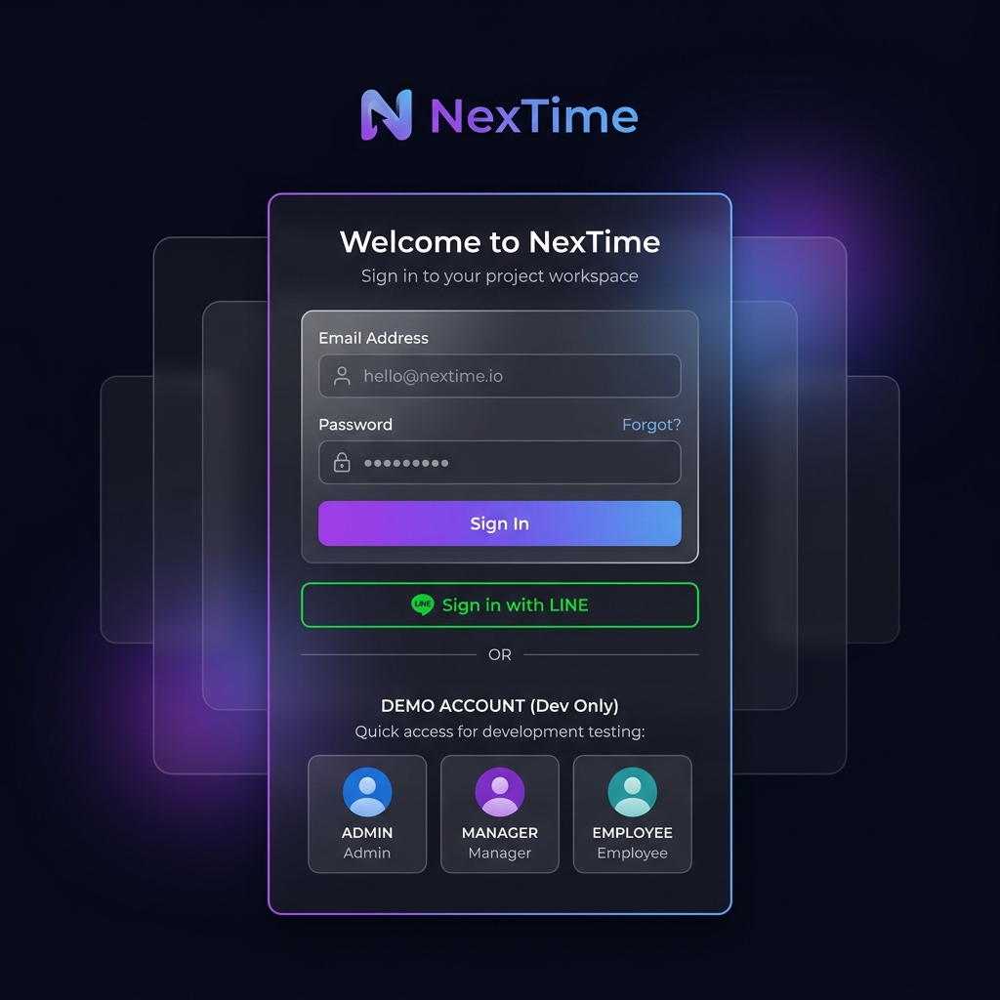

### A. ลงชื่อเข้าใช้งานด้วยอีเมลและรหัสผ่าน (Email & Password Login) [NEW!]

1. ในหน้าหลัก กรอก **อีเมลบริษัท** ในช่อง Email
2. กรอก **รหัสผ่าน** ในช่อง Password (รหัสผ่านเริ่มต้นที่ Admin กำหนดให้)
3. คลิกปุ่ม **"Sign In"**
4. ระบบจะตรวจสอบข้อมูลกับฐานข้อมูล (SHA-256 Hash) หากถูกต้องจะนำเข้าสู่หน้า Dashboard

> [!NOTE]
> หากลืมรหัสผ่าน กรุณาติดต่อ Admin เพื่อรีเซ็ตรหัสผ่านให้

### B. ลงชื่อเข้าใช้งานด้วย LINE (LINE Login)

1. ในหน้าหลัก ให้คลิกปุ่ม **"Sign in with LINE"**
2. ระบบจะเปลี่ยนเส้นทางไปยังหน้าลงทะเบียน/เข้าใช้งานของ LINE โดยตรง
3. ทำการสแกน **QR Code** หรือกรอกอีเมลและรหัสผ่านของบัญชี LINE
4. **การจับคู่โปรไฟล์อัตโนมัติ (Auto-binding):** ระบบจะตรวจดูอีเมลบริษัทที่ลงทะเบียนไว้ในฐานข้อมูล หากตรงกันกับอีเมลในบัญชี LINE ระบบจะทำการเชื่อมโยงข้อมูลและนำเข้าสู่หน้าแดชบอร์ดโดยอัตโนมัติ

> [!WARNING]
> บัญชี LINE ของคุณต้องใช้**อีเมลบริษัท**ที่ลงทะเบียนไว้ในระบบ หรือตรงกับโปรไฟล์ที่ Admin สร้างขึ้น หากมีปัญหาล็อกอินและแสดงข้อความแจ้งเตือนสีแดง *⚠️ ล็อกอินไม่สำเร็จ / Sign in Failed (unauthorized)* กรุณาติดต่อแอดมินประจำระบบเพื่อยืนยันข้อมูลอีเมลของท่าน

### C. ระบบ 2FA (แผนงานในอนาคต)

ตามข้อเสนอแนะเชิงดีไซน์ในคู่มือระบบ (system_setup.md) ระบบได้ออกแบบโครงสร้างรองรับการทำ 2FA ผ่านทางอีเมลบริษัทไว้ดังนี้ (ปัจจุบันยังไม่ได้เปิดใช้งานในระบบจริง):

1. **การเข้าใช้งานครั้งแรก:** พนักงานเข้าใช้ระบบผ่าน LINE Login จากนั้นระบุอีเมลบริษัท
2. **การส่ง OTP:** ระบบจะส่งรหัส **OTP 6 หลัก** ไปยังอีเมลบริษัทเพื่อยืนยันความเป็นพนักงานจริง
3. **การผูกบัญชี:** เมื่อกรอกรหัสถูกต้อง ระบบจึงจะผูก LINE User ID เข้ากับฐานข้อมูลโดยสมบูรณ์ เพื่อลดความจำเป็นในการแชร์ข้อมูลส่วนบุคคลจาก LINE โดยไม่จำเป็น

### D. บัญชีทดลองระดับผู้พัฒนา (Demo Account Switcher - เฉพาะ Local Dev)

หากรันระบบบนสภาพแวดล้อม `localhost` หรือ `127.0.0.1` ระบบจะแสดงส่วนช่วยเหลือพิเศษ **"Or sign in with Demo Account (Dev Only)"** เพื่อให้ผู้พัฒนาระบบสามารถเปลี่ยนบทบาท (Admin, Manager/PM, Employee) ไปมาได้อย่างรวดเร็ว เพื่อทำการทดสอบฟังก์ชันงาน

---

## 👥 2. โครงสร้างสิทธิ์การใช้งาน (Roles & Permissions)

เพื่อความเป็นระเบียบในการบริหารจัดสรรทรัพยากร ระบบแบ่งสิทธิ์ผู้ใช้ออกเป็น 2 เลเยอร์:

### 1. สิทธิ์ระดับระบบ (Global Role)

* **Admin (ผู้ดูแลระบบ):**
  * สิทธิ์สูงสุดในการเข้าถึงทุกโมดูล
  * จัดการข้อมูลส่วนตัวและสิทธิ์ของพนักงานทุกคนในระบบ
  * สร้างโปรเจกต์ใหม่และแก้ไขรายละเอียดได้ทุกโปรเจกต์
  * ตั้งค่าและลบ **Milestone Templates (แม่แบบแผนงาน)**
  * ตรวจสอบและอนุมัติเวลางานของทุกคนในบริษัท
  * จัดการ **Permission Schemes** และ **Cost Rates**
* **Manager / Owner:**
  * เหมาะสำหรับผู้บริหารโครงการหรือเจ้าของงานหลัก
  * สามารถสร้างโปรเจกต์ใหม่ และดูแลความคืบหน้าของโครงการต่าง ๆ ที่ตนเป็นเจ้าของ
  * เข้าดูรายงานภาพรวมสะสมของทั้งแผนกได้
* **Employee (พนักงานทั่วไป):**
  * พนักงานฝ่ายปฏิบัติงาน เช่น SA, Developer, Designer, QA
  * สามารถล็อกอิน บันทึกเวลางานส่วนตัว (Timesheet) ของตนเอง และส่งคำขออนุมัติ
  * เข้าใช้งานบอร์ดงานทีมเพื่ออัปเดตสถานะของตนเอง

### 2. บทบาทระดับโครงการ (Project Role)

* **PM (Project Manager - ประจำโครงการ):**
  * เป็นแอดมินดูแลความเรียบร้อยของโปรเจกต์ย่อยนั้น ๆ
  * เพิ่มหรือลดสมาชิกในทีม คัดเลือกผู้ปฏิบัติงานในโครงการ
  * ตรวจสอบรายละเอียดและ**อนุมัติ/ปฏิเสธเวลางาน (Timesheet Approvals)** ของสมาชิกร่วมโครงการ (จะไม่มีสิทธิ์เข้าไปยุ่งกับข้อมูลโปรเจกต์อื่นที่ไม่ได้สังกัด)
* **Team Lead / Member (หัวหน้าทีม / สมาชิกโครงการ):**
  * ผู้ปฏิบัติงานตามหน้าที่ที่ได้รับมอบหมาย
  * อัปเดตและเคลื่อนย้ายการ์ดงานบนบอร์ด และบันทึกเวลาที่ใช้จริงลงรายวัน

### 3. Dynamic Permission Schemes [NEW!]

นอกจากบทบาทพื้นฐานข้างต้น ระบบ NexTime รองรับ **Permission Schemes** ที่ปรับแต่งได้อย่างยืดหยุ่น ซึ่งสามารถกำหนดค่าได้ในเมนู [Settings > Permission Schemes](#c-permission-schemes-ระบบจัดการสิทธิ์แบบปรับแต่งได้) โดยแต่ละโปรเจกต์สามารถเลือกใช้ Scheme ที่แตกต่างกันได้ ทำให้โปรเจกต์ต่างกันมีสิทธิ์ต่างกัน

ตาราง Permission Matrix ด้านล่างเป็นค่าเริ่มต้น (Default Scheme) ซึ่งสามารถปรับแต่งได้ผ่าน Permission Schemes:

| สิทธิ์ (Permission) | Admin | Manager | PM | Team Lead | Member | Assignee |
| :--- | :---: | :---: | :---: | :---: | :---: | :---: |
| **Browse Project** (ดูโครงการ) | ✅ | ✅ | ✅ | ✅ | ✅ | ✅ |
| **Create Task** (สร้างงาน) | ✅ | ✅ | ✅ | ✅ | ✅ | ❌ |
| **Edit Task** (แก้ไขงาน) | ✅ | ✅ | ✅ | ✅ | ❌ | ✅ |
| **Assign Task** (มอบหมายงาน) | ✅ | ✅ | ✅ | ✅ | ❌ | ❌ |
| **Delete Task** (ลบงาน) | ✅ | ❌ | ✅ | ✅ | ❌ | ❌ |
| **Transition Task** (เปลี่ยนสถานะ) | ✅ | ✅ | ✅ | ✅ | ✅ | ✅ |
| **Manage Sprints** (จัดการ Sprint) | ✅ | ✅ | ✅ | ✅ | ❌ | ❌ |
| **Manage Releases** (จัดการ Release) | ✅ | ✅ | ✅ | ✅ | ❌ | ❌ |
| **Manage Members** (จัดการสมาชิก) | ✅ | ✅ | ✅ | ✅ | ❌ | ❌ |

> [!TIP]
> สิทธิ์ทั้ง 9 รายการสามารถปรับแต่งได้ตาม Permission Scheme ที่กำหนดให้แต่ละโปรเจกต์ ดูรายละเอียดเพิ่มเติมที่ [หัวข้อ 11.C Permission Schemes](#c-permission-schemes-ระบบจัดการสิทธิ์แบบปรับแต่งได้)

---

## 🚀 3. เริ่มต้นใช้งานอย่างรวดเร็ว (Quick Start Guide) [NEW!]

### สำหรับพนักงานใหม่ (Employee)

```
ขั้นตอนที่ 1 → 2 → 3 → 4 → 5
  Login  →  Dashboard  →  ดูงาน  →  บันทึกเวลา  →  ส่งอนุมัติ
```

1. **ลงชื่อเข้าใช้งาน:** เข้าหน้าเว็บระบบ NexTime แล้วลงชื่อเข้าใช้งานด้วย **อีเมล/รหัสผ่าน** หรือ **LINE Login** (ดูรายละเอียดที่ [หัวข้อ 1](#-1-การลงชื่อเข้าใช้งานระบบ-authentication))
2. **ดูหน้า Dashboard:** ตรวจสอบงานที่ได้รับมอบหมาย ดู Overdue Tasks และ Due Soon Tasks ที่แผง **My Tasks**
3. **เข้าดูบอร์ดงาน:** ไปที่เมนู **Projects** > เลือกโปรเจกต์ที่สังกัด > แท็บ **Board** เพื่อดูการ์ดงานที่ได้รับมอบหมาย
4. **บันทึกเวลาทำงาน:** ไปที่เมนู **Timesheet** > เลือกวันที่ > คลิก **Log Time** > กรอกข้อมูล > Save
5. **ส่งอนุมัติ:** เปลี่ยนสถานะจาก `Draft` เป็น `Pending` เพื่อส่งให้ PM ตรวจสอบ

### สำหรับ PM/Manager ที่ตั้งระบบครั้งแรก

```
ขั้นตอนที่ 1 → 2 → 3 → 4 → 5 → 6
  Login  →  สร้างโปรเจกต์  →  เพิ่มสมาชิก  →  สร้าง Sprint  →  ตั้งค่า  →  อนุมัติ
```

1. **ลงชื่อเข้าใช้งาน:** ลงชื่อเข้าใช้ด้วยบัญชี Admin หรือ Manager
2. **สร้างโปรเจกต์ใหม่:** ไปที่เมนู **Projects** > คลิก **New Project** > กรอกชื่อ, วันที่, งบประมาณ, เลือก Permission Scheme
3. **เพิ่มสมาชิกทีม:** ในหน้า Project Detail > แท็บ **Settings** > เพิ่มสมาชิกและกำหนดบทบาท (PM, Frontend Dev, Backend Dev, etc.)
4. **สร้าง Sprint & Task:** ไปที่แท็บ **Backlog** > สร้าง Sprint ใหม่ > สร้าง Task แล้วลากเข้า Sprint
5. **ตั้งค่าระบบ (Admin):** ไปที่เมนู **Settings** > ตั้งค่า Milestone Templates, Permission Schemes, Cost Rates ตามความต้องการ
6. **อนุมัติเวลางาน:** เมื่อสมาชิกส่งเวลางาน ไปที่เมนู **Approvals** > ตรวจสอบและกด Approve/Reject

> [!TIP]
> ทำตาม 5-6 ขั้นตอนข้างต้นเพื่อเริ่มต้นใช้งานได้ทันที! รายละเอียดเชิงลึกของแต่ละฟีเจอร์อยู่ในหัวข้อถัดไป

---

## 📊 4. หน้าภาพรวมระบบ (Dashboard)

หน้าภาพรวมเป็นจุดแรกของการเริ่มต้นทำงาน ซึ่งได้รับการดีไซน์สไตล์ล้ำสมัยแบบ Dark Mode และกระจกใสโปร่งแสง (Glassmorphism) มีส่วนสำคัญดังนี้:

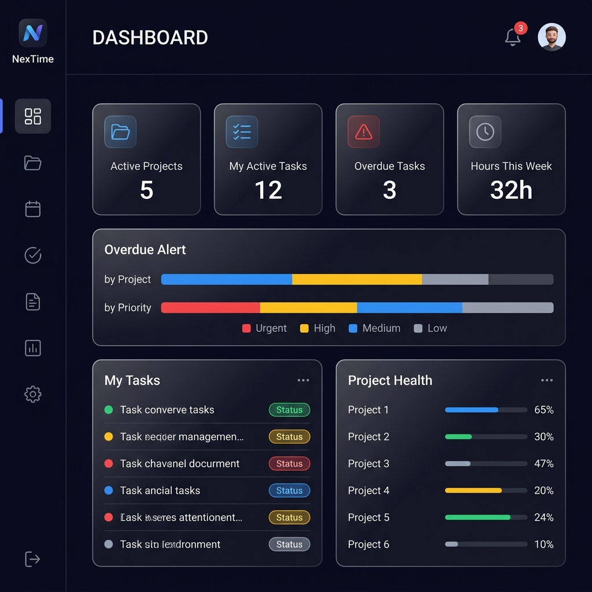

### สถิติวัดผลสำคัญ (4 Key Metric Cards)

| การ์ดสถิติ | คำอธิบาย |
| :--- | :--- |
| **Active Projects** | จำนวนโครงการที่เปิดดำเนินการอยู่ (กรองตามโครงการที่ผู้ใช้เป็นสมาชิก) |
| **My Active Tasks** | จำนวนงานที่ได้รับมอบหมายและยังไม่เสร็จ |
| **Overdue Tasks** | จำนวนงานที่เลยกำหนดส่งแล้ว (แสดงเป็น **สีแดงเตือน** 🔴) |
| **Hours This Week** | ชั่วโมงทำงานสะสมในสัปดาห์ปัจจุบัน (7 วันย้อนหลัง) |

### Overdue Alert Banner [NEW!]

แผนภูมิแท่งแนวนอนแสดงงานที่เลยกำหนด แยกตาม **Project** และ **Priority** ช่วยให้เห็นภาพรวมว่าโครงการใดมีงานค้างมากที่สุด และควรจัดลำดับความสำคัญอย่างไร

### My Tasks Panel [NEW!]

รายการงานที่ได้รับมอบหมาย เรียงตามวันครบกำหนด โดยมีการแสดงสถานะเตือนดังนี้:
* 🔴 **OVERDUE:** งานที่เลยกำหนดส่งแล้ว (แสดงเป็นสีแดง)
* 🟡 **DUE SOON:** งานที่จะครบกำหนดภายใน ≤3 วัน (แสดงเป็นสีเหลือง)

### Project Health Panel [NEW!]

ภาพรวมสุขภาพโครงการ แสดงข้อมูลสำคัญดังนี้:
* **Progress Bar:** แถบแสดงความคืบหน้าของโครงการเป็นเปอร์เซ็นต์
* **จำนวนสมาชิก:** จำนวนคนที่ร่วมงานในโครงการ
* **วันที่เหลือ:** จำนวนวันที่เหลือก่อนถึงกำหนดส่ง

### 🔔 Notification Bell [NEW!]

ระฆังแจ้งเตือนที่มุมขวาบนของหน้าจอ แสดงจำนวน Badge เมื่อมีการแจ้งเตือนใหม่ เมื่อกดจะแสดง Dropdown แบ่งเป็น 3 หมวด:
1. **Overdue Tasks:** งานที่เลยกำหนดส่งแล้ว (สีแดง)
2. **Due in 3 Days:** งานที่จะครบกำหนดภายใน 3 วัน (สีเหลือง)
3. **Due This Week:** งานที่จะครบกำหนดภายในสัปดาห์นี้

### เมนูนำทางหลัก (Sidebar)

| เมนู | สิทธิ์การเข้าถึง |
| :--- | :--- |
| **Dashboard** | ทุกคน |
| **Leads (CRM)** | Sales / PM / Admin |
| **Projects** | ทุกคน |
| **Timesheet** | ทุกคน |
| **Approvals** | PM / Admin |
| **Reports** | Manager / Admin |
| **Settings** | Admin |

---

## 🎯 4.1 ระบบลูกค้าเป้าหมายและการนัดหมายสำรวจ (Leads & Smart Survey Booking - ขั้นตอนที่ 1 & 2) [NEW!]

ในกระบวนการ 12 ขั้นตอนบริหารโครงการอย่างมืออาชีพ (12-Step Project Pipeline) ขั้นตอนที่ 1 และ 2 เป็นหัวใจสำคัญในการเชื่อมโยงระหว่างทีมขายและการลงพื้นที่ตรวจจริงของช่าง QC:

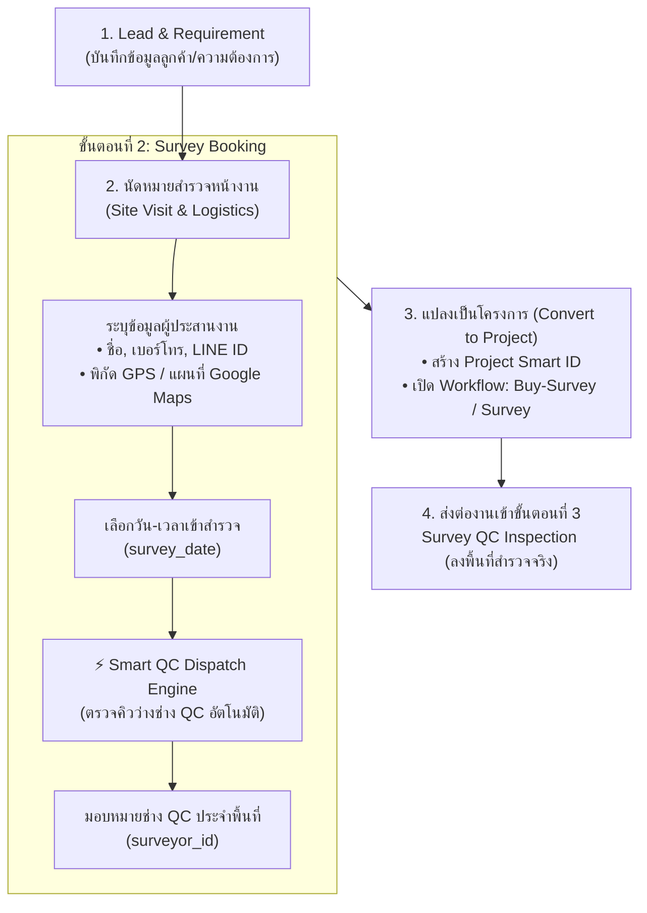
```mermaid
flowchart TD
    A["1. Lead & Requirement<br/>(บันทึกข้อมูลลูกค้า/ความต้องการ)"] --> B["2. นัดหมายสำรวจหน้างาน<br/>(Site Visit & Logistics)"]
    
    subgraph Step2 ["ขั้นตอนที่ 2: Survey Booking"]
        B --> C["ระบุข้อมูลผู้ประสานงาน<br/>• ชื่อ, เบอร์โทร, LINE ID<br/>• พิกัด GPS / แผนที่ Google Maps"]
        C --> D["เลือกวัน-เวลาเข้าสำรวจ<br/>(survey_date)"]
        D --> E["⚡ Smart QC Dispatch Engine<br/>(ตรวจคิวว่างช่าง QC อัตโนมัติ)"]
        E --> F["มอบหมายช่าง QC ประจำพื้นที่<br/>(surveyor_id)"]
    end
    
    Step2 --> G["3. แปลงเป็นโครงการ (Convert to Project)<br/>• สร้าง Project Smart ID<br/>• เปิด Workflow: Buy-Survey / Survey"]
    G --> H["4. ส่งต่องานเข้าขั้นตอนที่ 3<br/>Survey QC Inspection (ลงพื้นที่สำรวจจริง)"]
```

### การใช้งานขั้นตอนที่ 2 (Survey Booking):
1. **การบันทึกข้อมูลผู้ประสานงานหน้างาน (Site Coordinator):**
   * บังคับกรอกชื่อผู้ประสานงาน, เบอร์โทรศัพท์ และ LINE ID
2. **ระบบแปลงพิกัดและแผนที่อัจฉริยะ (Smart GPS / DMS Coordinate Parsing):**
   * รองรับการวางลิงก์ Google Maps หรือพิกัดทั้งแบบทศนิยม (`13.851979, 100.643406`) หรือองศาลิปดา DMS (`13°51'08.1"N 100°38'36.5"E`)
   * แสดงกรอบแผนที่จำลอง **Live Google Maps Preview** ทันที เพื่อให้ช่างสำรวจเดินทางได้ถูกต้องแม่นยำ
3. **ระบบคัดกรองช่าง QC อัตโนมัติ (Smart QC Dispatch Engine):**
   * เมื่อเลือกวันและเวลานัดหมาย ระบบจะค้นหาเฉพาะผู้ใช้งานที่มีทักษะ **`QC`**
   * ตรวจสอบคิวว่างในรัศมี **&plusmn;3 ชั่วโมง** เพื่อป้องกันไม่ให้มีงานนัดหมายสำรวจซ้อนทับกัน
4. **การแปลงเป็นโครงการ (Convert Lead to Project):**
   * เมื่อกดปุ่มแปลงเป็นโปรเจกต์ ระบบจะออกรหัส Smart Project ID และเปิดคอลัมน์ขั้นตอน **`Buy-Survey`** ➔ **`Survey`** บนบอร์ด Kanban โดยอัตโนมัติ เพื่อส่งมอบงานให้ช่าง QC เข้าสู่ขั้นตอนที่ 3 (Survey QC Inspection)

---

## 📝 4.2 ระบบบันทึกผลการเข้า Visit Site ลูกค้า (Site Visit Results & Next Actions) [NEW!]

เมื่อทีมงานฝ่ายขาย (Sales), ผู้จัดการโครงการ (PM) หรือช่างสำรวจ (QC Surveyor) กลับมาจากการลงพื้นที่จริง สามารถเปิดบันทึกผลการ Visit ได้ทันที:

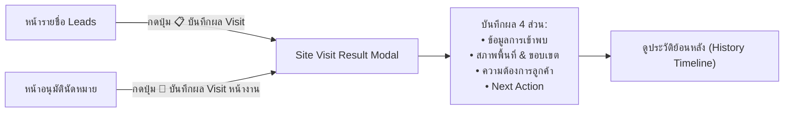
```mermaid
flowchart LR
    A["หน้ารายชื่อ Leads"] -->|"กดปุ่ม 📋 บันทึกผล Visit"| B["Site Visit Result Modal"]
    C["หน้าอนุมัตินัดหมาย"] -->|"กดปุ่ม 📝 บันทึกผล Visit หน้างาน"| B
    B --> D["บันทึกผล 4 ส่วน:\n• ข้อมูลการเข้าพบ\n• สภาพพื้นที่ & ขอบเขต\n• ความต้องการลูกค้า\n• Next Action"]
    D --> E["ดูประวัติย้อนหลัง (History Timeline)"]
```

### การใช้งานหน้าจอบันทึกผล Visit:
1. **การเข้าถึงแบบฟอร์ม:**
   - ที่หน้า **"ลูกค้ามุ่งหวัง (Leads)"**: คลิกปุ่มสีน้ำเงิน **`📋 บันทึกผล Visit`** ในแถวรายการลูกค้า
   - ที่หน้า **"อนุมัตินัดหมายออก Site"**: คลิกปุ่ม **`📝 บันทึกผล Visit หน้างาน`** ในการ์ดลูกค้านั้นๆ
2. **ฟิลด์ข้อมูล 4 ส่วนหลัก:**
   - **ส่วนที่ 1 — ข้อมูลการ Visit:** วัน-เวลาจริง, ผู้ไป Visit, ผลการเข้าพบ (`เข้า Visit สำเร็จ`, `ลูกค้าไม่อยู่`, `ยกเลิกนัด`, `เลื่อนนัดใหม่`)
   - **ส่วนที่ 2 — สภาพหน้างาน:** บันทึกสภาพบ้าน/พื้นที่, สรุปขอบเขตงาน, และประมาณการงบประมาณเบื้องต้น (บาท)
   - **ส่วนที่ 3 — ความต้องการลูกค้า:** บันทึกสิ่งที่ลูกค้าพูด/ข้อกังวล, และการตัดสินใจ (`สนใจดำเนินการ`, `ต้องการข้อมูลเพิ่ม`, `รอใบเสนอราคา`, `ไม่สนใจ`)
   - **ส่วนที่ 4 — การดำเนินการต่อ (Next Action):** เลือกลำดับถัดไป (`ส่งใบเสนอราคา` ➔ ระบบจะปรับสถานะ Lead เป็น **Pending Quote** ให้อัตโนมัติ, `โทรติดตาม`, `นัด Visit ใหม่`, `ปิดงาน`) พร้อมหมายเหตุลับเฉพาะทีม
3. **แท็บประวัติการ Visit (History Tab):**
   - สลับดูไทม์ไลน์ประวัติการเข้าพบลูกค้าย้อนหลังได้ทุกครั้ง พร้อมแสดงป้ายสีสถานะและผู้บันทึกข้อมูล

---

## 🎨 4.3 ระบบจัดการและตรวจรับแบบ 2D/3D และเงินมัดจำ (Phase 02: Design, Quote & Payment) [NEW!]

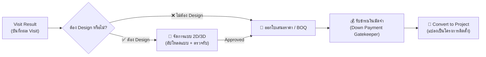
```mermaid
flowchart LR
    A["Visit Result<br/>(บันทึกผล Visit)"] --> B{"ต้อง Design หรือไม่?"}
    B -->|"✅ ต้อง Design"| C["🎨 จัดการแบบ 2D/3D<br/>(อัปโหลดแบบ + ตรวจรับ)"]
    B -->|"❌ ไม่ต้อง Design"| D["📄 ออกใบเสนอราคา / BOQ"]
    C -->|"Approved"| D
    D --> E["💰 รับชำระเงินมัดจำ<br/>(Down Payment Gatekeeper)"]
    E --> F["🚀 Convert to Project<br/>(แปลงเป็นโครงการติดตั้ง)"]
```

### 1. การจัดการแบบแปลน & ตรวจรับแบบ (Design & Space Planning Modal):
* **ปุ่มเข้าใช้งาน:** คลิกปุ่ม **`🎨 แบบ 2D/3D`** ในแถวรายการ Lead
* **การอัปโหลดแบบใหม่:**
  - เลือกประเภทแบบ: `3D Perspective`, `2D Floor Plan`, `Mood Board`, `Shop Drawing`
  - กำหนด Revision: `Rev A`, `Rev B`, `Rev C`, `Final`
  - **การแนบไฟล์:** กดปุ่ม **`📂 เลือกไฟล์จากเครื่อง`** (รองรับรูปภาพ/PDF พร้อม Thumbnail ตัวอย่าง) หรือวางลิงก์ **Google Drive / Cloud URL**
* **การตรวจรับแบบ (Customer Review & Approval):**
  - แสดงประวัติ Version แบบทุกรอบ พร้อมกล่องพิมพ์ Feedback
  - กดปุ่ม **`✅ ลูกค้าอนุมัติแบบ (Design Approved)`** ➔ สถานะจะปรับเป็น `Design Approved` เพื่อปลดล็อกสู่ขั้นตอนออกใบเสนอราคา BOQ
  - หรือกดปุ่ม **`🔄 ขอแก้ไขแบบ (Revise)`** ➔ สถานะปรับเป็น `Design Revision`

### 2. การรับชำระเงินมัดจำ & แปลงงาน (Down Payment Gatekeeper Modal):
* **ปุ่มเข้าใช้งาน:** คลิกปุ่ม **`💰 รับมัดจำ & แปลงงาน`**
* **ฟังก์ชันการทำงาน:**
  - ดึงข้อมูลใบเสนอราคาที่เชื่อมโยง และแนะนำยอดเงินมัดจำ 30% หรือ 50% ให้อัตโนมัติ
  - กรอกยอดเงินที่ได้รับจริง, ช่องทางชำระ (โอน/บัตร/เงินสด), วันที่รับเงิน และแนบลิงก์สลิปโอนเงิน
  - **Financial Gatekeeper:** เมื่อยืนยันเงินมัดจำเข้าแล้ว จะปลดล็อกปุ่ม **`🚀 แปลงเป็นโครงการติดตั้ง (Convert to Project)`** เพื่อเปิดโครงการจริง

---

## 📁 5. การจัดการโครงการและการดำเนินงานหน้างาน (Project Management & Execution)

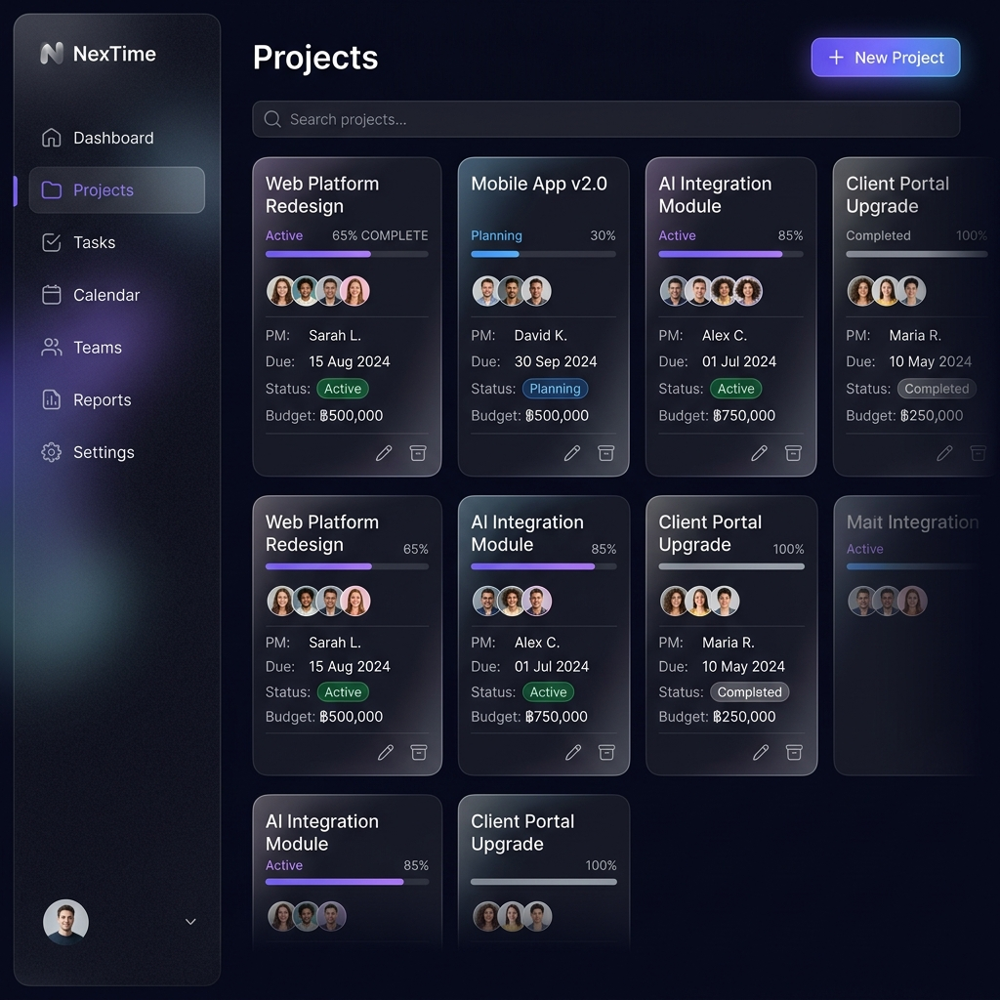

### A. การดูรายการโครงการ (Project List)

หน้า **Projects** แสดงรายการโครงการทั้งหมดที่ผู้ใช้มีสิทธิ์เข้าถึง พร้อมข้อมูลสรุปดังนี้:
* ชื่อโครงการ และสถานะ (Active / Archived)
* วันเริ่มต้น - วันสิ้นสุดโครงการ
* จำนวนสมาชิกในทีม
* **Budget (งบประมาณ):** แสดงเป็นตัวเลขจัดคอมม่า (เช่น ฿1,500,000)
* Progress Bar แสดงความคืบหน้าโดยรวม

### 🏅 5.1 ระบบตรวจรับคุณภาพ QC, ส่งมอบงาน และปิดโครงการ (Phase 04: QC, Handover & Settle) [NEW!]

เมื่อทีมช่างปฏิบัติงานติดตั้งเสร็จสิ้นครบ 100% ใน Phase 03 สามารถเข้าสู่กระบวนการตรวจรับและปิดโครงการได้ดังนี้:

1. **การเปิดหน้าต่าง QC Handover:**
   - ที่หน้า **Project Detail**: คลิกปุ่ม **`🏅 QC & ส่งมอบงาน (Phase 04)`** ที่แถบเมนูด้านบน
2. **แท็บที่ 1 — 🔍 ตรวจสอบคุณภาพ (QC Inspection):**
   - ตรวจประเมินตาม Digital QC Checklist 5 ด้านหลัก
   - บันทึกรูปถ่ายหลักฐานหน้างาน และเลือกผลการตรวจ: **`🏆 ผ่านเกณฑ์ QC (Passed QC)`** หรือ **`⚠️ ไม่ผ่าน — สั่งแก้งาน (Rework)`**
3. **แท็บที่ 2 — ✍️ ส่งมอบงาน & เซ็นรับดิจิทัล (Handover & E-Signature):**
   - ให้ลูกค้าประเมินความพึงพอใจ (1–5 ดาว ⭐)
   - ลูกค้าลงนามตรวจรับมอบงานบนกระดานดิจิทัลสด (**HTML5 Canvas Digital E-Signature**)
   - กำหนดระยะเวลารับประกันผลงาน (Warranty 6–36 เดือน)
4. **แท็บที่ 3 — 🏁 ตัดจ่าย & ปิด Job (Close & Settle in BMT):**
   - สรุปทีมช่างปฏิบัติงานจริงจาก JMT เพื่อตัดจ่ายต้นทุน
   - บันทึกการรับชำระเงินงวดสุดท้าย (Final Billing)
   - กดปุ่ม **`🏁 ยืนยันปิดโครงการสมบูรณ์ (Close & Settle Job)`** ➔ สถานะโครงการจะเปลี่ยนเป็น **`Completed`** ทันที

### B. การสร้างโครงการใหม่ (Create New Project)

คลิกปุ่ม **"New Project"** แล้วกรอกข้อมูลดังนี้:

| ฟิลด์ | คำอธิบาย | ตัวอย่าง |
| :--- | :--- | :--- |
| **Project Name** | ชื่อโครงการ | NexTime V2 |
| **Project Key** | รหัสย่อโครงการ (ใช้อ้างอิง Task ID) | NXT |
| **Project Type** | ประเภทโครงการ (`dev` สำหรับโครงการพัฒนาทั่วไปที่มี Gantt Timeline / `support` สำหรับโครงการซัพพอร์ตดูแลระบบย่อย/BU) | `support` |
| **Support Task Auto-generation** | รูปแบบการสร้างงานอัจฉริยะของโปรเจกต์ Support (สร้าง Task ตามกลุ่มบริการ หรือ สร้าง Task แยกเป็นรายถังรายเดือน [YYYY-MM]) | `Category-based Tasks` |
| **Start Date** | วันเริ่มต้นโครงการ | 2026-07-01 |
| **End Date** | วันสิ้นสุดโครงการ | 2026-12-31 |
| **Budget** | งบประมาณโครงการ (แสดงเป็นตัวเลขจัดคอมม่า) | ฿2,000,000 |
| **Custom Workflow Columns** | กำหนดคอลัมน์สถานะของบอร์ดได้เอง | ค่าเริ่มต้น: To Do, In Progress, Review, Done |
| **Permission Scheme** | เลือก Permission Scheme ที่จะใช้กับโครงการนี้ | Default Scheme |
| **Description** | คำอธิบายรายละเอียดของโครงการ | ระบบจัดการเวลาทำงาน |

### C. Project Detail View

เมื่อคลิกเข้าไปในโครงการ จะมีแท็บย่อยสำหรับการจัดการด้านต่าง ๆ:

| แท็บ | ฟังก์ชัน |
| :--- | :--- |
| **Overview** | ภาพรวมโครงการ: สถิติ, สถานะ, สมาชิกทีม และความเคลื่อนไหวทั่วไป |
| **Workflow** | Workflow Timeline Tracker: ระบบติดตามขั้นตอนงาน 4 เฟสพร้อม Interactive Stepper และ Quick Service Bypass |
| **Tasks** | บอร์ด Kanban, Backlog, Sprints, Releases |
| **Plan** | แผนภูมิแกนต์ (Gantt Chart) และ Baselines |
| **Timesheet** | Timesheet Entries เฉพาะโครงการนี้ |
| **Quotations** | ระบบออกใบเสนอราคา & BOQ อ้างอิงราคากลางจาก Price Book |
| **Reports** | รายงานและสถิติเฉพาะโครงการ |
| **Settings** | ตั้งค่าสมาชิก, Workflow, Permission และแม่แบบ |

### D. Team Members (การจัดการสมาชิกทีม)

เพิ่มหรือลดสมาชิกในทีม โดยสามารถกำหนดบทบาทได้อย่างยืดหยุ่น:

| บทบาท (Role) | คำอธิบาย |
| :--- | :--- |
| **PM** | Project Manager - ผู้จัดการโครงการ |
| **Frontend Dev** | นักพัฒนาส่วนหน้า |
| **Backend Dev** | นักพัฒนาส่วนหลัง |
| **Designer** | นักออกแบบ UI/UX |
| **SA** | System Analyst - นักวิเคราะห์ระบบ |
| **QA** | Quality Assurance - ผู้ตรวจสอบคุณภาพ |
| **Tester** | ผู้ทดสอบระบบ |
| **DevOps** | วิศวกรระบบ |
| **Scrum Master** | ผู้ดูแลกระบวนการ Scrum |
| **Custom** | กรอกบทบาทเองได้ตามต้องการ |

### E. Workflow Editor (ตัวแก้ไข Workflow) [NEW!]

ตั้งค่า **Status Columns** และ **Transition Rules** ได้ในแต่ละโปรเจกต์:

* **กำหนดคอลัมน์สถานะ:** เพิ่ม, แก้ไข, ลบ, จัดลำดับคอลัมน์ตามต้องการ
* **Transition Rules:** กำหนดเงื่อนไขการย้ายสถานะของ Task ได้ดังนี้:

| เงื่อนไข (Transition Rule) | คำอธิบาย |
| :--- | :--- |
| `pm_or_admin_only` | เฉพาะ PM หรือ Admin เท่านั้นที่ย้ายได้ |
| `assignee_only` | เฉพาะผู้รับผิดชอบงานเท่านั้นที่ย้ายได้ |
| `min_story_points` | ต้องมี Story Points ขั้นต่ำตามที่กำหนด |
| `has_description` | ต้องมีคำอธิบายงาน (Description) |
| `has_estimated_hours` | ต้องมีการประเมินชั่วโมงงาน (Estimated Hours) |

### F. Edit & Archive (แก้ไขและเก็บถาวรโครงการ)

* **Edit Project:** แก้ไขข้อมูลโครงการทุกฟิลด์ได้ตลอดเวลา
* **Archive Project:** เปลี่ยนสถานะโครงการเป็น Archived เมื่อเสร็จสมบูรณ์ (สามารถนำกลับมาเปิดใช้งานใหม่ได้)

### G. 4-Phase Project Lifecycle Workflow (Workflow Timeline Tracker) [NEW!]

ระบบการบริหารความคืบหน้าของงานโครงการแบบบูรณาการ 4 เฟส (4-Phase Pipeline) ได้รับการพัฒนาเพื่อเป็นเครื่องมือควบคุมขั้นตอนปฏิบัติงานแบบเป็นลำดับขั้น ครอบคลุมตั้งแต่การนัดหมายไปจนถึงการปิดยอดโอนเงินระบบบัญชีหลังการขาย:

```
[Phase 1: Lead & Survey] ➔ [Phase 2: Design & Quote] ➔ [Phase 3: Execution] ➔ [Phase 4: QC & Handover]
```

#### 1. การควบคุมแต่ละระยะ (Phase Workspaces):
- **Phase 01: Lead & Survey (นัดหมายและลงพื้นที่สำรวจ)**
  - ผู้ประสานงานสามารถระบุวันและผู้สำรวจหน้างาน (QC Surveyor) และทำการเช็คอิน-เช็คเอาท์หน้างานพร้อมบันทึกพิกัด GPS จริงและภาพถ่ายหลักฐานประกอบ
- **Phase 02: Design, Quote & Payment (ออกแบบและประเมินงบประมาณ)**
  - ขั้นตอนการแนบแบบพิมพ์เขียวหรือภาพ 3D พร้อมระบบอนุมัติแบบร่าง หากลูกค้าปฏิเสธจะเข้าสู่ **Design Revise Loop** (ปรับแก้แบบ) และทำการเสนอราคาอ้างอิง Price Book รวมถึงรอหลักฐานการชำระมัดจำงวดแรกเพื่อปลดล็อกงานก่อสร้าง
- **Phase 03: Project Execution (ดำเนินการก่อสร้างช่างติดตั้ง - JMT)**
  - ขั้นตอนการยืนยันแผนงาน (Project Plan) และดึงรายชื่อช่างปฏิบัติงานที่ได้รับมอบหมายจากระบบ JMT พร้อมบันทึกเวลางานลงเช็คอินหน้างานจริง
- **Phase 04: QC, Handover & After-Sales (ส่งมอบ ตรวจสอบ และบริการหลังการขาย - BMT)**
  - การลงผลตรวจส่งมอบงานผ่าน QC (Passed/Failed) หากพบข้อบกพร่องจะเข้าสู่ระบบรีวิวออนไลน์เพื่อปรับปรุง หากลูกค้าต้องการแก้ไขเพิ่มเติมจะเข้าสู่ **Rework Loop** ย้อนกลับไปทำแผนงานใน Phase 3 ใหม่ และเมื่อผ่านแล้วจะดึงช่างมาปิดยอดเงินในระบบ BMT (Close & Settle)

#### 2. เวิร์กโฟลว์แบบ Quick Service (งานด่วน):
> [!IMPORTANT]
> **ระบบข้ามขั้นตอนอัตโนมัติสำหรับงานด่วน (Quick Service Bypass Rule):**
> * หากโครงการได้รับการบันทึกประเภทเป็นแบบงานด่วน (`quick`, `quick_service`, `quick service` หรือรหัสโครงการเริ่มต้นด้วย `PQ`) **ระบบจะทำการข้ามขั้นตอนใน Phase 1 (สำรวจหน้างาน) และ Phase 2 (ออกแบบและเสนอราคา) ให้โดยอัตโนมัติทันที**
> * ในหน้าต่างการประมวลผล ระบบจะขึ้นสถานะเสร็จสิ้นอัตโนมัติ (Automated Bypass) ให้ทั้งสองเฟสแรก และดึงหมายเลขตั๋วชำระเงินมัดจำล่วงหน้า (Payment Ticket) ที่แนบมาจากฝั่งลูกค้าหรือทีมขายเข้าระบบทันที เพื่อเปิดสิทธิ์ให้ผู้ควบคุมสามารถเริ่มต้นจัดแผนงานและส่งช่างติดตั้งเข้าปฏิบัติงานใน **Phase 3 (Project Execution)** ได้ทันทีโดยไม่ต้องผ่านขั้นตอนสำรวจและเสนอราคาซ้ำซ้อน

#### 3. ปุ่มนำทาง Stepper และ Flowchart อัจฉริยะ:
- **Interactive Stepper:** PM หรือทีมงานสามารถคลิกเลือกหัวข้อ Phase 1, 2, 3 หรือ 4 บนแถบนำทางแนวนอนด้านบนเพื่อเปิดดูรายละเอียดประวัติเช็คลิสต์และข้อมูลของเฟสนั้น ๆ ย้อนหลังได้ตลอดเวลา
- **Workflow Flowchart:** แสดงแผนผังเวิร์กโฟลว์จำลองแบบไดนามิกอัปเดตสีตามขั้นตอนปัจจุบัน โดยใช้รหัสสีดังนี้:
  - 🟢 **สีเขียว:** ขั้นตอนที่อนุมัติหรือทำเสร็จสิ้นแล้ว
  - 🔵 **สีฟ้า:** ขั้นตอนที่กำลังดำเนินการปฏิบัติงานจริง ณ ปัจจุบัน
  - 🟡 **สีส้ม:** ขั้นตอนที่มีปัญหา ปรับแก้ไขแบบ หรืออยู่ในลูป Rework

---

## ⏱️ 6. การบันทึกชั่วโมงทำงาน (Timesheet)

พนักงานฝ่ายปฏิบัติงานใช้หน้านี้สำหรับลงบันทึกเวลาทำงานรายวันของตนเองเพื่อนำไปคำนวณต้นทุนและความก้าวหน้าของโครงการ

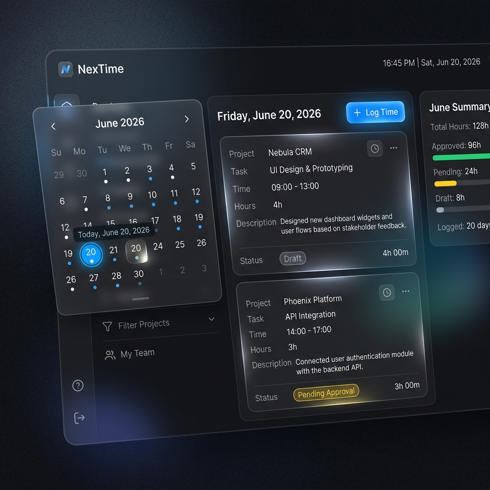

### Monthly Calendar View [CHANGED]

ระบบใช้ **ปฏิทินรายเดือนแบบ Mini Calendar** แทน Weekly Navigation โดยแสดงจุดสีบนวันที่ที่มีรายการบันทึกเวลาแล้ว ทำให้เห็นภาพรวมการบันทึกเวลาทั้งเดือนได้อย่างชัดเจน

```
┌──────────────────────────────────────────────────────────────────────┐
│  ┌────────────────┐                                                  │
│  │   June 2026    │   Entries for Friday, June 20, 2026              │
│  │ Mo Tu We Th Fr │   ─────────────────────────────────────────      │
│  │  1  2  3  4  5 │   • Web Development  - Dashboard CSS  (4h)      │
│  │  8  9 10 11 12 │   • Database Setup   - Schema Migrate (4h)      │
│  │ 15 16 17 18 19 │                          [Total: 8 hrs]         │
│  │ 20 21 22 23 24 │                                                  │
│  │ 27 28 29 30    │   ┌─────────── Monthly Stats ───────────┐       │
│  └────────────────┘   │ Total Hours: 120h                    │       │
│    Mini Calendar      │ Approved:    96h                     │       │
│    (• = มีรายการ)     │ Pending:     24h                     │       │
│                       └──────────────────────────────────────┘       │
└──────────────────────────────────────────────────────────────────────┘
```

### ขั้นตอนการบันทึกเวลางานรายวัน:

1. ไปที่เมนู **Timesheet**
2. เลือกวันที่ต้องการผ่าน **ปฏิทินรายเดือน** (Mini Calendar) ด้านซ้าย
3. คลิกปุ่ม **"Log Time"** เพื่อเปิดหน้าต่างป้อนข้อมูล
4. กรอกรายละเอียดดังนี้:
   * **Project:** เลือกโครงการที่สังกัด
   * **Task:** เลือกงานย่อยในโครงการนั้น (optional - หากไม่มีให้เลือกประเภททั่วไป)
   * **Hours:** จำนวนชั่วโมงที่ใช้จริงในงานนั้น
   * **Start Time / End Time** [NEW!]: ระบุเวลาเริ่ม-สิ้นสุด ระบบจะคำนวณชั่วโมงอัตโนมัติ (ปัดเป็น 0.5 ชม.)
   * **Description:** คำอธิบายรายละเอียดสั้น ๆ เกี่ยวกับงานที่ได้ทำลงไป
   * **Status:** เลือกสถานะตั้งต้น (`Draft` หรือ `Pending`)
5. คลิก **Save**

### Monthly Stats Sidebar [NEW!]

แผงด้านขวาแสดงสถิติสรุปของเดือนปัจจุบัน:
* **Total Hours:** ชั่วโมงรวมทั้งเดือน
* **Approved:** ชั่วโมงที่ผ่านการอนุมัติแล้ว
* **Pending:** ชั่วโมงที่รอการอนุมัติ

### ความหมายของสถานะเวลางาน (Timesheet Statuses):

| สถานะ | ความหมาย | สิทธิ์ในการจัดการ |
| :---: | :--- | :--- |
| **Draft** | ข้อมูลร่าง พนักงานบันทึกไว้ชั่วคราว | พนักงานสามารถ **แก้ไข (Edit)** หรือ **ลบ (Delete)** ได้ตามปกติ |
| **Pending** | ส่งคำขอไปยัง PM/Admin รอการตรวจเช็ก | ข้อมูลจะถูกล็อก **ไม่สามารถแก้ไขหรือลบได้** ระหว่างรอผลการตรวจ |
| **Approved** | ผ่านการอนุมัติและบันทึกเวลาเข้าระบบเรียบร้อย | มีเครื่องหมายขีดถูกสีเขียว ✅ ข้อมูลจะถูกล็อกถาวรและส่งไปใช้คำนวณสถิติต่าง ๆ |
| **Rejected** | ถูก PM ปฏิเสธการบันทึกเวลา | จะแสดงไอคอนกากบาทสีแดง ❌ พร้อม**ข้อความปฏิเสธ (Reject Reason)** พนักงานสามารถแก้ไขข้อมูลและส่งใหม่อีกครั้งได้ |

---

## 📋 7. บอร์ดจัดการงานทีม (Agile Kanban Board)

แท็บ **Tasks** เป็นศูนย์กลางการสื่อสารและจัดการงานย่อยภายในทีม โดยแบ่งแท็บการดำเนินงานภายในออกเป็น **6 ส่วนย่อย (Sub-Tabs):**

| Sub-Tab | ฟังก์ชัน |
| :--- | :--- |
| **Summary** | ภาพรวม Sprint และ Project [NEW!] |
| **Backlog** | วางแผนรอบพัฒนาและจัดการ Sprint |
| **Board** | บอร์ด Kanban สำหรับจัดการสถานะงาน |
| **Timeline** | แสดงงานแบบปฏิทิน/ไทม์ไลน์ [NEW!] |
| **Releases** | จัดการเวอร์ชันและการปล่อย |
| **Grooming** | Backlog Grooming สำหรับคัดกรองงาน [NEW!] |

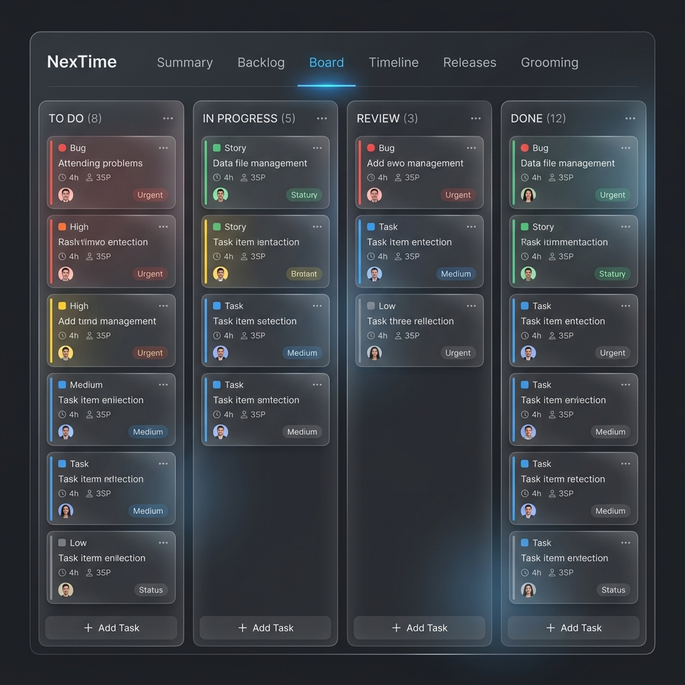

### คอลัมน์และสถานะของงานย่อย (Workflow Columns)

บอร์ดจัดเก็บการ์ดงานและแสดงตามสถานะงาน **4 คอลัมน์หลัก** เป็นค่าเริ่มต้น โดยใช้ไลบรารีดึง-ลากพิเศษ (dnd-kit) ที่ลื่นไหล:

1. **To Do (รอดำเนินการ):** งานใหม่ที่เตรียมนำมาทำ
2. **In Progress (กำลังทำ):** งานที่พนักงานกำลังลงมือดำเนินการอยู่ในปัจจุบัน
3. **Review (รอตรวจ):** งานที่ดำเนินการพัฒนาเสร็จแล้ว รอหัวหน้าทีมตรวจสอบความเรียบร้อย
4. **Done (เสร็จสิ้น):** งานที่ผ่านการรับรองและเสร็จสมบูรณ์ร้อยละ 100

> [!NOTE]
> แต่ละโปรเจกต์สามารถกำหนดคอลัมน์สถานะเองได้ผ่าน **Workflow Editor** ในหน้า Project Settings ดูรายละเอียดที่ [หัวข้อ 5.E](#e-workflow-editor-ตัวแก้ไข-workflow)

### การจัดระดับความสำคัญของงาน (Priority Color Coding)

ขอบการ์ดซ้ายมือจะระบุสีสะท้อนความด่วนของงานในบอร์ด เพื่อจัดลำดับความสำคัญของเวลา:

* 🔴 **สีแดง (Urgent):** งานด่วนวิกฤต ต้องรีบทำทันที เช่น บั๊กที่พบบนระบบจริง
* 🟡 **สีเหลือง (High):** งานสำคัญหลักที่มีผลกระทบต่อเป้าหมายตามไทม์ไลน์
* 🔵 **สีฟ้า (Medium):** งานพัฒนาฟังก์ชันทั่วไปตามรอบสปรินต์ปกติ
* ⚪ **สีเทา (Low):** งานย่อยที่ปรับแต่งทีหลังได้ ไม่เร่งรีบ

### ข้อมูลรายละเอียดภายในการ์ดงาน (Task Card Properties)

เมื่อสร้างหรือกดดูรายละเอียดของการ์ดงาน จะมีช่องข้อมูลดังนี้:

* **Issue Type (ประเภทงาน):** ระบุประเภทด้วยสีและไอคอนเฉพาะ
  * 🔴 `Bug` (ข้อบกพร่องระบบ)
  * 🟢 `Story` (ฟีเจอร์ผู้ใช้งาน)
  * 🔵 `Task` (งานทั่วไป)
  * 🟣 `Sub-task` (งานย่อย)
* **Story Points:** คะแนนความยากง่ายของงานย่อย (สำหรับวางแผนปริมาณงาน)
* **Estimated Hours:** การประเมินชั่วโมงการทำงาน
* **Assignee:** รูปภาพแสดงโปรไฟล์ผู้รับผิดชอบงาน
* **Checklist:** รายการย่อยที่ต้องกดขีดฆ่าเมื่อทำเสร็จทีละขั้น
* **Parent Task** [NEW!]: สามารถกำหนด Parent Task สำหรับ Sub-task hierarchy
* **Sprint/Release Assignment** [NEW!]: กำหนด Sprint และ Release ที่การ์ดงานสังกัด
* **Git Commits** [NEW!]: ดูรายการ Git Commit ที่เชื่อมกับ Task ได้จากหน้า Task Detail

### การสร้าง Task ใหม่

1. คลิกปุ่ม **"Create Task"** หรือไอคอน **+** ในคอลัมน์ที่ต้องการ
2. กรอกรายละเอียด: ชื่องาน, ประเภท, Priority, Story Points, Estimated Hours, Assignee, Description
3. เลือก Sprint และ Release ที่ต้องการ (ถ้ามี)
4. กำหนด Parent Task (ถ้าเป็น Sub-task)
5. คลิก **Save**

---

### Agile Sprints & Backlog Planner

เป็นแท็บย่อยในเมนูจัดการงาน เพื่อใช้วางแผนรอบพัฒนาโปรเจกต์ (Sprint Plan):

```
┌────────────────────────────────────────────────────────┐
│  ▶ Sprint 1 (Active)                     [Complete]    │
│  └─ • [Bug] Fix login redirect   (Est: 2h)             │
├────────────────────────────────────────────────────────┤
│  ⚡ Sprint 2 (Planned)                    [Start]       │
│  └─ • [Story] Integrate Line login (Est: 12h)          │
├────────────────────────────────────────────────────────┤
│  📂 Project Backlog (งานสะสมค้างทำ)                     │
│  └─ • [Task] Documentation writeup (Est: 8h)           │
└────────────────────────────────────────────────────────┘
```

* **การสร้าง Sprint ใหม่:** สามารถกดปุ่ม Create Sprint เพื่อกำหนดกรอบเวลาสำหรับทีม
* **การวางแผนงาน (Planning):** ลากงานจาก **Project Backlog** มาจัดวางในสปรินต์ที่ต้องการดำเนินการ
* **การควบคุมวงรอบ:**
  * คลิก **"Start Sprint"** เพื่อเริ่มดำเนินการสปรินต์ (เปลี่ยนสถานะเป็น Active)
  * คลิก **"Complete Sprint"** เมื่อสิ้นสุดรอบเวลา ระบบจะถามความต้องการนำงานที่ค้างส่ง (Incomplete Tasks) โยกกลับไปที่ Backlog หรือเก็บบันทึกเก็บประวัติไว้

---

### Release Management (รุ่นและการออกเวอร์ชัน)

แท็บย่อยสำหรับการควบคุมและติดตามเวอร์ชันที่จะปล่อยสู่ผู้ใช้จริง (Releases):

* **เพิ่มเวอร์ชัน (Create Release/Version):** ระบุรหัสรุ่น เช่น `v1.0.0`, `v1.1.0` และวันปล่อยระบบเป้าหมาย
* **จับคู่แผนงาน:** แทรกระบุว่าการ์ดงานชิ้นใดจะปล่อยพร้อมกับเวอร์ชันนั้น ๆ
* **จัดการสถานะ:** ปรับเปลี่ยนสถานะระหว่าง `Unreleased` (ยังไม่เปิดตัว) และ `Released` (ปล่อยสู่สาธารณะแล้ว) เพื่อปิดรอบเวอร์ชันอย่างสมบูรณ์

---

### Backlog Grooming & Timeline View

#### Backlog Grooming [NEW!]

Sub-tab สำหรับ Grooming ภายในเมนูจัดการงาน ช่วยให้ทีมสามารถคัดกรอง จัดลำดับ และจัดสรรงานได้อย่างมีประสิทธิภาพ:

* **ค้นหาและกรองงาน:** กรองตามชื่อ, Priority, Type, Assignee
* **Multi-select Checkboxes:** เลือกงานหลายชิ้นพร้อมกัน
* **Bulk Actions:** ดำเนินการกับงานหลายชิ้นพร้อมกัน:
  * **Assign:** มอบหมายผู้รับผิดชอบแบบเป็นกลุ่ม
  * **Set Priority:** กำหนดความสำคัญแบบเป็นกลุ่ม
  * **Move to Sprint:** ย้ายเข้า Sprint แบบเป็นกลุ่ม
  * **Set Story Points:** กำหนด Story Points แบบเป็นกลุ่ม

#### Timeline View [NEW!]

แท็บย่อยแสดงงานแบบปฏิทิน/ไทม์ไลน์ ช่วยให้เห็นภาพรวมของงานทั้งหมดตามแกนเวลา สามารถดูได้ว่างานใดทับซ้อนกันและควรจัดลำดับอย่างไร

#### Task Summary [NEW!]

แท็บย่อยแสดงภาพรวมของ Sprint และ Project รวมถึง:
* สรุป Story Points ทั้งหมด / ที่เสร็จแล้ว
* สัดส่วนงานแยกตามสถานะ (To Do, In Progress, Review, Done)
* Burndown/Burnup Chart ของ Sprint

---

## 📅 8. ระบบแผนงานและปฏิทินไทม์ไลน์โครงการ (Project Calendar Timeline & Gantt Chart)

### 🗓️ ปฏิทินไทม์ไลน์โครงการ (Project Calendar Timeline) [NEW!]

หน้าจอ **Project Timeline** (เมนูด้านซ้าย) แสดงตารางไทม์ไลน์ภาพรวมการดำเนินงานของโครงการทุกโครงการย้อนหลังและล่วงหน้าในแต่ละเดือนตามแกนเวลาจริง ช่วยให้ผู้บริหารและ PM ติดตามกำหนดการภาพรวมได้อย่างมีประสิทธิภาพ

#### ตัวกรองประเภทโครงการ (Project Type Filters)
ที่มุมขวาบนของหน้าปฏิทินไทม์ไลน์ มีปุ่มตัวกรองประเภทโครงการ 4 ปุ่มหลัก:
* **`Construction 🇹🇭` (งานก่อสร้างและติดตั้ง):** แสดงเฉพาะโครงการที่เป็นงานก่อสร้าง รีโนเวท ตกแต่ง หรือติดตั้งหน้างาน (เป็นค่าเริ่มต้น)
* **`Development` (งานพัฒนาระบบ/ซอฟต์แวร์):** แสดงเฉพาะโครงการที่เป็นงานพัฒนาซอฟต์แวร์ แอปพลิเคชัน หรือระบบ IT
* **`Support` (งานซัพพอร์ต):** แสดงเฉพาะโครงการดูแลระบบ งานซ่อมบำรุง หรือบริการหลังการขาย
* **`Show All` (แสดงทั้งหมด):** แสดงโครงการทุกประเภทในตารางไทม์ไลน์เดียวโดยไม่แยกหมวดหมู่

---

### 📊 แผนภูมิแกนต์ (Gantt Chart & Milestone Plan)

แผนภูมิแกนต์เป็นเครื่องมือสำคัญสำหรับการเห็นภาพรวมความคืบหน้าของระยะเวลาโครงการทั้งหมด


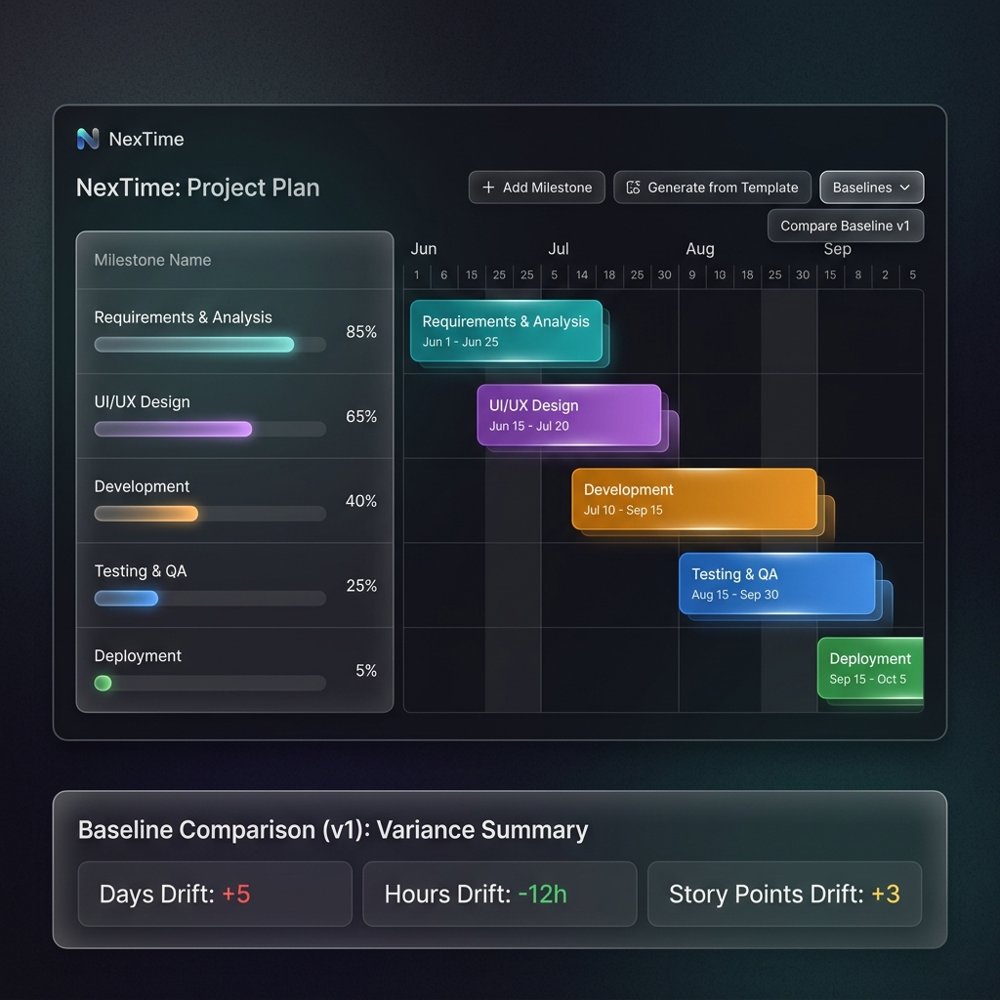

* **Gantt Chart (ไทม์ไลน์โครงการ):** แสดงระยะเวลาการทำงานของแต่ละ Milestone เป็นแกนนอนตามปฏิทินจริง ทำให้มองเห็นส่วนที่เหลื่อมล้ำทับซ้อนและแผนงานโดยรวม
* **การสร้างแผนอัตโนมัติ (Auto Milestone Generator):**
  เมื่อแอดมินสร้างโปรเจกต์ใหม่พร้อมระบุวันเริ่ม (Start Date) และวันเสร็จสิ้น (End Date) ของโครงการ ระบบจะทำการอ้างอิงแม่แบบแผนงาน (**Admin Task Templates**) ที่กำหนดไว้ในส่วนกลาง มาสร้างรายการ Milestone ย่อยพร้อมคำนวณหาวันเริ่มและสิ้นสุดที่เหมาะสมในไทม์ไลน์ให้อัตโนมัติ (ตามสัดส่วนร้อยละของกรอบเวลา) ช่วยให้ประหยัดเวลาการวางแผนเริ่มต้นได้สูงสุด
* **การจัดการ Milestone แบบกำหนดเอง:** เพิ่ม, แก้ไข, ลบ Milestone ได้ตามต้องการ พร้อมกำหนดวันเริ่มต้นและวันสิ้นสุดของแต่ละ Milestone

> [!NOTE]
> **หมายเหตุสำหรับโครงการประเภท Support:**
> หากโปรเจกต์ถูกเลือกเป็นประเภท **Support Project** ระบบจะระงับการวางแผน Milestone และ Gantt Chart รวมถึงเมนู Baseline ทั้งหมด โดยจะแสดงหน้าแจ้งเตือนพร้อมลิ้งก์ด่วนสำหรับการย้ายไปจัดการ Task บนบอร์ดหรือเริ่มบันทึกเวลาทำงานรายวันใน Timesheet แทน เนื่องจากงานซัพพอร์ตระบบหรืองานดูแลทั่วไปไม่มีขั้นตอนระยะเวลาการวางแผน (CapEx) และเน้นการลงเวลา (OpEx) เป็นหลัก

### Project Baselines & Versioning [NEW!]

ระบบ Baseline ช่วยให้สามารถบันทึก Snapshot ของแผนงานในแต่ละช่วงเวลา เพื่อใช้เปรียบเทียบและติดตามความเบี่ยงเบนของโครงการ:

#### สร้าง Baseline (บันทึกเวอร์ชันแผนงาน)
กดปุ่ม **"Save Version"** ที่แถบเครื่องมือมุมขวาบน เพื่อบันทึก Snapshot ของแผนงานปัจจุบัน พร้อมตั้งชื่อเวอร์ชัน (เช่น `Base_v1`) และคำอธิบาย

#### ดูประวัติ Baseline
แสดงรายการ Baseline ทั้งหมดที่เคยบันทึกไว้ในดรอปดาวน์ **Active Plan** และ **Compare vs**

#### สลับ/เปิดใช้ Baseline
เลือก Baseline ที่ต้องการในดรอปดาวน์ **Active Plan** เพื่อกู้คืนแผนงานและสลับไปเป็นแผนงานที่รันในปัจจุบัน (Workspace)

#### เปรียบเทียบแผนงาน (Plan Comparison & Gantt Compare)

คุณสามารถเลือกเปรียบเทียบระหว่างแผนงานอ้างอิง (Base Plan) และแผนปัจจุบัน (Current Live Plan / Actual) เพื่อดูความล่าช้าหรือการหน่วงของช่วงเวลา:
1. **เลือก Base Plan**: เลือกเวอร์ชัน Baseline ที่ช่องดรอปดาวน์ **Active Plan** (เช่น `original_1`)
2. **เลือก Actual / Compare**: เลือกเป็น **Current Live Plan** (หรือแผนเวอร์ชันอื่นที่ต้องการเปรียบเทียบ) ในช่อง **Compare vs**
3. **การทำให้แสดงความคลาดเคลื่อน (Drift & Delay)**: 
   * เนื่องจากเมื่อสลับเปลี่ยน Active Plan ระบบจะทำการคัดลอกข้อมูลใน Baseline เข้าสู่แผนปัจจุบันเริ่มแรก จึงทำให้ทั้ง 2 แผนมีข้อมูลที่ตรงกัน 100% และแสดงเป็น "On Track (0d)"
   * **วิธีการใช้งานจริง**: ให้คุณเลื่อนตารางลงมาที่ส่วน **"Milestones & Subtasks"** ด้านล่าง Gantt Chart จากนั้นกดไอคอนแก้ไข (รูปดินสอ 📝) ที่ Milestone ที่ต้องการ แล้วทดลองขยับเลื่อนวันเริ่มต้น/วันสิ้นสุด หรือปรับชั่วโมงงาน แล้วกดเซฟ
   * **การแสดงผล**: แถบ Gantt Chart แถวบน (แผนงานจริง) จะเลื่อนหดขยายตัวเปรียบเทียบกับแถวเส้นประด้านล่าง (Base Plan) โดยอัตโนมัติ และจะปรากฏแถบเส้นเชื่อมแสดงจำนวนวันล่าช้าสีแดง (เช่น `+3d Delay`) พร้อมแสดงสรุปในกล่องสถิติ **Schedule Slippage (Drift)** ทันที

**Variance Summary (ตารางสรุปผลต่าง):**

| เมตริก | คำอธิบาย |
| :--- | :--- |
| **Days Drift** | ผลต่างจำนวนวันที่เลื่อนออกไปสะสมรวม |
| **Story Points Drift** | ผลต่าง Story Points ที่เปลี่ยนแปลง |
| **Estimated Hours Drift** | ผลต่างชั่วโมงประมาณการสะสมที่เบี่ยงเบน |
| **Actual Hours** | ชั่วโมงที่ลงเวลาทำงานจริงและอนุมัติแล้ว (Approved) |

**Per-Task Comparison (ตารางแสดงรายละเอียดรายชิ้นงาน):**

แสดงรายละเอียดราย Task:
* **Start Delay:** จำนวนวันที่เริ่มช้ากว่าแผน
* **End Delay:** จำนวนวันที่เสร็จช้ากว่าแผน
* **Hours Drift:** ผลต่างชั่วโมงจริง vs ประเมิน
* **Points Drift:** ผลต่าง Story Points

สัญลักษณ์แสดงสถานะ Task:
* 🟢 **Added:** Task ที่เพิ่มขึ้นมาใหม่ในแผนเปรียบเทียบ
* 🔴 **Removed:** Task ที่ถูกลบออกไปจากแผนเปรียบเทียบ
* 🟡 **Changed:** Task ที่มีการเปลี่ยนแปลงข้อมูล

---

## 👥 9. การอนุมัติเวลาทำงานและการจัดการพนักงาน (Approvals & Employee Management)

แท็บเฉพาะสำหรับผู้ดูแลระบบและ PM เพื่ออนุมัติชั่วโมงทำงานของทีมงาน รวมถึงการบันทึกประวัติพนักงานเข้าสู่บริษัท:

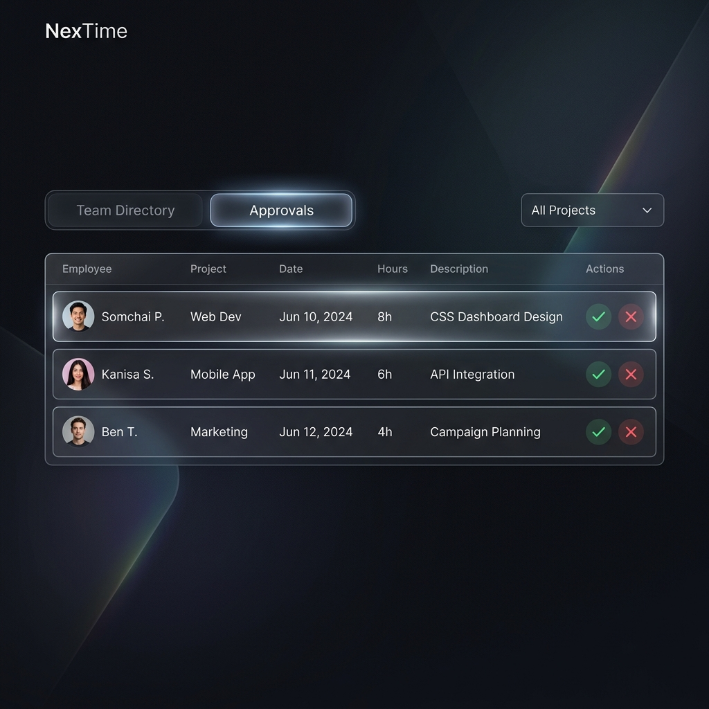

### A. การอนุมัติชั่วโมงทำงาน (Timesheet Approvals)

1. เข้าไปที่แท็บ **Team Approvals**
2. ระบบจะจัดแสดงรายการเวลางานทั้งหมดของพนักงานที่เป็นสิทธิ `Pending` แยกตามโครงการที่รับผิดชอบ
3. ผู้มีสิทธิ์อนุมัติสามารถกดตรวจสอบคำอธิบายและชั่วโมงทำงานของพนักงาน
4. ดำเนินการผ่านปุ่มควบคุมด่วน:
   * **Approve:** อนุมัติการบันทึกเวลา ชาร์จชั่วโมงงานเข้าโครงการสำเร็จ
   * **Reject:** ปฏิเสธเวลางาน (ระบบจะบังคับให้ระบุความเห็น/เหตุผล เพื่อแจ้งให้พนักงานคนดังกล่าวทราบสาเหตุและนำกลับไปแก้ไข)

> [!IMPORTANT]
> ระบบจะส่งอีเมลแจ้งผลการอนุมัติ (Approved/Rejected) ไปยังพนักงานโดยอัตโนมัติ พร้อมเหตุผลกรณีปฏิเสธ

### B. จัดการข้อมูลพนักงาน (Employee Directory)

โมดูลสำหรับ Admin ในการแก้ไขและเพิ่มสมาชิกใหม่ในระบบ:
* กรอกประวัติการจ้างงาน: ชื่อ, อีเมล, ฝ่าย, ความเชี่ยวชาญหลัก (Skills) และกำหนดบทบาทเริ่มต้น
* **กล้องเบราว์เซอร์ภายในหน้าเว็บ (Inline HTML5 Camera):**
  เมื่อต้องการเพิ่มภาพถ่ายพนักงาน ระบบเตรียมระบบเรียกใช้งานกล้องเว็บแคมผ่าน HTML5 ภายในหน้าเบราว์เซอร์โดยตรง ไม่เรียกแอปพลิเคชันกล้องของอุปกรณ์พกพาภายนอก ช่วยป้องกันปัญหาเครื่องสเปกต่ำแอปเด้งค้างหรือกล้องไม่ทำงาน สามารถถ่ายภาพพอร์ตเทรตพนักงานและกดอัปเดตใส่หน้าโปรไฟล์ได้ทันที
* **การบันทึกข้อมูลร่างสำรอง (Draft Persistence):**
  กรณีที่กำลังกรอกฟอร์มข้อมูลพนักงานค้างอยู่ แล้วหน้าเว็บเกิดการรีเฟรชหรืออินเทอร์เน็ตหลุด ระบบมีโปรแกรมบันทึกข้อมูลฟิลด์ที่กรอกล่าสุดลง `localStorage` เสมอ เมื่อเปิดหน้าเว็บกลับเข้ามา ข้อมูลที่กรอกค้างจะกลับมาแสดงผลทันทีโดยไม่ต้องเริ่มต้นพิมพ์ประวัติใหม่

### C. การเพิ่มพนักงานใหม่ (Add New Employee)

1. ไปที่เมนู **Approvals** > แท็บ **Employee Directory**
2. คลิกปุ่ม **"Add Employee"**
3. กรอกข้อมูลพนักงาน:
   * **ชื่อ-นามสกุล** (ภาษาไทยและภาษาอังกฤษ)
   * **อีเมลบริษัท** (ใช้สำหรับลงชื่อเข้าใช้ระบบ)
   * **รหัสผ่านเริ่มต้น** (Admin กำหนดให้ พนักงานควรเปลี่ยนหลังล็อกอินครั้งแรก)
   * **แผนก / ฝ่ายที่สังกัด**
   * **ความเชี่ยวชาญ (Skills)**
   * **บทบาทเริ่มต้น (Global Role):** Admin, Manager, หรือ Employee
4. (เลือกได้) ถ่ายภาพพนักงานผ่านกล้องเบราว์เซอร์
5. คลิก **Save** เพื่อบันทึก

---

## 📊 10. รายงานและกราฟสถิติ (Reports)

โมดูลที่ช่วยในการประมวลผลข้อมูลการบันทึกเวลาเพื่อนำไปประเมินประสิทธิภาพโครงการ ทำเอกสารจ่ายเงินประจำเดือน และวิเคราะห์ต้นทุนโครงการ แบ่งออกเป็น **3 แท็บรายงาน** พร้อมฟังก์ชันส่งออก:

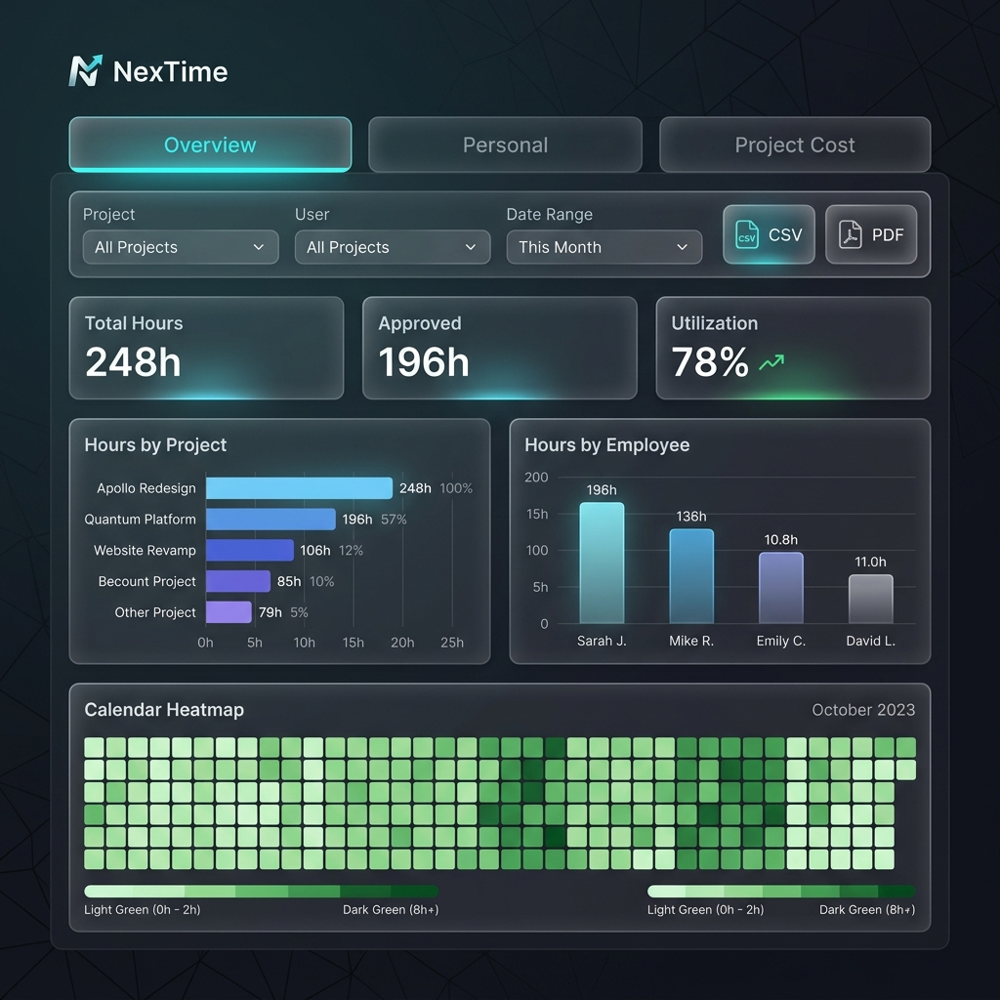

### A. Overview (ภาพรวม)

แท็บรายงานภาพรวมสำหรับดูสถิติการบันทึกเวลาทั้งหมดในระบบ:

**Filters (ตัวกรอง):**
* โปรเจกต์
* พนักงาน
* ช่วงวันที่
* สถานะ (Draft / Pending / Approved / Rejected)

**Stats (สถิติสรุป):**
| เมตริก | คำอธิบาย |
| :--- | :--- |
| **Total Hours** | ชั่วโมงทำงานรวมทั้งหมด |
| **Approved Hours** | ชั่วโมงที่ผ่านการอนุมัติ |
| **Utilization %** | เปอร์เซ็นต์การใช้ทรัพยากรเทียบกับเวลาทำงานมาตรฐาน |

**กราฟวิเคราะห์:**
* **Hours by Project:** แผนภูมิแท่ง (Bar Chart) แสดงสัดส่วนชั่วโมงแยกตามโปรเจกต์
* **Hours by Employee:** แผนภูมิแท่ง (Bar Chart) แสดงชั่วโมงสะสมของพนักงานแต่ละคน
* **Calendar Heatmap** [NEW!]: แผนที่ความร้อนรายวัน แสดงปริมาณชั่วโมงเป็นเฉดสี (สีเข้ม = ชั่วโมงมาก, สีอ่อน = ชั่วโมงน้อย)

### B. Personal Reports (รายงานส่วนบุคคล) [NEW!]

เลือกดูรายงานของพนักงานแต่ละคน:
* **Admin:** ดูได้ทุกคน
* **Employee:** ดูเฉพาะตัวเอง

**Monthly Stats:**
| เมตริก | คำอธิบาย |
| :--- | :--- |
| **Total Hours** | ชั่วโมงทำงานรวมของเดือน |
| **Completed Tasks** | จำนวนงานที่เสร็จสมบูรณ์ |
| **Average Hours/Day** | ชั่วโมงเฉลี่ยต่อวัน |

**เมตริกพิเศษ:**
* **Logging Streak:** จำนวนวันติดต่อกันที่บันทึกเวลาทำงาน (เช่น 🔥 15 วันติดต่อกัน)
* **Time Pattern Analysis:** วิเคราะห์รูปแบบเวลาเข้า-ออกงานเฉลี่ย (เช่น เข้างานเฉลี่ย 09:15, ออกงานเฉลี่ย 18:30)

**กราฟวิเคราะห์:**
* **Project Distribution:** แผนภูมิวงกลมแสดงสัดส่วนชั่วโมงแยกตามโปรเจกต์
* **Daily Hours Bar Chart:** กราฟแท่งชั่วโมงรายวันของเดือน

### C. Project Cost Reports (รายงานต้นทุนโครงการ) [NEW!]

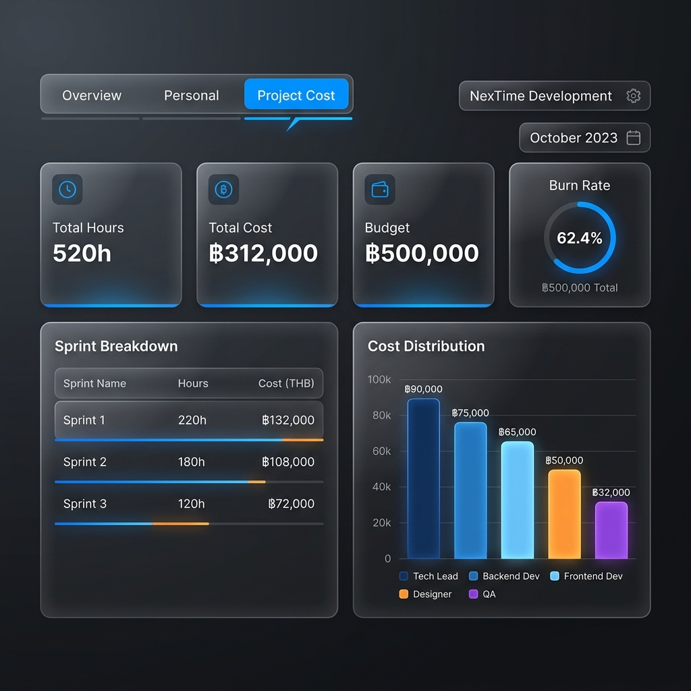

เลือกโปรเจกต์และเดือนที่ต้องการ เพื่อดูรายงานต้นทุน:

**สถิติสรุป:**
| เมตริก | คำอธิบาย |
| :--- | :--- |
| **Total Hours** | ชั่วโมงทำงานรวมของโครงการ |
| **Total Cost (฿)** | ต้นทุนรวม (คำนวณจาก Cost Rates × ชั่วโมง) |
| **Budget (฿)** | งบประมาณที่ตั้งไว้ |
| **Budget Burn Rate (%)** | อัตราการใช้งบประมาณ (Total Cost / Budget × 100) |

**Sprint Breakdown:**
แสดงชั่วโมงและต้นทุนแยกตาม Sprint เพื่อวิเคราะห์การใช้งบประมาณในแต่ละรอบการพัฒนา

**การคำนวณต้นทุน:**
```
ต้นทุน = Cost Rate (อัตราค่าแรงตาม Role) × ชั่วโมงทำงาน
```
อัตราค่าแรงตาม Role กำหนดได้ที่ [Settings > Cost Rates](#d-cost-rates--อัตราค่าแรง-labor-rates)

> [!WARNING]
> หากต้นทุนจริงสูงกว่า 80% ของงบประมาณ ระบบจะแสดงเตือนสีแดง เพื่อให้ PM พิจารณาปรับแผน

### D. Export (ส่งออกรายงาน) [NEW!]

* **Export CSV:** ส่งออกเป็นไฟล์ CSV ประกอบด้วยข้อมูล:
  * วันที่, พนักงาน, โปรเจกต์, ชั่วโมง, ต้นทุน, คำอธิบาย, สถานะ
  * เปิดได้ใน Excel, Google Sheets หรือโปรแกรม Spreadsheet อื่น ๆ

* **Export PDF:** พิมพ์รายงานเป็น PDF ผ่าน Browser Print
  * มี CSS สำหรับ Print โดยเฉพาะ (ซ่อนเมนู, ปรับเลย์เอาท์ให้เหมาะกับกระดาษ A4)
  * ใช้คำสั่ง `Ctrl + P` (Windows) หรือ `Cmd + P` (Mac) หรือกดปุ่ม **"Export PDF"** ในระบบ

---

## ⚙️ 11. การตั้งค่าระบบ (Settings)

ฟังก์ชันการทำงานขั้นสูงสำหรับผู้ดูแลระบบ (Admin) แบ่งออกเป็น **4 แท็บการตั้งค่า:**

### A. การจัดการแม่แบบ Milestone (Milestone Templates)

* ในเมนู **Settings** > **Milestone Templates**
* Admin สามารถเพิ่ม แก้ไข หรือลบแม่แบบแผนงานได้ตามความเหมาะสม
* กำหนดค่า **Start Percent** และ **End Percent** (เช่น เริ่มต้นที่ร้อยละ 10% ไปสิ้นสุดที่ 30% ของช่วงระยะเวลาโครงการ) เพื่อกำหนดสัดส่วนเวลาเฉลี่ยให้ระบบเจนอัตโนมัติ

### B. ระบบ Git Webhooks

ระบบ NexTime มี API Endpoint สำหรับดักรับข้อมูลการ Push Commit จาก Git เพื่อย้ายการ์ดงานบน Kanban Board อัตโนมัติ โดยระบุ Endpoint ดังนี้:

| ระบบ Git | Payload URL Endpoint |
| :--- | :--- |
| **GitHub** | `http://[Domain]/api/webhooks/github` |
| **GitLab** | `http://[Domain]/api/webhooks/gitlab` |

#### ขั้นตอนการตั้งค่า:
1. ไปที่การตั้งค่า Repository ของ Git (Settings) -> **Webhooks** -> **Add webhook**
2. ใส่ค่า **Payload URL** ตาม URL ของระบบด้านบน
3. เลือก Content type เป็น `application/json`
4. ติ๊กเลือกส่งเฉพาะ Push event จากนั้นกดบันทึกความเชื่อมโยง

#### ไกด์นำการเขียน Commit Message เพื่อเลื่อนสถานะงานอัตโนมัติ:
เมื่อนักพัฒนาทำคอมมิตโค้ด หากระบุ **Task ID** (เช่น `[t123]` หรือ `#t123`) พร้อมคำสั่งเปลี่ยนสถานะ ระบบจะโยกการ์ดชิ้นนั้นไปที่คอลัมน์เป้าหมายทันที:

1. **เปลี่ยนสถานะเป็น กำลังทำ (In Progress):**
   * คำสำคัญ (Keywords): `work`, `progress`, `develop`, `start`, `ทำ`, `เริ่ม`
   * ตัวอย่างคอมมิต: `[t456] start database indexing setup`
2. **เปลี่ยนสถานะเป็น เสร็จสิ้น (Done):**
   * คำสำคัญ (Keywords): `fix`, `close`, `resolve`, `complete`, `done`, `แก้`, `ปิด`
   * ตัวอย่างคอมมิต: `[t123] fix styling bug on dashboard`

### C. Permission Schemes (ระบบจัดการสิทธิ์แบบปรับแต่งได้) [NEW!]

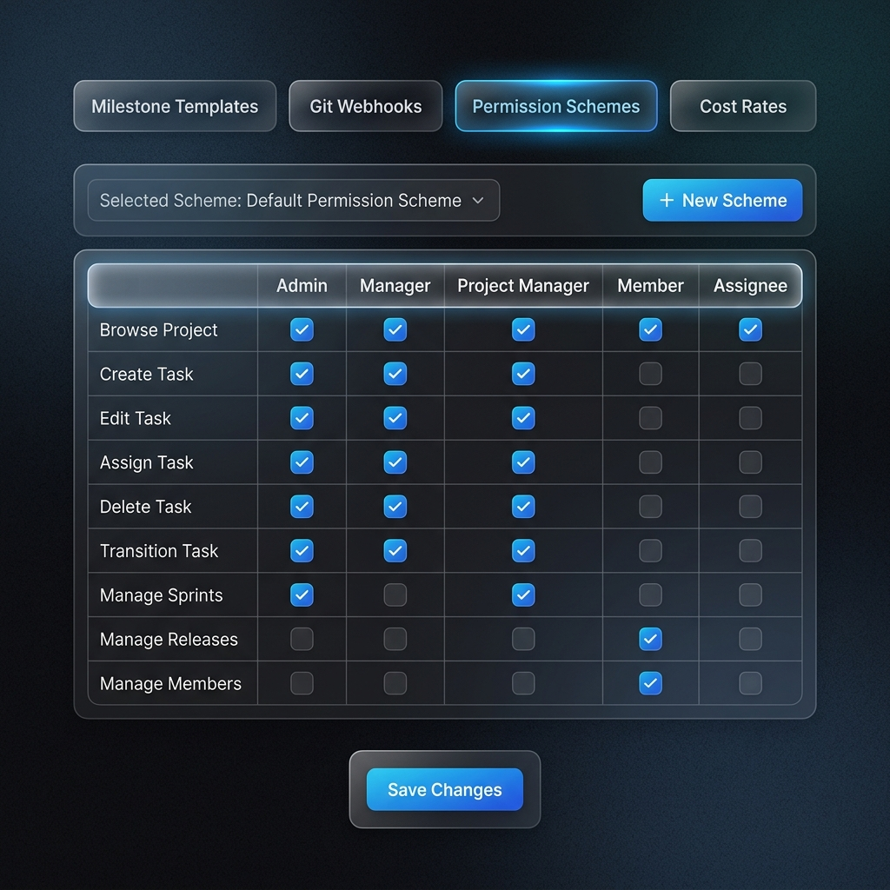

> [!IMPORTANT]
> เฉพาะ **Admin** เท่านั้นที่สามารถเข้าถึงการตั้งค่านี้ได้

ระบบ Permission Schemes ช่วยให้สามารถกำหนดสิทธิ์การใช้งานแบบยืดหยุ่นสำหรับแต่ละโปรเจกต์:

**การใช้งาน:**
* สร้าง Permission Scheme ใหม่หรือแก้ไข Scheme ที่มีอยู่
* กำหนด Scheme ให้แต่ละโปรเจกต์ได้ ทำให้โปรเจกต์ต่างกันมีสิทธิ์ต่างกัน

**9 ประเภทสิทธิ์ที่ปรับแต่งได้:**

| # | สิทธิ์ (Permission) | คำอธิบาย |
| :---: | :--- | :--- |
| 1 | **Browse Project** | ดูข้อมูลโครงการ |
| 2 | **Create Task** | สร้างงานใหม่ |
| 3 | **Edit Task** | แก้ไขรายละเอียดงาน |
| 4 | **Assign Task** | มอบหมายผู้รับผิดชอบ |
| 5 | **Delete Task** | ลบงาน |
| 6 | **Transition Task** | เปลี่ยนสถานะงาน |
| 7 | **Manage Sprints** | จัดการ Sprint (สร้าง, เริ่ม, จบ) |
| 8 | **Manage Releases** | จัดการ Release (สร้าง, ปล่อย) |
| 9 | **Manage Members** | เพิ่ม/ลบสมาชิกโครงการ |

**6 บทบาทที่กำหนดสิทธิ์ได้:**
Admin, Manager, PM, Team Lead, Member, Assignee

**Toggle Matrix UI:** ใช้ระบบ Toggle Matrix สำหรับติ๊กเปิด/ปิดสิทธิ์แต่ละรายการสำหรับแต่ละ Role ได้อย่างง่ายดาย

> [!CAUTION]
> ไม่สามารถลบ **Default Scheme** ได้ เนื่องจากเป็น Scheme พื้นฐานที่ใช้กับโปรเจกต์ที่ไม่ได้กำหนด Scheme เฉพาะ

### D. Cost Rates / อัตราค่าแรง (Labor Rates) [NEW!]

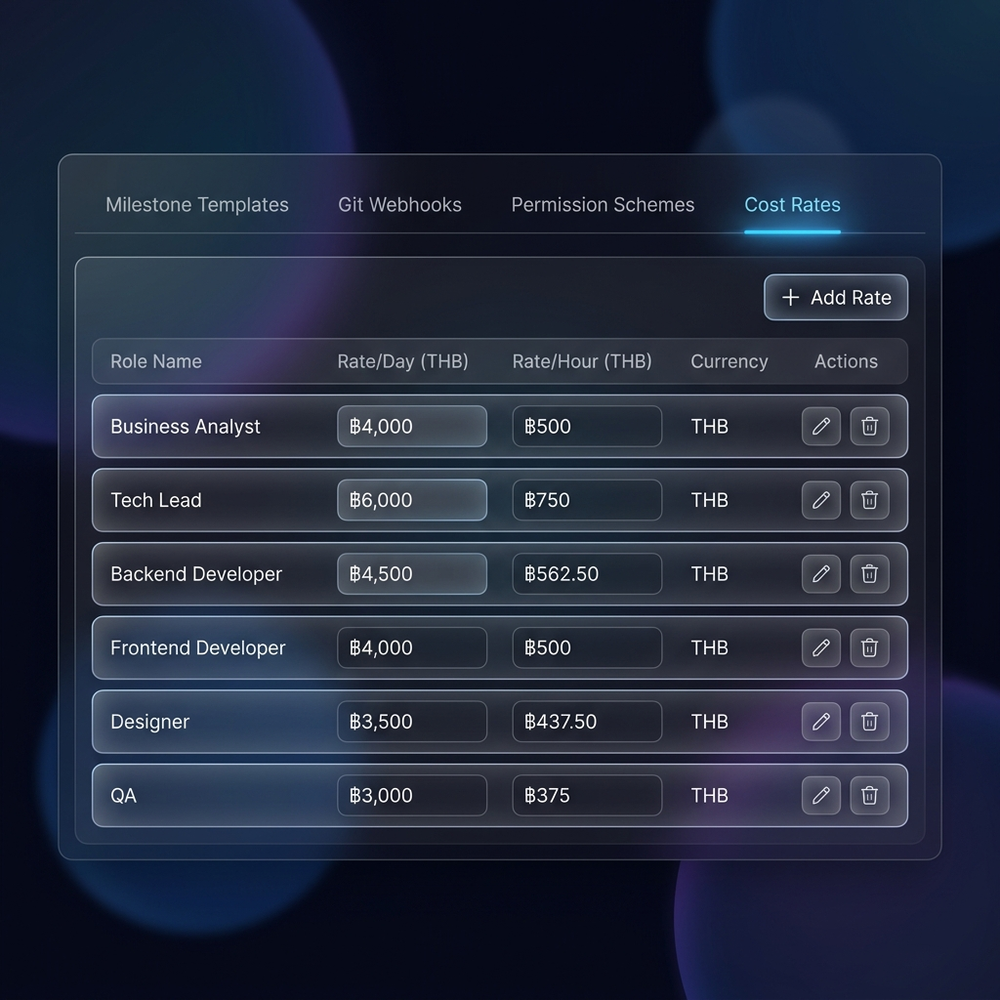

> [!IMPORTANT]
> เฉพาะ **Admin** เท่านั้นที่สามารถเข้าถึงการตั้งค่านี้ได้

ตั้งอัตราค่าแรงตาม Role ในหน่วย **THB (บาท)** สำหรับใช้คำนวณต้นทุนโครงการ:

**ฟิลด์ที่กำหนดได้:**

| ฟิลด์ | คำอธิบาย | ตัวอย่าง |
| :--- | :--- | :--- |
| **ชื่อ Role** | บทบาท/ตำแหน่ง | Backend Developer |
| **อัตรา/วัน** | ค่าแรงต่อวัน (THB) | ฿4,000 |
| **อัตรา/ชั่วโมง** | ค่าแรงต่อชั่วโมง (THB) | ฿500 |
| **สกุลเงิน** | สกุลเงินที่ใช้ | THB |

**Auto-sync:** เมื่อเปลี่ยนอัตรา/วัน ระบบจะคำนวณอัตรา/ชั่วโมงอัตโนมัติ (คิดจาก **8 ชม./วัน**) และกลับกัน
```
อัตรา/ชั่วโมง = อัตรา/วัน ÷ 8
อัตรา/วัน = อัตรา/ชั่วโมง × 8
```

**9 อัตราเริ่มต้น:**

| Role | อัตรา/วัน (฿) | อัตรา/ชั่วโมง (฿) |
| :--- | ---: | ---: |
| Business Analyst | 4,000 | 500 |
| Tech Lead | 6,000 | 750 |
| Backend Developer | 4,000 | 500 |
| Frontend Developer | 4,000 | 500 |
| Designer | 3,500 | 437.50 |
| QA Engineer | 3,200 | 400 |
| Tester | 2,400 | 300 |
| DevOps Engineer | 5,000 | 625 |
| Scrum Master | 4,800 | 600 |

> [!TIP]
> อัตราค่าแรงเหล่านี้ใช้ในการคำนวณ [Project Cost Report](#c-project-cost-reports-รายงานต้นทุนโครงการ) ตรวจสอบให้แน่ใจว่าอัตราค่าแรงที่กำหนดตรงกับนโยบายบริษัท

---

## 🔔 12. ระบบแจ้งเตือน (Notifications)

### A. Email Notifications (การแจ้งเตือนทางอีเมล)

เพื่อหลีกเลี่ยงความล่าช้าในการส่งผ่านข้อมูลและการติดตามผล ระบบ NexTime จะทำการส่งอีเมลแจ้งเตือนผ่าน SMTP Server เบื้องหลังเป็นแบบ Asynchronous (ไม่หน่วงหน้าจอดำเนินงานของผู้ใช้) ในกรณีสำคัญดังนี้:

1. **เมื่อส่งเวลาตรวจสอบ (Employee → PM):**
   เมื่อพนักงานกดเปลี่ยนสถานะบันทึกชั่วโมงจาก `Draft` ไปยัง `Pending` ระบบจะส่งอีเมลแจ้งเตือนถึงผู้ดูแลโครงการ (PM) โดยอัตโนมัติ โดยในจดหมายจะมีลิงก์ด่วนเพื่อให้ PM สามารถกดเข้าไปพิจารณาผลงาน

2. **เมื่อทราบผลการตรวจสอบ (PM → Employee):**
   เมื่อ PM ดำเนินการอนุมัติ (`Approved`) หรือปฏิเสธ (`Rejected`) บันทึกชั่วโมงทำงานแล้ว ระบบจะทำการส่งอีเมลส่งกลับไปยังพนักงานผู้เป็นเจ้าของรายการข้อมูลในทันที พร้อมส่งความเห็นหรือสาเหตุหากงานถูกส่งคืน เพื่อให้ได้รับการอัปเดตและดำเนินแก้ไขทันเวลา

### B. Notification Bell (ระฆังแจ้งเตือนในระบบ) [NEW!]

ไอคอนระฆัง 🔔 ที่มุมขวาบนของหน้าจอ พร้อม **Badge** แสดงจำนวนการแจ้งเตือน (สูงสุด **9+**)

เมื่อคลิก จะแสดง **Dropdown** แบ่งเป็น 3 หมวด:

| หมวด | สี | คำอธิบาย |
| :--- | :---: | :--- |
| **Overdue Tasks** | 🔴 | งานที่เลยกำหนดส่งแล้ว |
| **Due in 3 Days** | 🟡 | งานที่จะครบกำหนดภายใน 3 วัน |
| **Due This Week** | ⚪ | งานที่จะครบกำหนดภายในสัปดาห์นี้ |

* คลิกที่รายการแจ้งเตือนเพื่อนำทางไปยังหน้า **Task Detail** ของโปรเจกต์ที่เกี่ยวข้องโดยตรง

---

## 🤖 13. ระบบ Chatbot (AI Assistant) [NEW!]

ระบบ NexTime มี **Chatbot ผู้ช่วยอัจฉริยะ** ในตัว เข้าถึงได้จากปุ่มแชทที่มุมล่างขวาของหน้าจอ

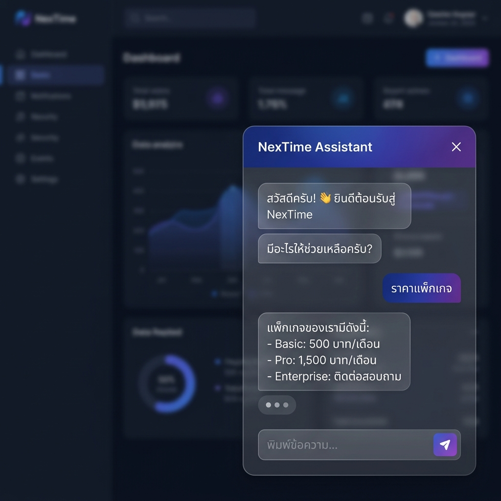

### ฟังก์ชันการทำงาน

Chatbot ตอบคำถามพื้นฐานเกี่ยวกับระบบ NexTime รองรับทั้ง **ภาษาไทย** และ **ภาษาอังกฤษ**

### หมวดหมู่คำถามที่รองรับ

| หมวดหมู่ | ตัวอย่างคำถาม | การตอบกลับ |
| :--- | :--- | :--- |
| **ทักทาย** | สวัสดี, hello, หวัดดี | ตอบรับและแนะนำตัว |
| **ราคาและแพ็กเกจ** | ราคา, แพ็กเกจ, จ่าย, pricing | แนะนำติดต่อฝ่ายขาย |
| **ปัญหาการใช้งาน** | ปัญหา, เข้าไม่ได้, พัง, bug | แนะนำติดต่อฝ่ายสนับสนุน |
| **คำถามทั่วไป** | NexTime คืออะไร, ใช้งานยังไง | อธิบายภาพรวมระบบ |

### วิธีใช้งาน

1. คลิกไอคอน **💬 Chat** ที่มุมล่างขวาของหน้าจอ
2. พิมพ์คำถามในช่องข้อความ
3. ส่งข้อความด้วยปุ่ม **Send** หรือกดปุ่ม **Enter**
4. รอ Chatbot ตอบกลับ (มีอนิเมชัน **Typing indicator** ขณะรอคำตอบ)

> [!NOTE]
> Chatbot ปัจจุบันเป็นแบบ **Rule-based** มีแผนพัฒนาเป็น AI-powered ในอนาคตเพื่อตอบคำถามได้หลากหลายมากขึ้น

---

## 📱 14. การใช้งานบนมือถือ (Mobile Responsive) [NEW!]

ระบบ NexTime รองรับการใช้งานบนอุปกรณ์พกพา (มือถือ, แท็บเล็ต) โดยมีฟีเจอร์สำคัญดังนี้:

### Hamburger Menu (☰)

เมนู Sidebar จะถูกซ่อนเป็นปุ่ม **Hamburger (☰)** บนหน้าจอขนาดเล็ก (< 768px) เมื่อกดจะแสดงเมนูนำทางเต็มจอแบบ Overlay

### Mobile Bottom Navigation

แถบเมนูด้านล่างสำหรับนำทางด่วนบนมือถือ:

| ไอคอน | เมนู | ฟังก์ชัน |
| :---: | :--- | :--- |
| 🏠 | **Home** | หน้า Dashboard |
| ✅ | **Tasks** | บอร์ดจัดการงาน |
| 📅 | **Plan** | แผนภูมิแกนต์ |
| ⏱️ | **Time** | บันทึกเวลาทำงาน |
| 👥 | **Team** | สมาชิกทีม |

### Responsive Grid

เลย์เอาท์ทุกหน้าปรับขนาดตามหน้าจออัตโนมัติ:
* **Desktop (≥ 1024px):** แสดงเลย์เอาท์เต็มรูปแบบ พร้อม Sidebar ถาวร
* **Tablet (768px - 1023px):** ปรับเป็น 2 คอลัมน์ ซ่อน Sidebar เป็น Hamburger
* **Mobile (< 768px):** แสดงเป็น 1 คอลัมน์ พร้อม Bottom Navigation

---

## ❓ 15. คำถามที่พบบ่อย (FAQ & Troubleshooting)

### การลงชื่อเข้าใช้งาน

**Q: ล็อกอินด้วย LINE แล้วเข้าระบบไม่ได้ แสดง "Sign in Failed"?**
> A: ตรวจสอบว่าบัญชี LINE ของคุณใช้อีเมลบริษัทที่ลงทะเบียนไว้ในระบบ NexTime หากไม่ตรง กรุณาติดต่อ Admin เพื่อยืนยันข้อมูลอีเมล

**Q: ล็อกอินด้วยอีเมลและรหัสผ่านแล้วเข้าไม่ได้?**
> A: ตรวจสอบว่าพิมพ์อีเมลและรหัสผ่านถูกต้อง (ตัวพิมพ์เล็ก/ใหญ่มีผล) หากยังเข้าไม่ได้ ให้ติดต่อ Admin เพื่อตรวจสอบบัญชีและรีเซ็ตรหัสผ่าน

**Q: วิธีเปลี่ยนรหัสผ่าน หรือรีเซ็ตรหัสผ่านพนักงาน?**
> A: 
> 1. **เปลี่ยนรหัสผ่านส่วนตัว:** ผู้ใช้ทุกคนสามารถไปที่เมนู **Settings (ตั้งค่าระบบ)** > แท็บ **🔐 Security & Password** กรอกรหัสผ่านเดิมและรหัสผ่านใหม่เพื่อเปลี่ยนรหัสผ่านได้ด้วยตนเอง
> 2. **รีเซ็ตรหัสผ่านให้พนักงาน:** ผู้ดูแลระบบ (Admin) สามารถไปที่แท็บ **Security & Password** หรือกดปุ่ม **"Reset to password123"** ในฟอร์มแก้ไขพนักงานหน้า **Team Directory** เพื่อรีเซ็ตรหัสผ่านให้พนักงานได้ทันที

**Q: User ในระบบ (Global Role) กับ User ใน Project (Project Role) ต่างกันอย่างไร?**
> A: 
> * **User ในระบบ (Global Role):** คือบัญชีผู้ใช้ในระดับองค์กร (`Admin`, `Manager`, `Employee`, `User`) กำหนดสิทธิ์การเข้าถึงเมนูหลักและการบริหารจัดการทั้งระบบ
> * **User ใน Project (Project Role):** คือบทบาทและสิทธิ์เฉพาะโครงการนั้นๆ (`PM`, `Team Lead`, `Frontend dev`, `QA` ฯลฯ) ซึ่งพนักงาน 1 คน มีสิทธิ์เป็น `Employee` ในระดับระบบ แต่เป็น `PM` (ผู้จัดการโครงการ) ในโครงการ A และเป็น `Developer` ในโครงการ B ได้ ยืดหยุ่นตามโครงสร้างทีม

**Q: ในหน้าสมาชิกทีม (Team Directory) สามารถเปลี่ยนมุมมอง Card และ List ได้ไหม?**
> A: ได้ครับ! ที่มุมขวาบนของแท็บ Team Directory จะมีปุ่มให้เลือกสลับมุมมองระหว่าง **Card View** 🎴 (แสดงเป็นการ์ดพร้อมรูปภาพ) และ **List View** 📋 (แสดงเป็นตารางรายการความหนาแน่นสูง) ระบบจะจดจำโหมดล่าสุดที่คุณเลือกไว้ให้อัตโนมัติ

---

### การบันทึกเวลาทำงาน

**Q: บันทึกเวลาแล้วทำไมแก้ไขไม่ได้?**
> A: หากสถานะเป็น `Pending` (รอการตรวจสอบ) ข้อมูลจะถูกล็อกไม่สามารถแก้ไขได้ ต้องรอผลการตรวจสอบก่อน หากถูก `Rejected` จะสามารถแก้ไขและส่งใหม่ได้

**Q: กรอกฟอร์มค้างอยู่แล้วหน้าเว็บรีเฟรช ข้อมูลหายไหม?**
> A: ไม่หาย! ระบบจะบันทึกข้อมูลฟอร์มที่กรอกค้างไว้ใน `localStorage` อัตโนมัติ เมื่อเปิดหน้าเว็บกลับมา ข้อมูลจะกลับมาแสดงผลทันที

### บอร์ดงาน & Sprint

**Q: ลากการ์ดงานไม่ได้ ต้องทำอย่างไร?**
> A: ตรวจสอบว่าคุณมีสิทธิ์ Transition Task ใน Permission Scheme ของโปรเจกต์นั้น ๆ หรือตรวจสอบ Transition Rules ที่อาจจำกัดการย้ายสถานะ (เช่น ต้องมี Description หรือ Estimated Hours ก่อน)

**Q: Sprint จบแล้ว งานที่ค้างอยู่จะไปไหน?**
> A: เมื่อกด "Complete Sprint" ระบบจะถามว่าต้องการนำงานค้าง (Incomplete Tasks) โยกกลับไปที่ Backlog หรือเก็บบันทึกประวัติไว้

**Q: ทำไมแถบ "Auto-Generated Plan" (แผนงานอัตโนมัติ) ถึงไม่แสดงหลังสร้างโปรเจกต์ใหม่?**
> A: เกิดจาก 2 สาเหตุที่เป็นไปได้:
> 1. **ข้อมูลหน้าจอยังไม่ได้อัปเดต:** หลังสร้างเสร็จ ระบบหลังบ้านจะสร้างแผนงานทันทีใน Database แต่หน้าเว็บยังไม่ได้ดึงล่าสุด ให้ลอง **รีเฟรชหน้าจอ (F5)** อีกครั้ง
> 2. **ไม่ได้ระบุ End Date ตั้งแต่แรก:** ระบบจะเจนแผนงานอัตโนมัติเฉพาะตอนที่สร้างโปรเจกต์ใหม่และมีข้อมูล **Start Date** และ **End Date** พร้อมกันเท่านั้น หากเว้นว่างไว้แล้วมาแก้ไขทีหลัง จะต้องไปที่แท็บ **Project Plan** เลือกโปรเจกต์ดังกล่าว แล้วกดปุ่ม **🚀 Generate Milestones from Templates** เพื่อสั่งทำงานด้วยตัวเอง

### รายงาน & ต้นทุน

**Q: ดู Cost Report แล้วตัวเลขไม่ถูก?**
> A: ตรวจสอบ **Cost Rates** ในเมนู Settings ว่าตั้งค่าอัตราค่าแรงตาม Role ถูกต้องหรือไม่ ต้นทุนคำนวณจาก Cost Rate × ชั่วโมงทำงาน หาก Role ของพนักงานไม่ตรงกับ Cost Rate ที่กำหนด อาจทำให้ตัวเลขคลาดเคลื่อน

**Q: Export รายงานเป็น PDF แล้วเลย์เอาท์เพี้ยน?**
> A: แนะนำให้ใช้ Google Chrome เพื่อผลลัพธ์ที่ดีที่สุด และตรวจสอบว่าเลือก Paper Size เป็น A4 ในหน้า Print Dialog

### Chatbot

**Q: Chatbot ตอบไม่ตรงคำถาม?**
> A: Chatbot ปัจจุบันเป็นแบบ **Rule-based** จึงรองรับเฉพาะคำถามบางหมวดหมู่ (ทักทาย, ราคา, ปัญหาการใช้งาน) มีแผนพัฒนาเป็น AI-powered ในอนาคตเพื่อตอบคำถามได้หลากหลายมากขึ้น

**Q: ปุ่ม Construction 🇹🇭, Development, Support และ Show All ในหน้าปฏิทินไทม์ไลน์โครงการ (Project Calendar Timeline) คืออะไร?**
> A: ปุ่มเหล่านี้คือ **ตัวกรองประเภทโครงการ (Project Type Filter)** สำหรับกรองตารางไทม์ไลน์ตามหมวดหมู่:
> * **Construction 🇹🇭 (งานก่อสร้าง):** แสดงเฉพาะโครงการก่อสร้าง ติดตั้ง หรือรีโนเวทหน้างาน
> * **Development (งานพัฒนา):** แสดงเฉพาะโครงการพัฒนาระบบ ซอฟต์แวร์ หรือ IT
> * **Support (งานซัพพอร์ต):** แสดงเฉพาะโครงการดูแลระบบ หรือบริการหลังการขาย
> * **Show All (แสดงทั้งหมด):** แสดงโครงการทุกประเภทในตารางเดียว

**Q: ระบบรองรับเบราว์เซอร์อะไรบ้าง?**
> A: แนะนำให้ใช้ Google Chrome, Microsoft Edge, หรือ Firefox เวอร์ชันล่าสุด สำหรับ Safari อาจมีบางฟีเจอร์ที่แสดงผลแตกต่างเล็กน้อย


**Q: ใช้งานบนมือถือได้ไหม?**
> A: ได้! ระบบรองรับ Responsive Design บนทุกอุปกรณ์ พร้อม Mobile Bottom Navigation สำหรับนำทางด่วน ดูรายละเอียดที่ [หัวข้อ 14](#-14-การใช้งานบนมือถือ-mobile-responsive)

---

## 📖 16. การจัดการความรู้เชิงเรื่องเล่าการใช้งานระบบ (Knowledge Management - Storytelling Guide) [NEW!]

เรื่องเล่าการบริหารจัดการโครงการด้วยระบบ **BuildFlow / vbooking (NexTime)** ผ่านสถานการณ์ปฏิบัติงานจริง ตั้งแต่วันแรกของการตั้งทีม จนถึงวันส่งมอบงานสำเร็จ

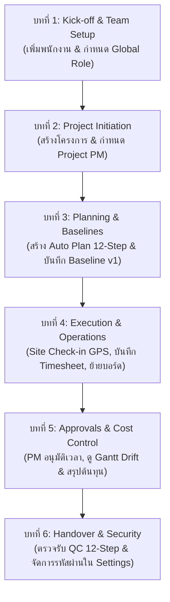
```mermaid
graph TD
    A["บทที่ 1: Kick-off & Team Setup<br/>(เพิ่มพนักงาน & กำหนด Global Role)"] --> B["บทที่ 2: Project Initiation<br/>(สร้างโครงการ & กำหนด Project PM)"]
    B --> C["บทที่ 3: Planning & Baselines<br/>(สร้าง Auto Plan 12-Step & บันทึก Baseline v1)"]
    C --> D["บทที่ 4: Execution & Operations<br/>(Site Check-in GPS, บันทึก Timesheet, ย้ายบอร์ด)"]
    D --> E["บทที่ 5: Approvals & Cost Control<br/>(PM อนุมัติเวลา, ดู Gantt Drift & สรุปต้นทุน)"]
    E --> F["บทที่ 6: Handover & Security<br/>(ตรวจรับ QC 12-Step & จัดการรหัสผ่านใน Settings)"]
```

---

### 🎬 บทที่ 1: การต้อนรับทีมงานและการจัดโครงสร้างสิทธิ์ (Onboarding & Team Setup)

> *"คุณสมชาย (Admin) ได้รับโจทย์จากผู้บริหารในการเตรียมความพร้อมของทีมงาน 15 คน เพื่อรองรับโครงการปรับปรุงสาขาอาคารชุดใหม่..."*

1. **การลงทะเบียนพนักงาน:** สมชายเข้าสู่ระบบในสิทธิ์ **Admin** ไปที่เมนู **ช่างติดตั้ง & ทีมงาน (Team Approvals)** เลือกแท็บ **Team Directory** และกดปุ่ม **"+ Add Employee"**
2. **การถ่ายภาพและบันทึกประวัติ:** สมชายใช้ระบบกล้องเบราว์เซอร์ (HTML5 Inline Camera) ถ่ายภาพช่างหน้างานโดยตรง ไม่ต้องสลับแอป พร้อมกำหนดสิทธิ์ระดับระบบ (Global Role) ให้ทุกคน เช่น เลือก `Employee` สำหรับช่างและนักพัฒนา และเลือก `Manager` สำหรับหัวหน้าฝ่าย
3. **การปรับมุมมองการทำงาน:** เมื่อต้องการตรวจสอบรายชื่อพนักงานทั้งหมด สมชายสามารถคลิกเปลี่ยนมุมมองระหว่าง **Card View 🎴** (แสดงรูปโปรไฟล์พร้อมการ์ดสวยงาม) และ **List View 📋** (แสดงเป็นตารางรายการเพื่อค้นหาและเปรียบเทียบข้อมูลอย่างรวดเร็ว)

---

### 🏗️ บทที่ 2: การสร้างโครงการใหม่และการมอบหมายบทบาท (Project Initiation & Role Assignment)

> *"โครงการ 'ปรับปรุงระบบไฟฟ้าและตกแต่งโชว์รูม' เริ่มต้นขึ้น สมชายต้องการตั้งค่าให้ 'วิชัย' ซึ่งมีสิทธิ์เป็นเพียง Employee ในระบบ ให้ทำหน้าที่เป็น PM ผู้ดูแลโครงการนี้โดยเฉพาะ..."*

1. **สร้างโครงการ:** สมชายไปที่เมนู **รายชื่อโครงการ (Projects)** กดปุ่ม **"+ New Project"** ระบุชื่อโครงการ วันเริ่มต้น วันสิ้นสุด และงบประมาณ
2. **กำหนด Project Role:** ในช่องสมาชิกโครงการ (Project Members) สมชายเพิ่มชื่อ "วิชัย" เข้าไป พร้อมเลือกบทบาทในโครงการเป็น **`PM` (Project Manager)**
   - *จุดเด่น KM:* แม้ว่าวิชัยจะมี Global Role ในระบบเป็นเพียง `Employee` แต่ในโครงการนี้ วิชัยจะมีสิทธิ์เต็มในการบริหาร Task, จัดการ Sprint และอนุมัติ Timesheet ของลูกทีมประจำโครงการนี้ได้โดยไม่ส่งผลกระทบต่อโครงการอื่น

---

### 📐 บทที่ 3: การสร้างแผนงานอัตโนมัติและการบันทึก Baseline (Planning & Baselines)

> *"วิชัย (PM) ต้องการวางโครงสร้างงาน 12 ขั้นตอนมาตรฐาน (12-Step Construction Pipeline) และล็อกแผนอ้างอิงแรกไว้เปรียบเทียบ..."*

1. **สร้างแผนงาน 12 ขั้นตอน:** วิชัยไปที่เมนู **แผนงาน / Gantt (Project Plan)** เลือกโครงการ ระบบทำการสร้าง Milestones อัตโนมัติจาก Template (เช่น Survey, Design, BOQ Proposal, Execution, QC Handover)
2. **บันทึกแผนอ้างอิง (Save Baseline v1):** ก่อนเริ่มงานจริง วิชัยกดปุ่ม **"Save Version"** ที่มุมขวาบน ตั้งชื่อว่า `Base_v1_Contract` เพื่อบันทึก Snapshot วันเริ่ม-จบและชั่วโมงประเมินเริ่มต้นไว้เป็นเกณฑ์อ้างอิง

---

### ⏱️ บทที่ 4: การปฏิบัติงานประจำวัน การเช็คอินไซต์ และการลงเวลา (Daily Operations)

> *"ช่างติดตั้งลงพื้นที่จริง และทีมพัฒนาเริ่มลุยงานตามสปรินต์..."*

1. **การเช็คอินหน้างาน (Site Check-in):** ช่างเดินทางถึงไซต์งาน เปิดมือถือไปที่เมนู **เช็คอิน / เช็คเอาท์ช่าง (Site Check-In)** กดปุ่มเช็คอิน ระบบจะบันทึกพิกัด GPS พร้อมภาพถ่ายหน้างานจริงไว้เป็นหลักฐาน
2. **การย้ายสถานะการ์ดงาน (Kanban Board):** ทีมงานเข้าหน้า **โปรเจกต์บอร์ด (Tasks)** เลือกมุมมอง Kanban ลากการ์ดงานจาก `To Do` ➔ `In Progress` ➔ `Review`
3. **การบันทึกชั่วโมงทำงาน (Timesheet Logging):** เมื่อจบวัน พนักงานเข้าหน้า **บันทึกหน้างาน / ช่าง (Timesheet)** กรอกชั่วโมงทำงานจริงและคำอธิบายงาน แล้วกดส่งอนุมัติ (`Pending`)

---

### 📈 บทที่ 5: การตรวจสอบ อนุมัติ และการควบคุมความเบี่ยงเบน (Approvals & Cost Drift)

> *"วิชัย (PM) และสมชาย (Admin) สรุปความคืบหน้าประจำสัปดาห์..."*

1. **การอนุมัติเวลา (Timesheet Approvals):** วิชัยเข้าหน้า **Team Approvals** ตรวจสอบชั่วโมงงานของลูกทีม กด **Approve** เพื่อยืนยัน หรือกด **Reject** พร้อมระบุข้อเสนอแนะเพื่อให้ลูกทีมนำไปแก้ไข
2. **การติดตาม Gantt Drift (Schedule Slippage):** เมื่อมีการปรับขยับวันเสร็จงานจริงในบอร์ด วิชัยเปิดหน้า **Gantt Chart** เลือก Active Plan เป็น `Base_v1_Contract` และ Compare vs เป็น `Current Live Plan`
   - แถบ Gantt จะแสดงเส้นเชื่อมเปรียบเทียบความล่าช้า (เช่น `+3d Delay`) พร้อมคำนวณผลต่างชั่วโมงและวันส่งมอบสะสมในตาราง **Variance Summary** ให้เห็นทันที
3. **การดูรายงานต้นทุน (Cost Reports):** สมชาย (Admin) เข้าหน้า **สรุปงบประมาณและต้นทุน (Reports)** ระบบนำชั่วโมงที่อนุมัติแล้ว คูณกับอัตราค่าแรง (Cost Rates) คำนวณเป็นต้นทุนค่าแรงจริงเทียบกับงบประมาณโครงการให้อัตโนมัติ

---

### 🔐 บทที่ 6: การส่งมอบงาน การปิดโครงการ และความปลอดภัย (Handover & Password Security)

> *"โครงการสำเร็จลุล่วงด้วยดี ทีมงานทำการตรวจรับ QC และดูแลความปลอดภัยของบัญชีผู้ใช้..."*

1. **การตรวจรับงาน (QC & Final Handover):** สมาชิกทีมย้าย Task ขั้นตอนสุดท้ายเข้าสู่ `Done` ความคืบหน้า Milestone พุ่งขึ้นเป็น 100% สมชายเข้าเปลี่ยนสถานะโครงการเป็น `Completed`
2. **การจัดการความปลอดภัยและรหัสผ่าน (Password Security):**
   - พนักงานทุกคนเข้าเมนู **ตั้งค่าระบบ (Settings)** > **Security & Password** เพื่อเปลี่ยนรหัสผ่านเดิมเป็นรหัสผ่านใหม่ของตนเองเพื่อความปลอดภัย
   - หากพนักงานคนใดลืมรหัสผ่าน สมชาย (Admin) สามารถเปิดหน้า **Security & Password** แล้วกดไอคอน 🔑 **รีเซ็ตรหัสผ่าน** หรือกำหนดรหัสผ่านใหม่ให้พนักงานคนนั้นได้ในคลิกเดียว

---

> [!TIP]
> **สรุปคุณประโยชน์ของระบบ KM:** เรื่องเล่านี้สะท้อนว่าระบบ BuildFlow / vbooking ช่วยเชื่อมโยงกระบวนการทำงานตั้งแต่ระดับบริหาร (Admin/Manager), ระดับคุมโครงการ (PM), จนถึงผู้ปฏิบัติงานหน้างาน (Employee/Technician) ให้ทำงานบนฐานข้อมูลเดียวกันอย่างราบรื่น ปลอดภัย และตรวจสอบได้ 100%

---

> [!NOTE]
> หากพบปัญหาการใช้ระบบ หรือต้องการเชื่อมต่อฟังก์ชันเพิ่มเติม กรุณาแจ้ง Admin ของระบบ NexTime หรือผู้พัฒนาผ่านช่องทางติดต่อหลังบ้านของบริษัท ขอให้มีความสุขกับการลงบันทึกเวลาทำงานอย่างเป็นระบบ!

---

*เอกสารฉบับนี้อัปเดตล่าสุด: กรกฎาคม 2026 | BuildFlow / vbooking (NexTime v2.0)*

